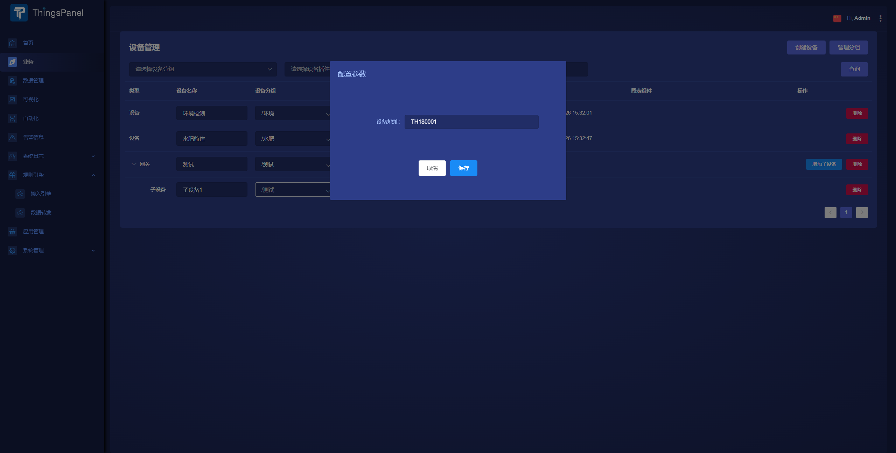
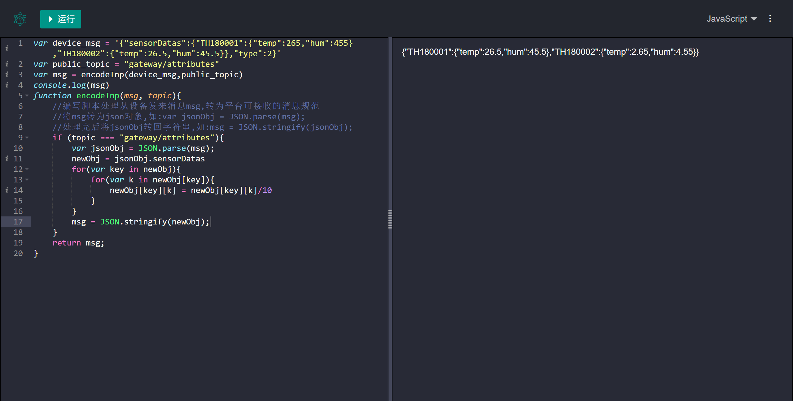
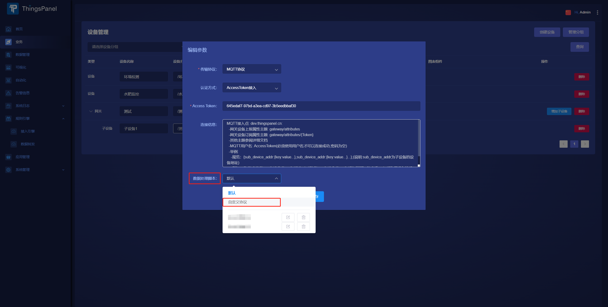
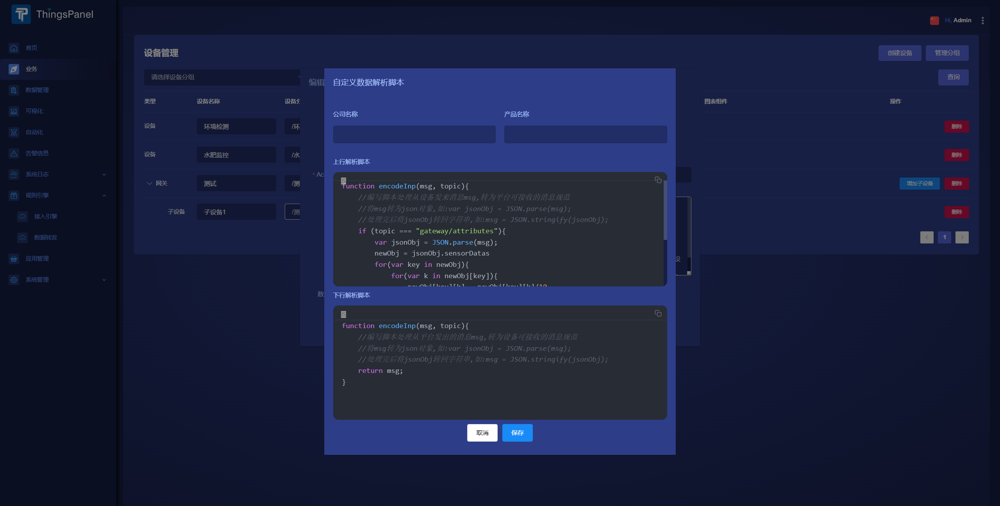

---
sidebar_position: 8
---

# 非官方标准MQTT协议设备接入

## 问题

1. mqtt设备/网关`发送和订阅主题`与平台不一致并无法修改，怎么接入ThingsPanel平台?
   
2. mqtt设备/网关`json报文规范`与平台规范不一致，怎么接入ThingsPanel平台?

## 使用规则引擎转发设备数据

使用规则引擎转发设备数据的方式常用来解决第一种问题。

1. 在规则引擎中新建一条接入规则
2. 拖拽一个`mqtt in`节点，填写设备主题接入数据
3. 再拖拽一个`mqtt out`节点，与`mqtt in`节点连线
4. 在`mqtt out`配置中需要添加新的mqtt-broker节点，根据平台mqtt网关/设备接入规则填写主题和认证方式（AccessToken接入填写用户名,MQTTBasic认证填写用户名和密码）
5. 平台到设备的通信参考以上步骤
6. 除了以上节点，合理使用其他功能节点，也可以转换报文规范并对设备传输的值加工和处理
   
## 使用编辑参数页面的`数据处理脚本`功能

数据处理脚本功能可解决第二种问题，它的原理相当于中间件。

1. 创建设备后，点击编辑参数，在数据处理下拉框选择`自定义协议`
2. 在弹出的`自定义数据解析脚本`对话框中输入`上行解析脚本`和`下行解析脚本`
3. 保存后创建其他同类设备的时候可以直接选择解析脚本
4. 数据处理脚本通常还可对设备传输的值做加工处理
5. 具体细节可以参考下面提供给的解析案例

## 案例

网关设备平台规范报文：

```json
{
	"TH180001": {
		"temp": 26.5,
		"hum": 45.5
	},
	"TH180002": {
		"temp": 26.5,
		"hum": 45.5
	}
}
```

非规范设备报文：
```json
{
	"sensorDatas": {
		"TH180001": {
			"temp": 265,
			"hum": 455
		},
		"TH180002": {
			"temp": 265,
			"hum": 455
		}
	},
	"type": 2
}
```
以上行解析脚本为例：

1. 分析发现设备发来的报文多了一层嵌套，并且数值都未做处理
2. 创建网关设备，添加两个子设备。（注意子设备地址在编辑参数中填写，同一网关中不可重复，如下图）

3. 首先编写代码
    ```javascript
    var device_msg = '{"sensorDatas":{"TH180001":{"temp":265,"hum":455},"TH180002":{"temp":26.5,"hum":45.5}},"type":2}'
    var public_topic = "gateway/attributes"
    var msg = encodeInp(device_msg,public_topic)
    console.log(msg)
    function encodeInp(msg, topic){
        // 将设备自定义msg（自定义形式）数据转换为json形式数据, 设备上报数据到物联网平台时调用
	// 入参：topic string 设备上报消息的 topic
	// 入参：msg byte[] 数组 不能为空
	// 出参：string
	// 处理完后将对象转回字符串形式
	// 例，byte[]转string：var msgString = String.fromCharCode.apply(null, msg);
	// 例，string转jsonObj：msgJson = JSON.parse(msgString);
	// 例，jsonObj转string：msgString = JSON.stringify(msgJson);
	var msgString = String.fromCharCode.apply(null, msg)
        if (topic === "gateway/attributes"){
            var jsonObj = JSON.parse(msgString);
            newObj = jsonObj.sensorDatas
            for(var key in newObj){
                for(var k in newObj[key]){
                    newObj[key][k] = newObj[key][k]/10
                }
            }
            msg = JSON.stringify(newObj);
        }
        return msg;
    }
    ```
4. 使用在线js调试工具,这里用的是：https://www.lddgo.net/code/runcode/javascript

5. 调试好以后，将函数粘贴进脚本保存（脚本在网关的编辑参数中，如图）


6. 下行脚本的编写也同上


