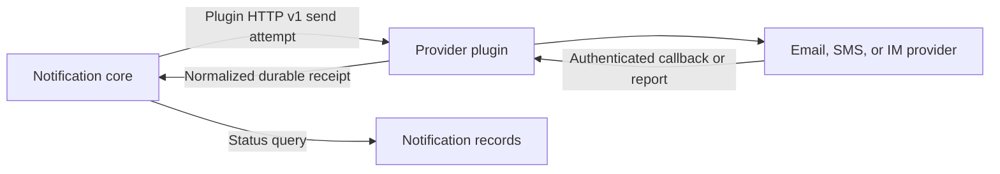

# Build a notification plugin

Notification plugins connect the platform's notification core to an external provider. The core owns tenant permissions, provider-account selection, notification strategies, scheduling, retries, and delivery records. A plugin implements one provider integration and can run independently; it does not need to use Encore.



## 1. Implement the plugin interface

Each plugin exposes an authenticated HTTP service with these endpoints:

| Endpoint | Purpose |
|---|---|
| `GET /v1/manifest` | Return the versioned plugin manifest. It must not send a message. |
| `POST /v1/validate` | Validate account configuration. It must not send a test message. A bounded, read-only credential check is allowed. |
| `POST /v1/send` | Make one bounded submission attempt for one delivery and one target. |
| `GET /healthz` | Report basic process/provider readiness. It must not send a message. |

The manifest identifies `api_version`, `plugin_id`, plugin version, channels, content modes, configuration and recipient schemas, secret fields, optional account identity fields, and delivery-receipt capability. Declare only capabilities the plugin actually implements.

## 2. Validate embedded schemas

Configuration and recipient constraints are embedded JSON Schema Draft 2020-12 documents. The notification core does not impose a separate keyword allowlist; it validates embedded schemas as Draft 2020-12 and rejects external network or file `$ref` loading. The web configuration editor supports a narrower set of schema keywords and field controls than the Core validator, so a schema that compiles may still be impossible to edit in the UI. Compile schemas in the target Core and test each field through the target UI before registering a plugin.

Keep credentials in top-level `secret_fields`. Secret values are write-only and must never be returned from a manifest or validation response. `identity_fields` should name only stable provider-account identity inputs; changing them can create a different account identity.

## 3. Return an accurate send outcome

A plugin send result distinguishes three outcomes:

- `accepted`: the provider confirmed it accepted the submission. This does not prove delivery.
- `rejected`: the plugin can prove the provider did not accept the attempt.
- `unknown`: the provider may have applied the side effect, but the result could not be confirmed.

Do not treat a timeout or disconnect after a write begins as a rejection. Do not automatically retry ambiguous sends; an ID in the platform request is not necessarily a provider-side idempotency key. If the plugin returns `accepted` without a receipt, the UI must not call it delivered.

## 4. Handle receipts safely

When the provider supports callbacks or reports, authenticate the original provider event, normalize it into a stable receipt event, and persist it before acknowledging or deleting the provider message. Forward the durable receipt to the notification core with the dedicated receipt credential. Acknowledge the source event only after the core confirms durable acceptance. Use stable event IDs to make callback replays safe.

Do not advertise receipt capability until the complete provider-authentication, durable-buffer, Core-authentication, and acknowledgement path has been tested. A local parser or mocked callback is not proof of an end-to-end receipt.

## 5. Secure provider access

- Keep the plugin listener on a trusted private network and authenticate every endpoint.
- Restrict outbound destinations to the provider endpoints configured for that plugin; use TLS and bounded connect, response, and total timeouts.
- Disable automatic retries and redirects for non-idempotent provider writes.
- Cap request and response sizes. Reject duplicate JSON keys, unknown fields, explicit `null` where the contract forbids it, and expired attempts before contacting the provider.
- Never log credentials, full recipients, message bodies, or raw provider response bodies.

## 6. Test and package

Use local provider fixtures to test validation without sending, accepted and rejected results, disconnect-after-write ambiguity, malformed or oversized responses, secret redaction, and receipt replay. Run the plugin's tests, static checks, and build offline before packaging. Keep SDK source and contract versions pinned in each standalone plugin module.

## 7. Published repositories

The plugin SDK and these provider adapters are available as independent public repositories:

| Project | Repository | Scope |
|---|---|---|
| Plugin SDK and no-send template | [thingspanel-notification-plugin-sdk](https://github.com/ThingsPanel/thingspanel-notification-plugin-sdk) | Portable Go SDK, contract, and starter template. |
| SMTP email | [thingspanel-notification-smtp](https://github.com/ThingsPanel/thingspanel-notification-smtp) | SMTP provider adapter. |
| DingTalk group robot | [thingspanel-notification-dingtalk](https://github.com/ThingsPanel/thingspanel-notification-dingtalk) | DingTalk custom group robot adapter. |
| Alibaba Cloud SMS | [thingspanel-notification-aliyun-sms](https://github.com/ThingsPanel/thingspanel-notification-aliyun-sms) | Alibaba Cloud template SMS adapter. |
| Legacy signed webhook | [thingspanel-notification-legacy-webhook](https://github.com/ThingsPanel/thingspanel-notification-legacy-webhook) | Compatibility adapter for the documented legacy payload. |

Publishing a repository does not install or register its plugin in a ThingsPanel instance, configure provider credentials, or prove live delivery. The adapters use local fixtures in their automated tests; a real provider send and any delivery receipt require separate authorized integration checks.

## 8. Run the no-send starter

The SDK repository includes a starter plugin that rejects sends without contacting a provider. Clone it and run its tests:

```sh
git clone https://github.com/ThingsPanel/thingspanel-notification-plugin-sdk.git
cd thingspanel-notification-plugin-sdk/examples/minimal-plugin
go test ./...
```

See the SDK's [development guide](https://github.com/ThingsPanel/thingspanel-notification-plugin-sdk/blob/main/docs/DEVELOPMENT.md) for changing the module and plugin IDs, implementing the manifest and provider, testing, packaging, and preparing a plugin for registration. The starter is a no-send example; it does not validate live provider delivery.
