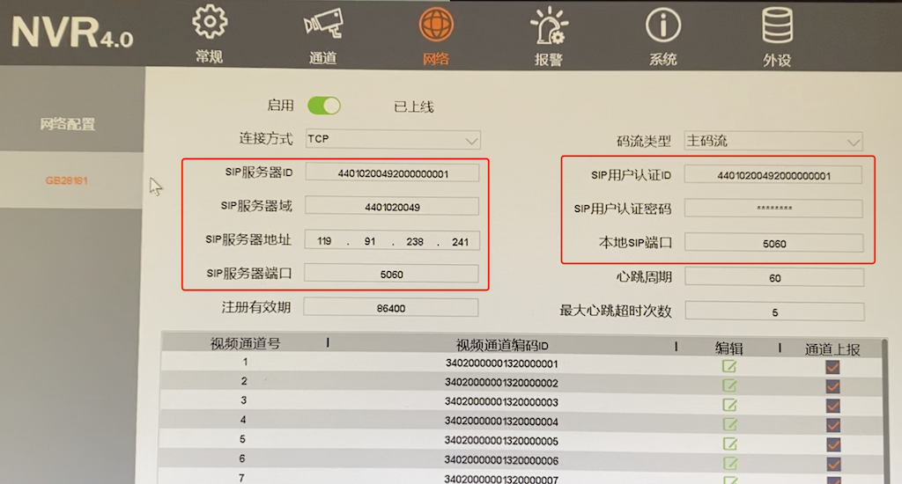

# GB28181安防摄像头接入
* 使用ThingsPanelGB28181协议插件，可直接接入国标摄像头。
* 默认自带功能,需要额外配置GB28181协议插件与服务方可使用。
* 0.4.6版本开始支持。

## 什么是GB28181协议?
GB28181协议是中国视频监控领域的国家标准,GB28181协议指的是国家标准GB/T 28181—2016《公共安全视频监控联网系统信息传输、交换、控制技术要求》。

该标准规定了公共安全视频监控联网系统的互联结构， 传输、交换、控制的基本要求和安全性要求， 以及控制、传输流程和协议接口等技术要求，是视频监控领域的国家标准。GB28181协议信令层面使用的是SIP（Session Initiation Protocol）协议。

流媒体传输层面使用的是实时传输协议（Real-time Transport Protocol，RTP）协议。
因此可以理解为GB28181是在国际通用标准的基础之上进行了私有化定制以满足视频监控联网系统互联传输的标准化需求。本文旨在说明在FFmpeg中增加对GB28181协议的支持，使其可以与支持GB28181协议的设备进行通信与控制，实现设备的注册、保活以及流媒体的传输。

## 支持功能
* 国标级联摄像头接入。
* 实时视频流监控。
* 云台控制。
* 录像与回放功能。

## 采用方案

* GB28181接入使用[wvp-GB28181-pro](https://github.com/ZLMediaKit/ZLMediaKit)项目
  * WEB VIDEO PLATFORM是一个基于GB28181-2016标准实现的网络视频平台，支持NAT穿透，支持海康、大华、宇视等品牌的IPC、NVR、DVR接入。支持国标级联，支持rtsp/rtmp等视频流转发到国标平台，支持rtsp/rtmp等推流转发到国标平台。该平台使用MIT授权，明确声明可用于商用和非商用目的。ThingsPanel使用该项目但未基于该平台做二次开发。
* 流媒体平台使用[ZLMediaKit](https://github.com/ZLMediaKit/ZLMediaKit)
  * ZLMediaKit一个基于C++11的高性能运营级流媒体服务框架，该平台使用MIT授权，明确声明可用于商用和非商用目的。ThingsPanel使用该项目但未基于该平台做二次开发。

## 配置流程

为ThingsPanel平台增加GB28181接入需要按照如下流程：

1. 安装WVP服务
2. 添加GB28181设备插件

### 安装WVP服务
```
docker pull 648540858/wvp_pro
docker run  --env WVP_IP=“192.168.31.10” -it -p 18080:18080 -p 30000-30500:30000-30500/udp -p 30000-30500:30000-30500/tcp -p 80:80 -p 5060:5060 -p 5060:5060/udp 648540858/wvp_pro
```
然后访问192.168.31.10:18080 （云端可能需要打开端口才可以访问）

## 使用流程

1. 没有插件的需要先注册插件（应用管理-》接入协议-》注册插件按钮）

 |名称|设备类型|协议类型|接入地址|http服务器地址|插件订阅主题前缀|作者|描述|
 |-|-|-|-|-|-|-|-|
 |GB28181|网关|WVP_01|127.0.0.1:18080|http://127.0.0.1:18080\|\|admin\|\|admin|-|-|-|
 ```
 说明：  
 设备类型：必须选网关  
 协议类型：必须以WVP_开头  
 接入地址：不会有实际作用，会展示在（创建设备-》编辑参数）连接信息中。  
 http服务器地址：必填，wvp服务地址，后面跟用户名和密码用||分割；是ThingsPanel与WVP平台交互数据的地址。  
 ```
3. 添加设备并选择设备插件为GB28181摄像头
4. 选择GB28181协议
5. 在设备端配置IP地址、端口、域编号、用户名密码。
   
6. 在设备监控查看视频流


