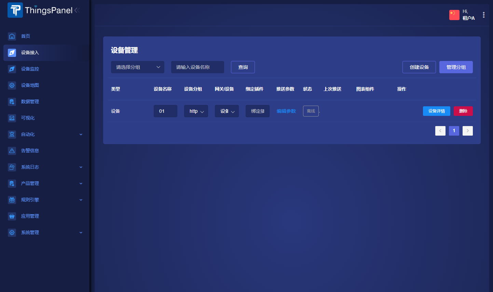
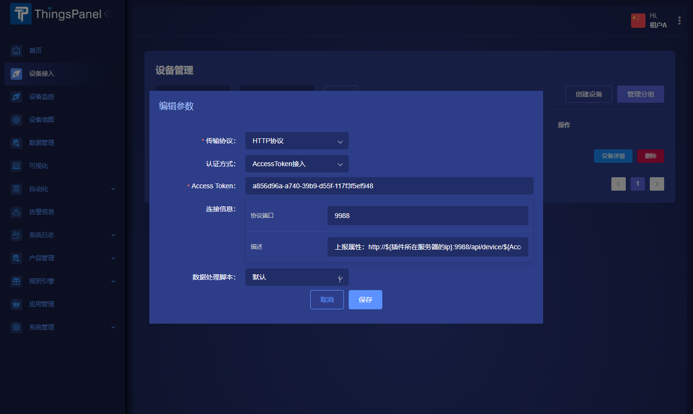
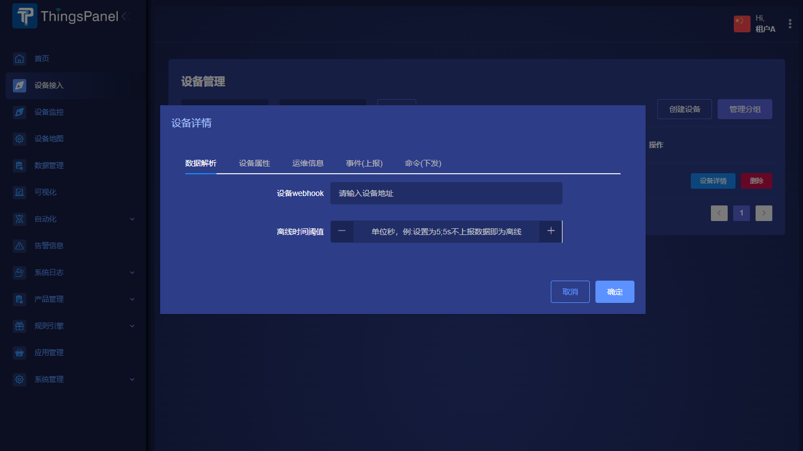

# HTTP接入
目前代码库有http协议插件，部署后注册协议插件便可接入http协议设备.

## 仓库地址
https://github.com/ThingsPanel/http-protocol-plugin

## 对接设备步骤
- 创建设备

- 点击`编辑参数`并选择`http协议`后保存

- 点击`设备详情`按钮，在数据解析栏填入相关信息（webhook地址设设备接收平台下发给设备消息的地址）

- 具体细节请查看http协议插件代码库的README文件
