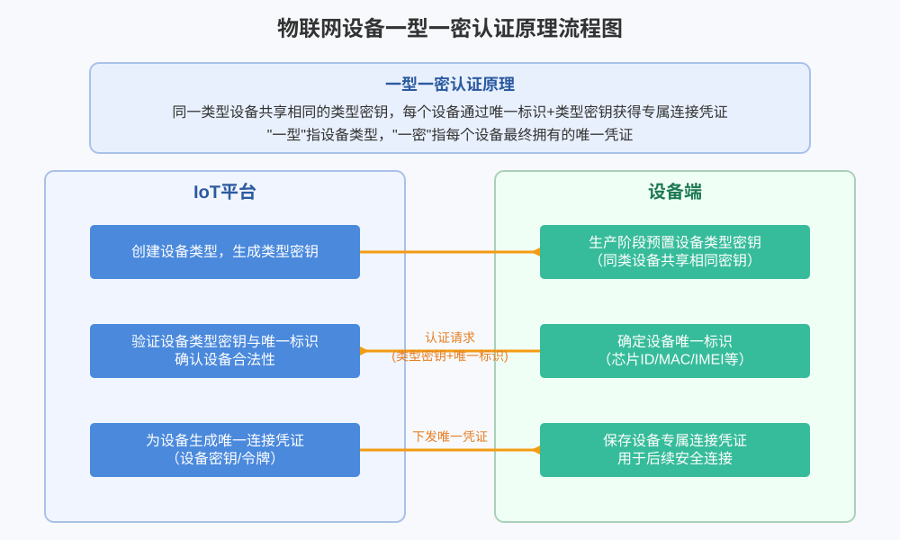
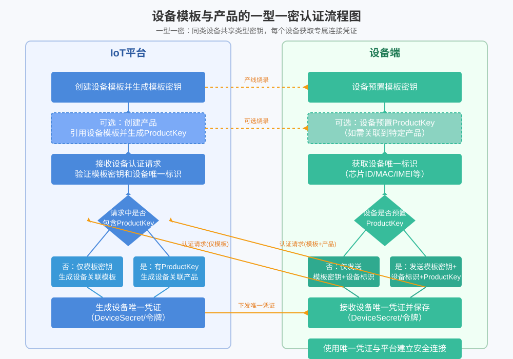
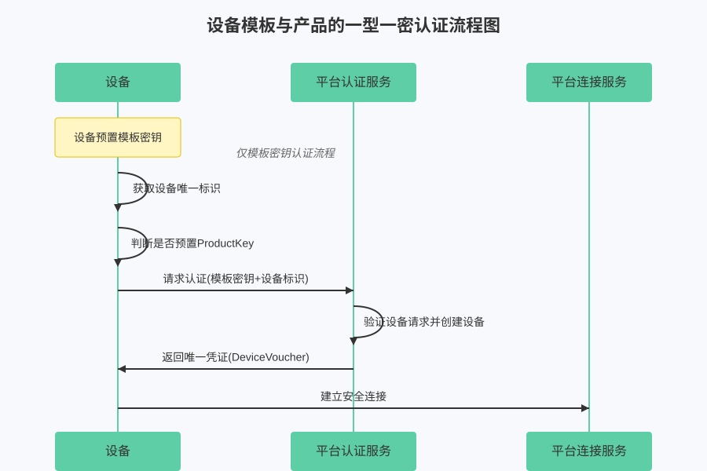
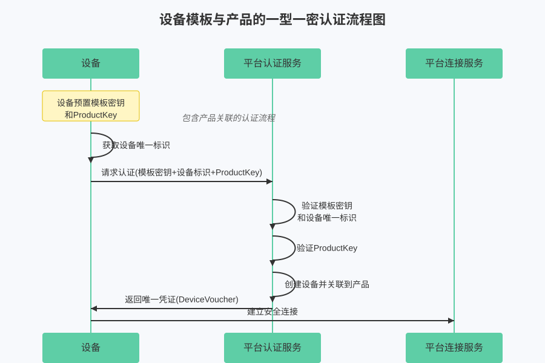

# 一型一密接入

## 核心原理



"一型一密"认证原理的核心在于：

- **"一型"**：代表一类设备共享相同的类型密钥
- **"一密"**：代表每个设备最终获得的专属唯一连接凭证

这种机制巧妙平衡了生产便利性和安全性，避免了为每台设备单独预置唯一密钥的复杂性。

### 认证流程三个关键环节

#### 1. 类型密钥预置阶段
- **平台侧**：创建设备类型，生成类型密钥
- **设备侧**：在生产阶段预置类型密钥（同类设备共享相同密钥）

#### 2. 设备认证阶段
- **设备侧**：确定自身唯一标识（如芯片ID、MAC地址、IMEI等）
- **设备侧→平台侧**：发送认证请求，包含类型密钥和唯一标识
- **平台侧**：验证设备类型密钥与唯一标识，确认设备合法性

#### 3. 凭证下发阶段
- **平台侧**：为合法设备生成唯一连接凭证
- **平台侧→设备侧**：下发设备专属连接凭证
- **设备侧**：保存连接凭证，用于后续安全连接

:::info

这种认证机制有效解决了物联网设备大规模部署时的安全与效率问题，适用于各种物联网平台和应用场景，不局限于特定厂商的实现。

:::

## ThingsPanel一型一密设计



### 仅使用模板密钥的认证流程


### 使用模板密钥+ProductKey的认证流程


## API接口说明

### 设备动态认证接口

**接口地址：** `POST /api/v1/device/auth`

**接口描述：** 支持设备一型一密动态认证，包含两种认证流程

#### 请求参数

| 参数名 | 类型 | 必填 | 说明 |
|--------|------|------|------|
| `template_secret` | string | ✅ | 模板密钥 |
| `device_number` | string | ✅ | 设备唯一标识（如MAC地址、IMEI等） |
| `device_name` | string | ❌ | 设备名称 |
| `product_key` | string | ❌ | 产品密钥，用于产品关联 |
| `parent_device_number` | string | ❌ | 父设备编号（子设备时必填） |
| `sub_device_addr` | string | ❌ | 子设备地址（子设备时必填） |

#### 请求示例

```json
{
  "template_secret": "your_template_secret",
  "device_number": "your_device_unique_id",
  "device_name": "设备名称",
  "product_key": "your_product_key"
}
```

#### 响应参数

| 参数名 | 类型 | 说明 |
|--------|------|------|
| `code` | integer | 状态码，200表示成功 |
| `message` | string | 响应消息 |
| `data` | object | 响应数据 |
| `└─ device_id` | string | 设备ID |
| `└─ voucher` | string | 设备连接凭证 |

#### 响应示例

```json
{
  "code": 200,
  "message": "操作成功",
  "data": {
    "device_id": "4e7e16dc-b1e7-5eef-32a6-48a7d767c85f",
    "voucher": "{\"username\":\"6c2f1bdc-6fc2-b535-f0ba-f77fe9dc6db1\"}"
  }
}
```

## 使用指南

### 🚀 准备工作
- 在平台创建设备模板并获取模板密钥
- 确定设备唯一标识（建议使用MAC地址、芯片ID等）
- 如需关联产品，准备产品密钥

### 📋 认证流程
1. 设备启动时发送认证请求到 `/api/v1/device/auth`
2. 平台验证模板密钥和设备标识
3. 平台返回设备ID和连接凭证
4. 设备保存凭证用于后续连接

### ⚠️ 注意事项
- 模板密钥在同类设备中共享，需妥善保管
- 设备唯一标识必须确保全局唯一
- 连接凭证应安全存储，避免泄露
- 建议在设备首次认证后本地缓存凭证