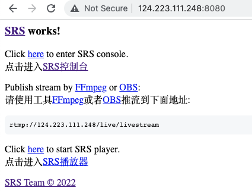
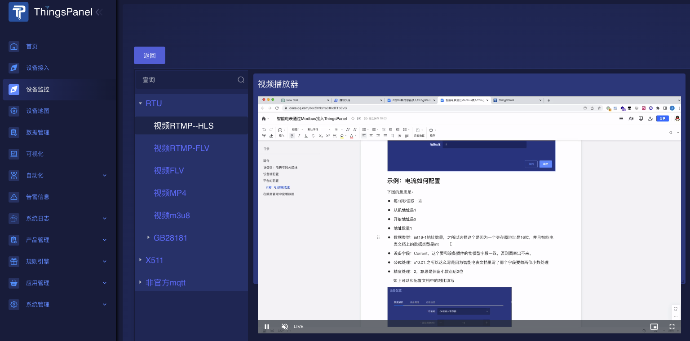

# RTMP摄像头接入
RTMP（Real-Time Messaging Protocol）摄像头是指使用RTMP协议进行视频传输的摄像头设备。RTMP是一种实时流媒体传输协议，最初由Adobe开发，用于在互联网上实现音视频的传输和播放。

RTMP摄像头通过将视频数据编码为RTMP流，并通过网络传输到服务器，实现实时的视频传输和直播。这种摄像头通常包含内置的编码器，可以将视频数据压缩为RTMP格式，然后通过网络发送到指定的服务器。摄像头还可能包含麦克风和音频编码器，以支持同时传输音频和视频。

## 准备工作
- 搭建服务
- 准备RTMP摄像头，测试可使用FFmpeg。
- 开放端口，分别是1935、1985、8080
  
## 操作步骤

### 1、搭建SRS

``` 
docker run --rm -it -p 1935:1935 -p 1985:1985 -p 8080:8080 \
registry.cn-hangzhou.aliyuncs.com/ossrs/srs:4 ./objs/srs -c conf/docker.conf
 ```
需要打开 1935 1985 8080 3个端口

访问服务器网址的8080端口

http://124.223.111.248:8080/


系统提示，推流到rtmp://124.223.111.248/live/livestream



### 2、推流

如下使用FFmpeg模拟摄像头进行推流：

```
ffmpeg -re -i ElectricityMeter.mp4 -c copy -f flv  rtmp://124.223.111.248/live/livestream
```
推流之后，在srs的后台可获得3个地址：
查看播放地址

- RTMP (by VLC): rtmp://124.223.111.248/live/livestream
- H5 FLV :http://124.223.111.248:8080/live/livestream.flv
- H5(HLS): http://124.223.111.248:8080/live/livestream.m3u8

### 3、在ThingsPanel中使用视频地址插件播放


