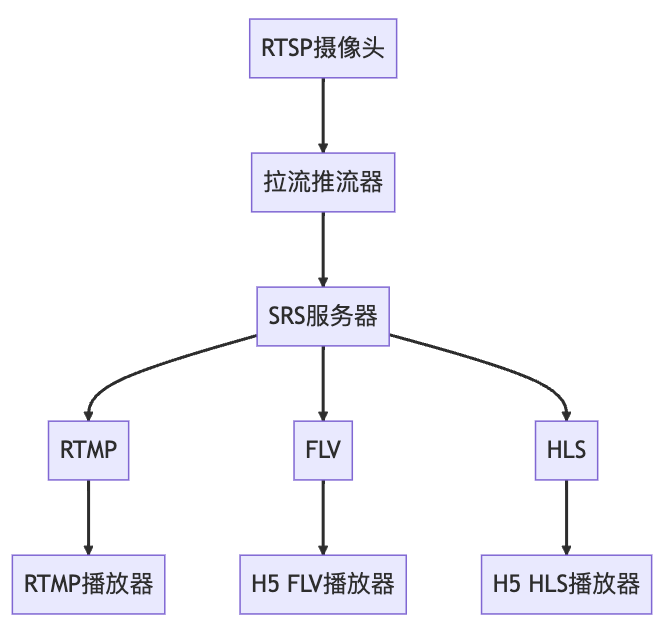

# RTSP摄像头接入

RTSP（Real Time Streaming Protocol）是一种用于实时音视频传输的协议，通常用于监控设备、视频会议等场景。

RTSP接入到ThingsPanel，可通过推流器方案实现，具体流程图如下：

## 流程图

推流器是一个硬件设备，其作用如图所示，从多个摄像头获得rtsp视频流，并推送到媒体服务器srs。再由srs进行视频分发。

在电商平台搜索“rtsp 推流”即可获得相关设备信息。

推流器部署在局域网，可以直接访问摄像头的rtsp视频流。部署和安装方法请按照推流器的手册进行。