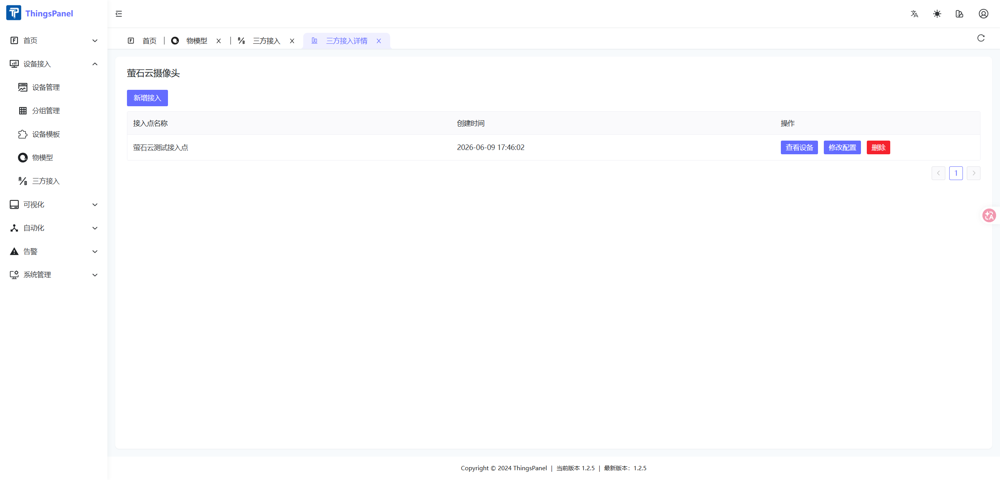
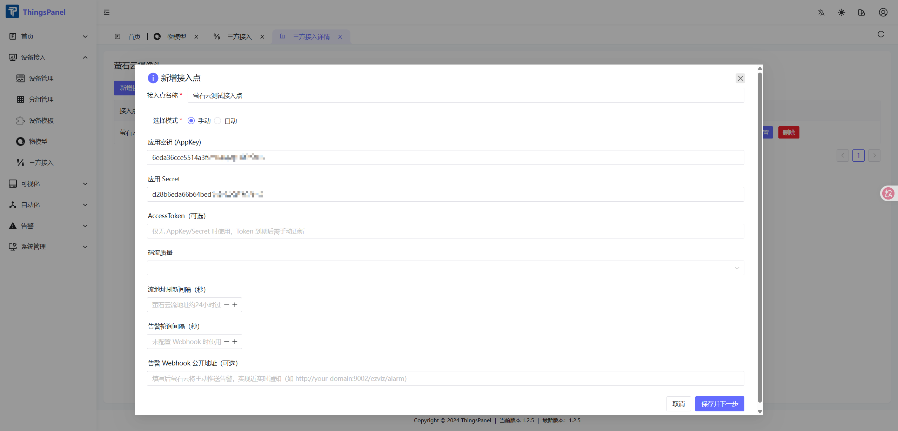
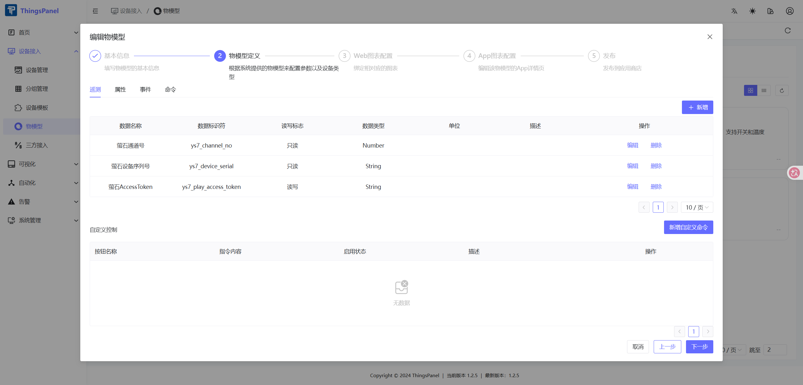
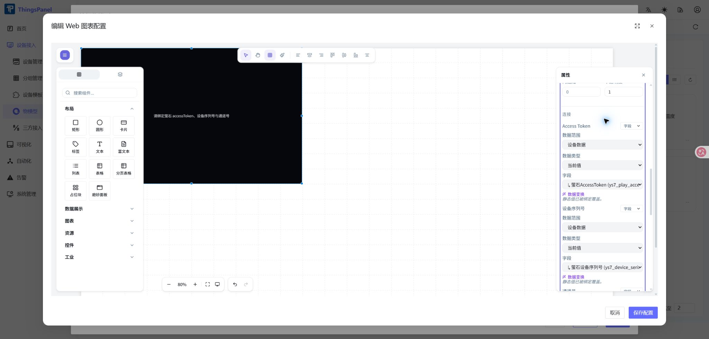
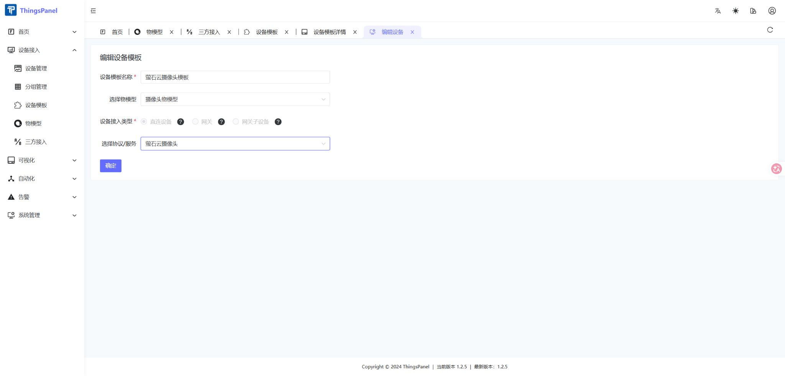
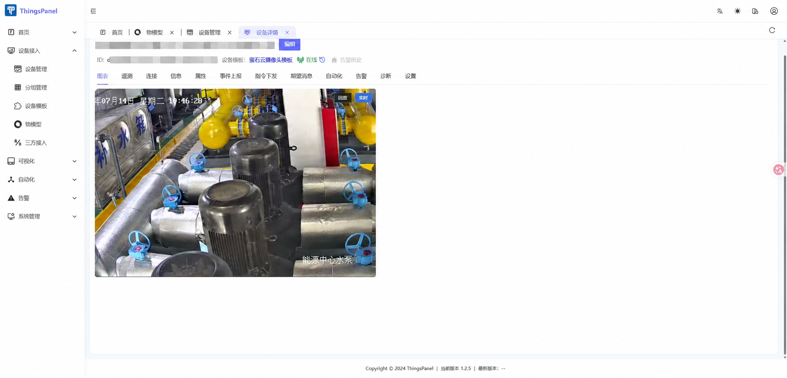

# EZVIZ Cloud Video Integration

ThingsPanel integrates EZVIZ Cloud cameras through the **EZVIZ Player** in ThingsVis.

The complete setup flow is:

```text
Configure the EZVIZ third-party service
  → Create a camera thing model and configure its Web chart
  → Create a device template and associate the thing model
  → Select the EZVIZ Camera service for the device template
  → Import and associate cameras from the EZVIZ service
  → Verify live view and playback on the device details page
```

## 1. Prepare the EZVIZ Open Platform Account

Before starting, make sure that:

- The cameras have already been added to EZVIZ Cloud.
- You have the AppKey and Secret of an application on the EZVIZ Open Platform.

## 2. Configure the EZVIZ Third-Party Service

Go to **Device Access → Third-Party Access**.

### 2.1 Select the EZVIZ Camera Service

Find and open **EZVIZ Camera** in the service list. If the service is unavailable, install or deploy the EZVIZ connector before creating EZVIZ devices.


### 2.2 Open the Access Point List

The service details page lists the configured access points. From this page, you can:

- Select **Add Access** to create an access point.
- Select **View Devices** to view synchronized cameras.
- Select **Modify Configuration** to update access-point settings.
- Delete an unused access point after migrating its associated devices.

One EZVIZ Open Platform application is normally configured as one access point. Create separate access points when different applications, accounts, or projects must be isolated.



### 2.3 Add an Access Point

Select **Add Access**, then configure the following fields:

| Setting | Required | Description |
| --- | --- | --- |
| Access point name | Yes | A recognizable name for the EZVIZ application or project |
| Selection mode | Yes | Manual mode lets you select devices; automatic mode synchronizes devices according to the service rules |
| AppKey | Yes | AppKey of the EZVIZ Open Platform application |
| Secret | Yes | Secret that belongs to the same application |
| AccessToken | No | Leave blank to let the server obtain it with AppKey and Secret; a manually entered token must be updated after it expires |
| Stream quality | No | Select according to the required image quality and available bandwidth |
| Stream URL refresh interval | No | Refresh interval for EZVIZ playback URLs; normally keep the default |
| Alarm polling interval | No | Used to poll alarm data when no webhook is configured |
| Public alarm webhook URL | No | A publicly reachable URL that receives alarms pushed by EZVIZ Cloud |

After confirming that AppKey and Secret belong to the same application, select **Save and Next** to choose cameras and their device template.



AppKey, Secret, and AccessToken are sensitive. Mask their complete values in screenshots, logs, and support requests.

## 3. Create the Camera Thing Model

Go to **Device Access → Thing Model**, select **Add Thing Model**, and create a model such as “EZVIZ Camera Model.”



Under **Model Definition → Attributes**, add these fields:

| Data name | Identifier | Data type | Access | Required | Description |
| --- | --- | --- | --- | --- | --- |
| EZVIZ AccessToken | `ys7_play_access_token` | String | Read/write | Yes | Obtained and periodically refreshed by the server |
| EZVIZ device serial | `ys7_device_serial` | String | Read-only | Yes | EZVIZ device serial number, for example `J33497352` |
| EZVIZ channel number | `ys7_channel_no` | Number | Read-only | Yes | Usually `1` for a single-channel device; supported range is `1`–`32` |
| Verification code | `validCode` | String | Read-only | No | Required when video encryption is enabled |

The thing model defines only the field structure. Do not put real tokens in model descriptions, screenshots, or frontend source code.

## 4. Configure the Web Chart

Open **Web Chart Configuration** after completing the model definition:

1. Add **EZVIZ Player**.
2. Bind **Access Token** to `ys7_play_access_token`.
3. Bind **Device Serial** to `ys7_device_serial`.
4. Bind **Channel Number** to `ys7_channel_no`.
5. For encrypted devices, bind **Verification Code** to `validCode`.
6. Select the Security UI template and choose HD or SD according to the network conditions.
7. Save the Web chart configuration and finish creating the thing model.



### Recording Storage Type

The recording storage type determines where historical recordings are read from:

| Type | Recording source | Requirements | Related settings |
| --- | --- | --- | --- |
| SD card | Camera storage card | An enabled SD card containing recordings for the selected time range | Cloud recording space ID and `busType` are not required |
| Cloud storage | EZVIZ Cloud recording space | An active EZVIZ Cloud storage service and an AccessToken with recording permissions | Enter the cloud recording space ID and `busType` when provided by EZVIZ |

- **Cloud recording space ID (`spaceId`)** identifies an EZVIZ Cloud recording space. Leave it blank when the EZVIZ API does not provide one.
- **Cloud recording `busType`** identifies the cloud recording business type. Enter it only when it is explicitly provided by the EZVIZ Open Platform or the project configuration.
- This option affects recording playback only; it does not affect live video.

## 5. Create a Device Template

Go to **Device Access → Device Template**, then create or edit the EZVIZ camera template:

1. Enter a template name, such as “EZVIZ Camera Template.”
2. Select the camera thing model created above.
3. Select **Direct Device** as the device access type.
4. Select **EZVIZ Camera** as the protocol/service.
5. Save the device template.



Associating only the thing model is not sufficient. The protocol/service must also be set to **EZVIZ Camera** so that synchronized cameras use the correct third-party service.

## 6. Import and Associate Cameras

Return to **Device Access → Third-Party Access**, open the **EZVIZ Camera** service, and select the cameras to import. Associate them with the EZVIZ camera device template.

Confirm that:

- The template uses the correct camera thing model.
- The template protocol/service is EZVIZ Camera.
- The synchronized device code contains the correct serial and channel information.
- The device status is Online.


## 7. Verify Device Attributes

Confirm that the device contains values for `ys7_play_access_token`, `ys7_device_serial`, and `ys7_channel_no`. If the connector maintains the token, it should report a new `ys7_play_access_token` whenever the token is refreshed.

## 8. Verify Live View and Playback

Open **Device Management → Device Details → Chart**. The integration is working when the player displays the live video and the device status is Online.



The player also supports live/recording switching, mute, screenshots, local recording, digital zoom, quality selection, and full screen.

## 9. Troubleshooting

### The player reports missing bindings

Confirm that `ys7_play_access_token`, `ys7_device_serial`, and `ys7_channel_no` are bound to the player and have device values.

### The token is invalid or expires during use

Use AppKey and Secret on the server to obtain a new AccessToken, then update the device attribute. Never request a token with Secret in frontend code.

### An encrypted device cannot play video

Add `validCode` to the thing model and report the verification code printed on the device label.

### The serial and channel are correct, but playback still fails

Confirm that the camera is online, belongs to the expected EZVIZ account, and is accessible to the EZVIZ Open Platform application.
