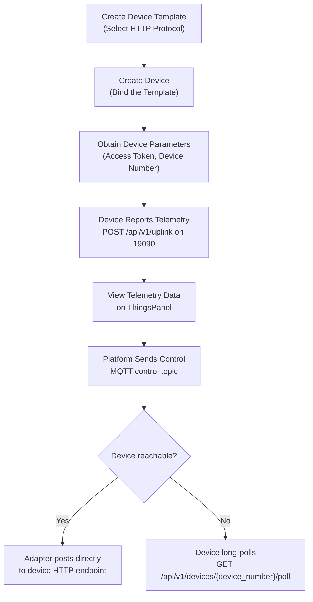

# HTTP

HTTP Protocol Access allows devices that do not natively support MQTT to exchange data with ThingsPanel through standard HTTP requests. Devices report telemetry to the HTTP adapter; ThingsPanel sends commands or control messages through MQTT; the adapter supports both direct HTTP downlink and device long polling.

## Repository

[ThingsPanel/thingspanel-adapter-http](https://github.com/ThingsPanel/thingspanel-adapter-http)

## Prerequisites

Install ThingsPanel Community Edition using the [official installer](http://install.thingspanel.io/) (HTTP device access service is included), or deploy from source. If deploying from source, register the HTTP Protocol Access Plugin in the **System Administrator** panel before use.

## Port Responsibilities

| Port | Owner | Purpose |
|---|---|---|
| `19090` | HTTP adapter | Device-facing API: uplink, poll, ack |
| `19091` | HTTP adapter | Platform callback and health endpoints |
| `8080` | Device side | Default direct downlink receiver port for `/api/v1/control` and `/api/v1/command` |

Device uplink, long polling, and ack requests use `19090`. Platform callbacks use `19091`.

## Device Identity

Devices identify themselves with `device_number`, for example `D001`. The platform's internal `device_id` is assigned by ThingsPanel and is resolved by the adapter after querying device configuration. Device payloads and long-poll URLs should use `device_number`, not `device_id`.

## Operation Flowchart



## Onboarding Steps

### Create Device Template

1. Log in to ThingsPanel as a tenant.
2. Go to **Device Connectivity** -> **Device Template**, click **Create Template**, select **Direct Device** -> **HTTP Protocol**, then save.


### Create Device

1. Go to **Device Connectivity** -> **Device Management**, click **Add Device**, select the HTTP Protocol template created above.


2. Fill in the Access Token (must be unique per device) and save.


3. Click the **Edit** button on the device card to open device details. Locate and record the **Device Number**. This is the unique identifier used in HTTP payloads, long-poll URLs, and control topics.


### Send Telemetry Data

Devices send data via HTTP POST to the adapter uplink endpoint. Replace `YOUR_ACCESS_TOKEN` and `YOUR_DEVICE_NUMBER` with values from your device.

```bash
curl -X POST http://127.0.0.1:19090/api/v1/uplink \
  -H "Content-Type: application/json" \
  -H "Access-Token: YOUR_ACCESS_TOKEN" \
  -d '{
        "device_number": "YOUR_DEVICE_NUMBER",
        "temp": 25.5,
        "hum": 60.2,
        "status": "active"
      }'
```

:::info Request Format
| Field | Description |
|---|---|
| `Access-Token` header | Device access token configured on the platform |
| `device_number` in body | Device number assigned by the platform, for example `D001` |
| JSON body | Arbitrary telemetry key-value pairs |
:::

## Downlink Modes

### Direct Mode

Use direct mode when the device or middleware has a public/reachable HTTP endpoint.

Set optional `downlinkHost` in the device voucher. The adapter posts directly to:

```text
POST http://downlinkHost:8080/api/v1/control
POST http://downlinkHost:8080/api/v1/command
```

Control request body:

```json
{
  "tp_device_number": "D001",
  "values": {
    "xx": 11
  }
}
```

Command request body:

```json
{
  "tp_message_id": "msg-001",
  "tp_device_id": "platform-device-id",
  "tp_device_number": "D001",
  "method": "set",
  "params": {}
}
```

The device must expose an HTTP server for the configured downlink paths. A client that only reports telemetry will not receive direct control commands.

### Long Polling Mode

Use long polling when the device is behind NAT or otherwise not reachable by the adapter.

If `downlinkHost` is empty, downlink messages are queued for the device to fetch. If direct mode is configured but the direct request fails, the adapter also falls back to the long-poll queue.

```text
GET http://adapter-host:19090/api/v1/devices/{device_number}/poll
```

The poll request waits up to 30 seconds.

No pending message:

```json
{
  "commands": []
}
```

Pending command:

```json
{
  "commands": [
    {
      "type": "command",
      "device_number": "D001",
      "message_id": "msg-001",
      "method": "set",
      "params": {}
    }
  ]
}
```

After executing a command from poll, the device reports the result:

```text
POST http://adapter-host:19090/api/v1/devices/{device_number}/commands/{message_id}/ack
```

```json
{
  "ok": true,
  "data": {}
}
```

Authentication uses the device `accessToken` from the voucher. Send it as `X-Api-Key`, `Access-Token`, or `Authorization: Bearer <token>`.

### Platform Control Topic

The platform sends HTTP device control messages through the plugin MQTT topic:

```text
plugin/HTTP/devices/telemetry/control/<device_number>
```

Example:

```text
plugin/HTTP/devices/telemetry/control/D001
```

Payload:

```json
{
  "xx": 11
}
```

## Form Configuration

The plugin returns two groups of device configuration fields to the frontend:

| Group | Field | Description |
|---|---|---|
| CFG | `port` | Direct device downlink port, default `8080`. |
| CFG | `controlUrl` | Device control path, default `/api/v1/control`. |
| CFG | `commandUrl` | Device command path, default `/api/v1/command`. |
| VCR | `accessToken` | Device credential used for uplink, poll, and ack authentication. |
| VCR | `downlinkHost` | Optional direct downlink host. Leave empty for long polling mode. |

## Virtual Device Test

Long polling test:

```powershell
go run .\cmd\virtual_device -server http://127.0.0.1:19090/api/v1/uplink -device D001 -token YOUR_ACCESS_TOKEN
```

Direct downlink test:

```powershell
go run .\cmd\virtual_device -server http://127.0.0.1:19090/api/v1/uplink -device D001 -token YOUR_ACCESS_TOKEN -poll=false -listen :8080
```

For direct mode, set the device voucher `downlinkHost` to `127.0.0.1` and keep the default port `8080`.

## View Telemetry Data

After the device successfully reports data, it appears online. You can view real-time telemetry on the device detail page.


## Common Issues

1. **Device not found**: Confirm the ThingsPanel device exists and its device number matches the `device_number` in payloads and URLs.
2. **SDK log shows empty `deviceID` while querying**: Device uplink queries configuration by `device_number`. The SDK log only prints `deviceID`, so an empty value there does not mean the adapter used `device_id`.
3. **No response when reporting data**: Verify that the `Access Token` matches the platform configuration, and that the device network can reach the adapter uplink port `19090`.
4. **Adapter not started**: Confirm the device uplink port `19090` is not already in use (Linux: `netstat -tulpn | grep 19090`).
5. **Platform connection failed**: Confirm `platform.url` in `configs/config.yaml` is reachable from the adapter host, and that the configured MQTT broker is running.
6. **Direct downlink connection refused**: Confirm the device has an HTTP server listening on `downlinkHost:port/controlUrl` or `commandUrl`.
7. **Long polling keeps returning an empty queue**: Confirm the platform sent the downlink to the expected `device_number`, and that `downlinkHost` is empty or direct mode failed and fell back to polling.
