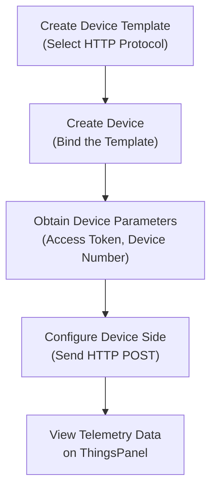
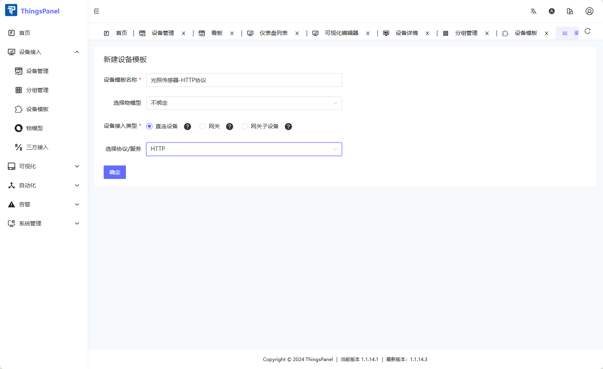
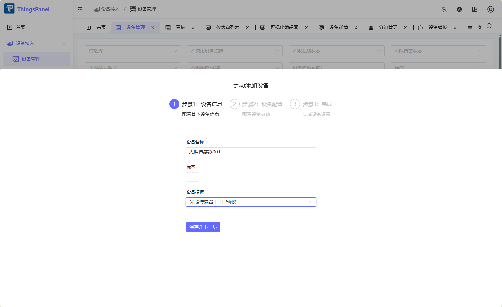
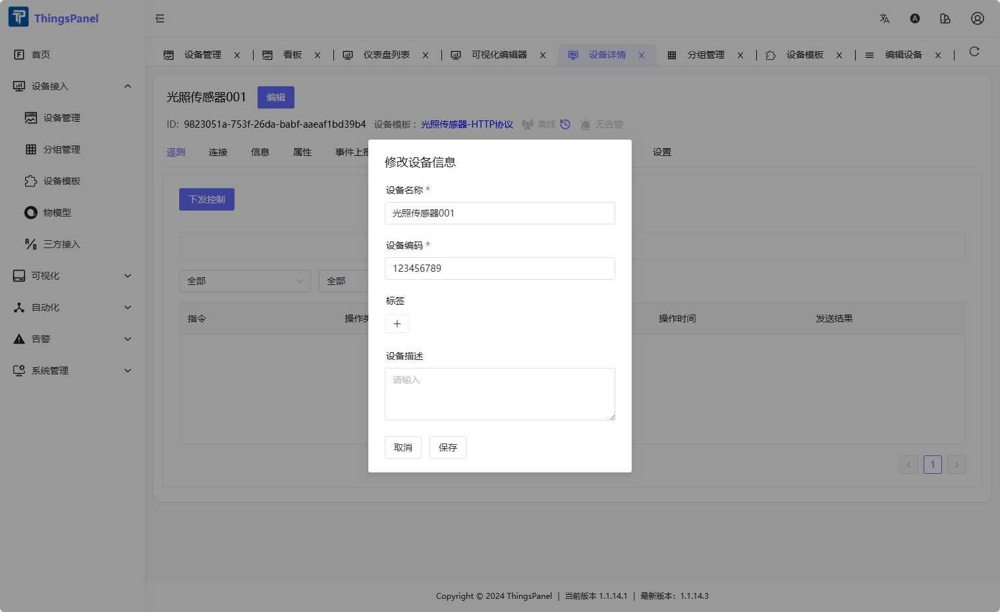
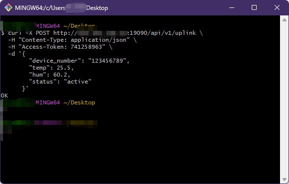

# HTTP

HTTP Protocol Access allows devices that do not natively support MQTT to send telemetry data to ThingsPanel via standard HTTP POST requests. It is ideal for resource-constrained devices, embedded systems, or any environment where deploying an MQTT client is impractical.

## Repository

[ThingsPanel/thingspanel-adapter-http](https://github.com/ThingsPanel/thingspanel-adapter-http)

## Prerequisites

Install ThingsPanel Community Edition using the [official installer](http://install.thingspanel.io/) (HTTP device access service is included), or deploy from source. (If deploying from source, register the HTTP Protocol Access Plugin in the **System Administrator** panel before use.)

The default device uplink port for community deployments is `19090`.

## Operation Flowchart



## Onboarding Steps

### Create Device Template

1. Log in to ThingsPanel as a tenant.
2. Go to **Device Connectivity** → **Device Template**, click **Create Template**, select **Direct Device** → **HTTP Protocol**, then save.



### Create Device

1. Go to **Device Connectivity** → **Device Management**, click **Add Device**, select the HTTP Protocol template created above.



2. Fill in the Access Token (must be unique per device) and save.


3. Click the **Edit** button on the device card to open device details. Locate and record the **Device Number** — this is the unique identifier used in HTTP payloads.



### Send Telemetry Data

Devices send data via HTTP POST to the plugin's uplink endpoint. Replace `YOUR_ACCESS_TOKEN` and `YOUR_DEVICE_NUMBER` with values from your device.

```bash
curl -X POST http://127.0.0.1:19090/api/v1/uplink \
  -H "Content-Type: application/json" \
  -H "Access-Token: YOUR_ACCESS_TOKEN" \
  -d '{
        "device_number": "YOUR_DEVICE_NUMBER",
        "temp": 25.5,
        "hum": 60.2,
        "status": "active"
      }'
```

:::info Request Format
| Field | Description |
|---|---|
| `Access-Token` header | Device access token (configured in step above) |
| `device_number` in body | Device number assigned by the platform |
| JSON body | Arbitrary telemetry key-value pairs |
:::

### View Telemetry Data

After the device successfully reports data, it appears online. You can view real-time telemetry on the device detail page.



## Common Issues

1. **No response when reporting data**: Verify that the `Access Token` matches the platform configuration, and that the device network can reach the plugin port.
2. **Plugin not started**: Confirm the `http_port` is not already in use (Linux: `netstat -tulpn | grep 19090`).
3. **Platform connection failed**: Confirm the `platform.url` in `configs/config.yaml` is reachable from the plugin host.
4. **Data fails in Docker environments**: Ensure the device uses the host machine IP, not `127.0.0.1` or a container-internal IP.
