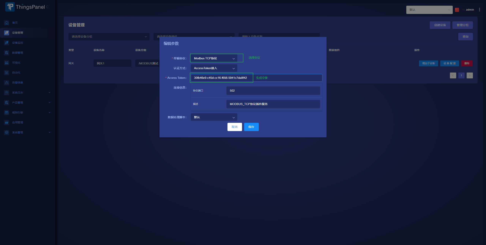
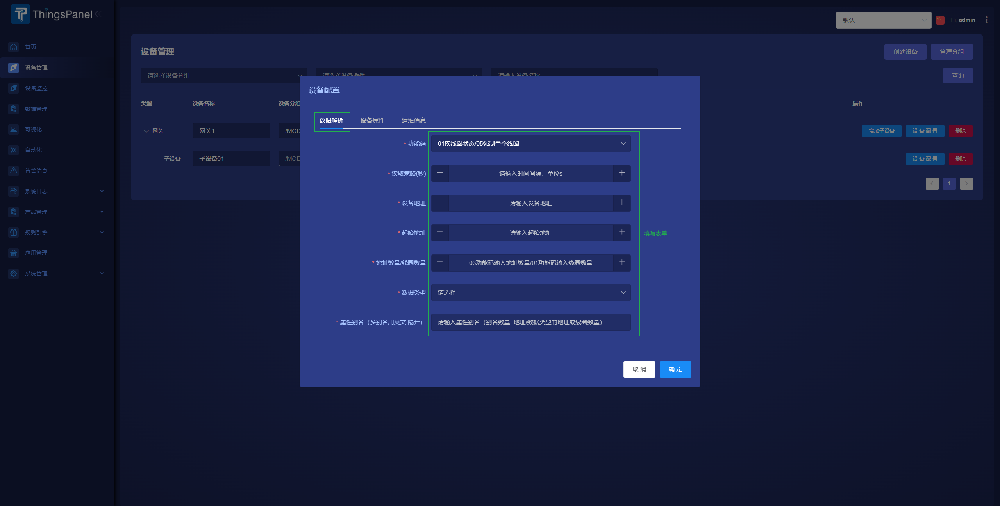

# ModBus接入

## 什么是modbus协议

Modbus是一种串行通信协议，是Modicon公司（现在的施耐德电气 Schneider Electric）于1979年为使用可编程逻辑控制器（PLC）通信而发表。Modbus已经成为工业领域通信协议事实上的业界标准，并且现在是工业电子设备之间常用的连接方式。

Modbus允许多个 (大约240个) 设备连接在同一个网络上进行通信，举个例子，一个由测量温度和湿度的设备，并且将结果发送给计算机。在数据采集与监视控制系统（SCADA）中，Modbus通常用来连接监控计算机和远程终端控制系统（RTU）

ThingsPanel的Modbus协议设备接入方式有以下两种

## 第一种 通过规则引擎接入

【ThingsPanel对接ModBus设备(通过规则引擎)】  
https://www.bilibili.com/video/BV1s14y1h7YQ?share_source=copy_web&vd_source=ffdc396f72a54b325037ada71bc99b05

如私有化部署需要自行安装modbus节点，一般需要进入容器执行命令安装运行环境
```bash
docker exec -it containerID /bin/sh
apk add gcc g++ make cmake gfortran libffi-dev openssl-dev libtool
```

## 第二种 使用协议插件的方式接入
协议插件可自行开发，也可直接使用官方提供的协议插件  
官方插件：https://github.com/ThingsPanel/modbus-protocol-plugin.git
### 使用官方Modbus协议插件的方式接入
官方提供的Modbus协议插件是单独运行的服务，通过Modbus协议插件，设备就可以跟平台交互数据。协议插件可以与ThingsPanel在同一台计算机上运行，也可以在另一台可通过网络访问ThingsPanel实例的计算机上运行。  
另外，根据需要也可自行开发的协议插件。
#### 协议分类
Modbus协议插件支持两种模式接入：
1. Modbus TCP模式
2. Modbus RUT模式
#### 接入步骤
1. 创建设备->选择网关->编辑参数->选择`Modbus TCP协议`或`Modbus RUT协议`；认证方式为默认的AccessToken接入，这里会生成AccessToken，设备与协议插件服务建立连接后需要推送AccessToken完成认证。

3. 增加子设备，点子设备的设备配置按钮，在解析数据栏出现配置表单。（默认大端模式）

5. 参数说明：
    - 功能码
    - 读取策略（秒）：获取设备属性的时间间隔
    - 设备地址：对应RTU模式的地址码或TCP模式的单元标识符
    - 起始地址：读取信息的其实地址（十进制）
    - 地址数量/线圈数量：一次读取的寄存器地址数量或线圈个数，必须是数据类型后地址数量的整数倍
    - 数据类型：同一个子设备只能读取同一种数据类型的数据，必须
    - 属性别名（多别名用英文,隔开）：别名的数量是地址数量或线圈数量除数据类型后的地址数
6. 对接设备（可使用MThing上位机模拟设备对接）
7. 查看数据管理是否收到数据
8. 选择合适的设备插件绑定到子设备，然后可查看数据可视化


