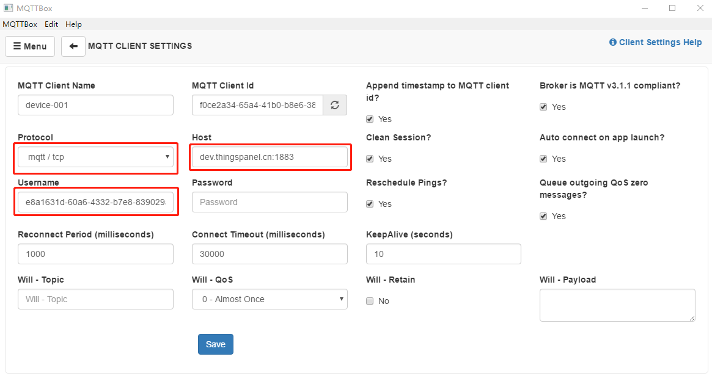

# 设备MQTT接入

## 什么是MQTT

消息队列遥测传输（英语：Message Queuing Telemetry Transport，MQTT）是ISO 标准（ISO/IEC PRF 20922）下基于发布 (Publish)/订阅 (Subscribe)范式的消息协议，可视为“资料传递的桥梁”，它工作在 TCP/IP协议族上，是为硬件性能低下的远程设备以及网络状况糟糕的情况下而设计的发布/订阅型消息协议，为此，它需要一个消息中间件，以解决当前繁重的资料传输协议，如：HTTP。
MQTT 是一种简单的消息传递协议，设计用于具有低带宽的受限设备。因此，它是物联网设备接入的完美解决方案。

## ThingsPanel支持的接入
ThingsPanel平台提供了标准的 MQTT 接入协议，支持 MQTT v3.1/v.5，任何支持 MQTT 协议的设备都可以通过相应的 MQTT 客户端代码接入平台。

## 设备MQTT接入方式
* MQTT设备可以直接接入到系统中。
* MQTT设备如果是网关，一种方式是通过规则引擎转化为标准设备再接入到系统中。

| 接入类型 | 认证 | 接入地址|
| ----- | --- | -------- |
| MQTT | username/password普通认证方式 | mqtt://{服务IP}:1883|



## MQTT身份认证
| MQTT | 连接参数 | 值 | 说明 |
| ---- | ----- | ---- | ---------- |
| username | AccessToken | 设备创建后自动生成（用户也可自己修改），每个设备唯一。 |
| password | password | 创建设备后可选输入项 |
| clientId | 随机 | 为保证设备安全，客户端id请使用大于6位的随机字符 |

:::info

ThingsPanel 对同一个设备身份信息只支持一个 MQTT 连接，如果在两个或多个物理设备中，使用同样的 username/password 身份信息连接，平台仍然将这些连接视为同一个设备，这会导致后一个设备连接成功后会顶掉之前的设备连接。

:::

## MQTT主题

### 设备发布主题
| 消息类型 | 主题 |
| --- | --- |
| 设备上报属性主题 | device/attributes |
| 网关设备上报属性主题 | gateway/attributes |
| 设备上报事件主题 | device/event |
| 设备服务指令响应主题 | device/command/reply |

#### 上报属性消息规范

``` showLineNumbers
{key1:value1, key2:value2 ...}
```
例如：
```json showLineNumbers
{"temp":18.5, "hum":40}
```

### 设备订阅主题
| 消息类型 | 主题 |
| --- | --- |
| 订阅属性主题 | device/attributes/{AccessToken} |
| 网关设备订阅属性主题 | gateway/attributes/{AccessToken} |
| 事件上报的响应主题 | event/response/{accesstoken} |
| 服务指令主题 | command/send/{accesstoken} |
