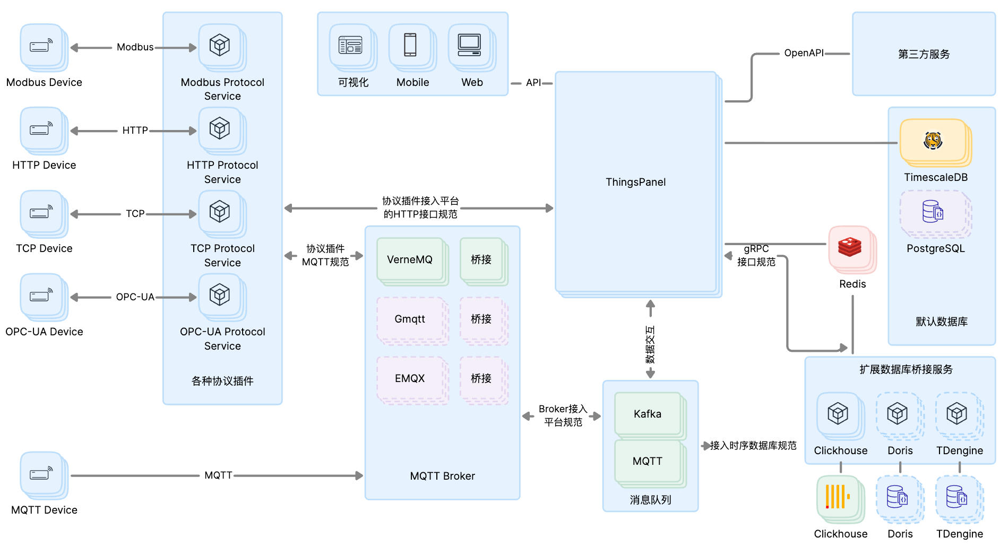
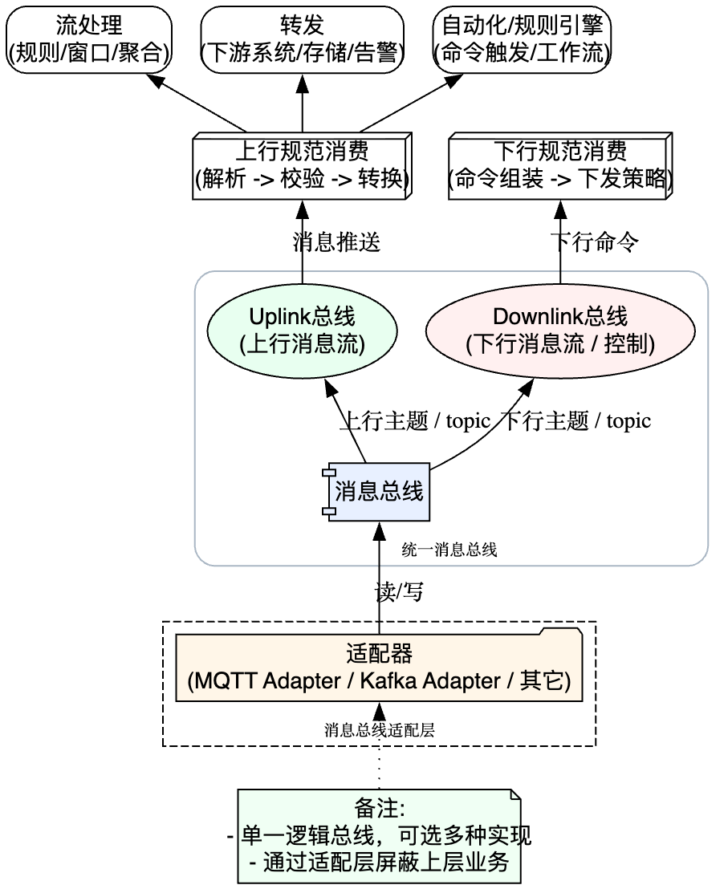
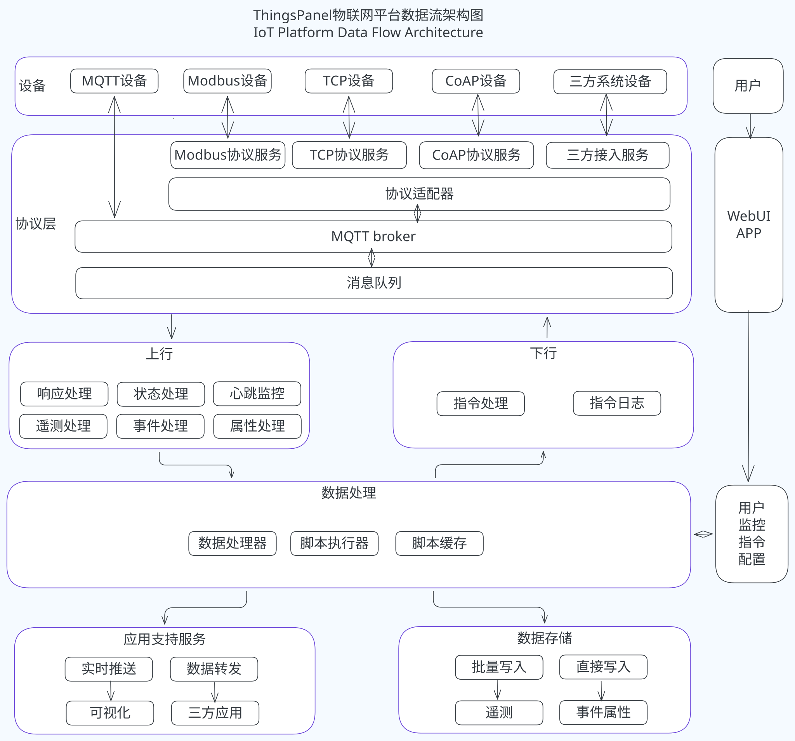

# 系统架构

**ThingsPanel设计优势**：

- **高性能分布式架构**：使用领先的开源技术构建，支持水平扩展，单节点支持万级设备接入，集群可处理百万级设备。
- **灵活的插件化设计**：通过插件方式可方便地增加新的功能和适配新的设备，支持协议、数据库、服务的灵活扩展。
- **高可用性保障**：集群中的每个节点都是对等的，无单点故障，支持服务自动容错和恢复。
- **开放的集成能力**：提供标准化的 API 接口，支持第三方系统快速集成。

参见如下架构图及关键组件。
## ThingsPanel系统架构图

说明：

- **设备接入服务**：ThingsPanel 支持多种通信协议，包括 Modbus、HTTP、TCP、OPC-UA 等，通过对应的设备接入服务与 IoT 设备进行连接和通信。这种设计可以帮助用户轻松扩展到新的设备和协议，确保与众多 IoT 设备的兼容性。

- **MQTT Broker集群**：VerneMQ、GMQTT 等各种知名的 MQTT Broker，为 IoT 设备提供高性能、高可靠性的消息传递服务。可以根据需求选择合适的 Broker。

- **数据库**：支持多种数据库如 Cassandra 和 TDengine 等分布式存储数据库，这提供了数据的高可用性、扩展性和灵活性，为 IoT 提供了高效、可靠的数据存储解决方案。可以根据实际需求选择合适的数据库。

- **部署**：ThingsPanel 的架构设计考虑到了高可用性和扩展性，确保没有单点故障，每个组件都可以进行水平扩展。

- **设备接入服务**：通过设备接入服务的设计，ThingsPanel 可以轻松地扩展新的功能和服务，满足不断变化的业务需求。

- **插件化**：协议、数据库和 Broker 都是通过插件的形式实现的，这种模块化的设计可以方便地增加新的功能和适配新的设备，同时也使得维护更为简单。

- **跨平台接入**：ThingsPanel 支持多种终端接入，包括移动端、Web 端等。这意味着用户可以在任何设备上访问和管理他们的物联网设备。

- **API接口体系**：
  - REST API：提供标准的 HTTP 接口，支持设备管理、数据查询等操作
  - WebSocket：支持实时数据推送和设备状态监控
  - 认证机制：支持 Token、签名等多种认证方式
  - 数据服务：支持实时数据订阅、历史数据查询、批量数据处理等功能

- **集中管理**：ThingsPanel 作为核心的管理平台，可以集中处理多种设备、协议和存储的数据，这简化了管理工作并提高了效率。
---

## ThingsPanel物联网消息总线架构图 (IoT Message Bus Architecture)

---

### 架构概述

该架构以 **“统一消息总线（Unified Message Bus）”** 为核心，构建了一个松耦合、高扩展、可观测的物联网耦合组织体系。
它通过**适配层**屏蔽不同协议差异（MQTT、Kafka 等），实现上下行消息的规范化处理、流式计算与命令控制。

整体结构可以概括为三层：

| 层级                                     | 模块                       | 功能定位                  |
| -------------------------------------- | ------------------------ | --------------------- |
| **接入层（Adapter Layer）**                 | 适配器（MQTT / Kafka / 其他）   | 接入多种通信协议并转化为统一总线格式    |
| **核心层（Message Bus Layer）**             | 统一消息总线、Uplink/Downlink 流 | 承载上行与下行消息流动，实现解耦与隔离   |
| **处理层（Processing & Automation Layer）** | 上行消费、流处理、转发、自动化、下行命令组装   | 实现数据处理、规则引擎、控制下发等业务逻辑 |

---

###  模块功能说明

#### 1. 消息总线适配层（Adapters）

* 支持 **MQTT、Kafka* 等多种消息队列。
* 通过适配器模块将设备消息转化为统一的总线格式。
* 屏蔽不同底层通信协议的差异，为上层提供一致的接口。

> ✅ **好处：** 新增协议接入时无需修改上层业务逻辑。

#### 2. 统一消息总线（Message Bus）

* 架构的核心通信枢纽。
* 提供**上行（Uplink）**与**下行（Downlink）**双向消息流：

  * **Uplink**：设备 → 平台（状态上报、事件通知等）
  * **Downlink**：平台 → 设备（控制指令、配置下发等）
* 支持主题（Topic）机制，实现灵活订阅与广播。

> ✅ **好处：**
>
> * 解耦设备端与业务端；
> * 实现多模块并行开发；
> * 提高系统扩展性与稳定性。

#### 3. 上行数据处理链

| 模块           | 功能                        |
| ------------ | ------------------------- |
| **上行规范消费**   | 消息解析、校验、格式转换为标准化数据模型      |
| **流处理**      | 实时规则计算、窗口聚合、数据过滤          |
| **转发模块**     | 将结果数据推送至下游系统（数据库、告警、分析平台） |
| **自动化/规则引擎** | 基于事件触发动作（例如报警、控制命令、工作流）   |

> ✅ **价值：** 实现实时决策与业务联动，使 IoT 数据具备可操作性。

#### 4. 下行控制链

| 模块          | 功能                     |
| ----------- | ---------------------- |
| **下行规范消费**  | 将上层命令转化为设备可识别的协议格式     |
| **配置/控制模块** | 管理下发策略（限流、重试、优先级、超时控制） |

> ✅ **价值：** 提高命令可靠性和可控性，确保设备操作安全有效。

---

###  架构优势

| 优势类别       | 说明                     |
| ---------- | ---------------------- |
| **统一通信标准** | 通过消息总线实现协议统一与主题化管理     |
| **高扩展性**   | 适配层与总线解耦，可自由扩展设备类型与协议  |
| **高可维护性**  | 各处理模块独立部署与扩展，方便灰度与热更新  |
| **实时与可靠性** | 流式处理与策略控制模块确保数据实时与命令可靠 |
| **业务灵活性**  | 可快速实现复杂业务逻辑  |
| **生态兼容性**  | 易于与大数据、AI、告警、存储系统对接    |

### 对用户与企业的价值

| 用户/企业类型           | 获得的价值                |
| ----------------- | -------------------- |
| **设备厂商**          | 快速接入平台，无需关注底层协议适配    |
| **开发者**           | 使用统一接口实现数据消费与控制逻辑    |

---

## ThingsPanel物联网平台数据流架构图IoT Platform Data Flow Architecture

---

该架构设计了一个五层数据处理流水线，负责管理从物联网设备到应用/数据库的**全部上行和下行数据流**。

###  核心架构层次与职责

| 层次 | 核心职责 | 举例说明 |
| :--- | :--- | :--- |
| **Adapter (协议适配)** | 屏蔽协议差异，统一数据格式。 | 消息队列适配，支持 **MQTT、Kafka** 。 |
| **Uplink (上行处理)** | 路由、解码、分发上行数据。 | 调用 Processor 解码，将遥测数据发往 **Storage 和 Forwarder**。 |
| **Processor (数据处理)** | 执行脚本，完成数据的编解码（原始 $\leftrightarrow$ 标准 JSON）。 | 运行 **Lua 脚本**将设备自定义格式数据转换为平台标准 JSON。 |
| **Storage (存储)** | 优化写入数据库。 | **批量写入**遥测历史、更新最新值、存储属性/事件。 |
| **Downlink (下行指令)** | 处理平台指令请求，编码后下发给设备。 | 将 API 的命令请求编码，通过 **Adapter** 发送给设备。 |

---

### 价值分析与对比

#### 解决的核心问题

| 针对痛点 | 解决方案 |
| :--- | :--- |
| **代码耦合、难以维护** | 引入五层架构，**职责分离**，如 Adapter 仅负责协议，Processor 仅负责脚本。 |
| **协议扩展困难** | **Adapter 层抽象**，支持 MQTT、Kafka，未来新增协议只需实现新的 Adapter 即可。 |
| **处理性能瓶颈** | 采用 **Channel 异步处理、批量写入（遥测）、脚本缓存、协程池**等机制，实现高并发、高性能。 |
| **缺乏监控** | 完善**日志、指标体系（Prometheus）**，增强可观测性。 |

#### 核心好处（架构优势）

1.  **高扩展性（协议无关）**: `Adapter/Publisher` 接口的设计使得新协议接入成本极低。
2.  **高并发与高性能**:
    * **异步消息总线（Bus/Channel）**: 实现层与层之间的解耦和**背压控制**。
    * **批量写入**: 对遥测数据进行性能优化。
    * **脚本沙箱与缓存**: 保障执行效率和安全性。
3.  **高内聚低耦合**: 各层模块高度独立，便于**单元测试、模块替换和独立维护**。
4.  **功能完备**: 全面覆盖了数据解码、网关拆分、历史数据、心跳状态、指令下发、数据转发等**物联网核心功能**。

#### 同类对比的优势

该架构的优势在于其清晰的**分层**和对关键**性能点**的优化：

* **设计模式应用得当**: 有效应用了**生产者-消费者模式**（Channel）、**适配器模式**（Adapter）、**策略模式**（Processor），避免了“大函数体”的混乱。
* **兼顾性能与功能**: 既有高性能的处理机制（批量写入、异步），又具备复杂的业务处理能力（网关拆分、历史数据支持）。
* **数据流向可控**: 上下行链路职责清晰，**故障定位和流程追踪**更加简单。

---

### 对用户（平台使用者）的价值

| 方面 | 用户价值 |
| :--- | :--- |
| **稳定性和可靠性** | **高并发、异步处理**和容错设计（后续优化）保证**数据不丢失、不积压**。 |
| **快速接入新设备** | Processor 层抽象，用户只需编写不同设备的**编解码脚本（Lua）**，即可快速对接新设备和自定义协议。 |
| **灵活的平台集成** | **Forwarder 机制**允许将处理后的标准数据转发到其他系统（如大数据湖、业务应用），方便平台间的集成。 |
| **可观测性** | 完善的**日志和监控指标**，使得运维人员能够快速发现和定位问题。 |

---

