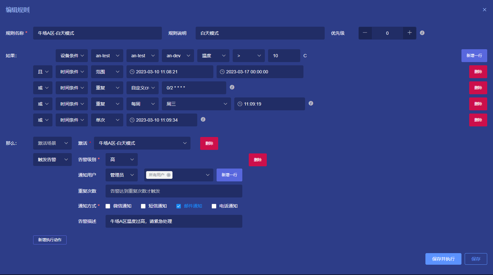
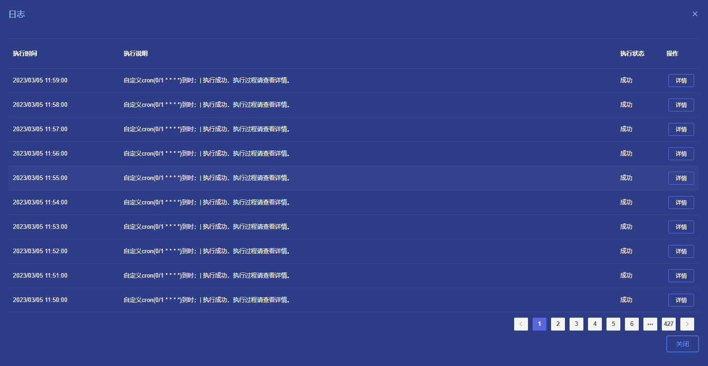
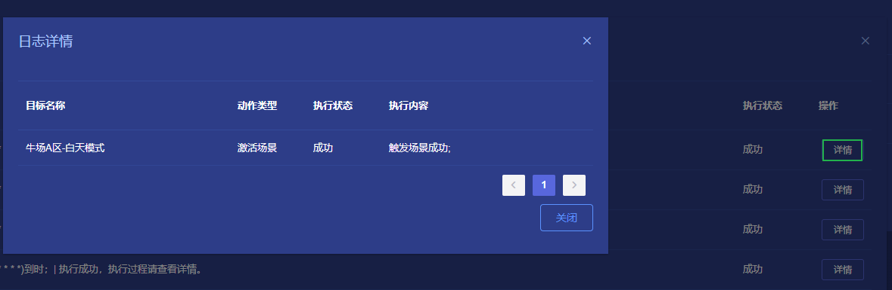

# 自动化
通过配置自动化业务流程的方式，管理和控制生产过程中的各项运行和生产活动。用来提高工业生产效率和品质，减少生产成本和劳动力，降低生产事故发生率。

:::caution

在配置**设备条件**的时候，需要设备绑定插件才能选择属性和事件。

::: 

## 功能介绍

ThingsPanel的自动化包括场景联动与场景管理。

场景联动：添加和编辑场景联动的规则，包括设备触发和时间触发两种。

场景管理：添加可被批量管理的设备。

## 场景联动操作步骤

**前置条件**：已经对接好设备并给设备绑定了插件。

1. **新增规则**  
    点击`新增规则`按钮填写表单；  
    `如果`是触发条件，`那么`是执行动作；  
    **设备条件**：  
        - 设备的属性、事件、上下线；  
    **时间条件**：  
        - 单次；
        - 重复，包括：
            1. 每小时每小时的第几分钟执行；
            2. 每天每天的几点几分执行；
            3. 每周每周几的几点几分（需要选择星期）；
            4. 每月每月几号的几点几分；
            5. 自定义cron
        - 单次（执行后自动删除），时间格式为yyyy-MM-dd HH:mm:ss。

        |cron|描述|
        |-|-|
        |0/2 * * * *|每2分钟触发|
        |0 0/2 * * *|每两小时触发|
        |15 10 * * *|每天上午的10:15触发|
        |0/5 14 * * *|在每天下午2点到下午2:55期间的每5分钟触发|
        |0/5 14,18 * * *|在每天下午2点到2:55期间和下午6点到6:55期间的每5分钟触发|
        |15 10 ? * MON-FRI|周一至周五的上午10:15触发|
        |15 10 15 * *|每月15日上午10:15触发|
    
2. **启动规则**  
    编辑完规则后，点击`启动`按钮启动规则；
3. **日志**
    可通过点击日志查看规则的执行触发情况；
    
4. **日志详情**
    通过点击`日志`上的详情按钮，查看规则执行情况；
    

### 场景联动规则说明

**执行器**：

- 操作设备：下发指令给设备
- 激活场景：激活某个场景
- 触发告警：
  * 告警级别：高、中、低
  * 通知用户
  * 重复多次之后才触发告警

* 通知方式
## 场景管理

- 场景管理用于批量的控制设备，一次可以添加多个设备并设置状态，方便随后进行批量控制 。
- 场景可以被时间和设备触发。
- 在智能家居中，可设立例如离家模式、阅读模式、休息模式。
- 在工业场景中，可以设立例如工作模式、下班模式等

**功能说明：**
* 场景列表：列出添加的各种场景，支持跨项目场景。
* 场景日志：查看场景执行的情况。
* 新增场景： 批量添加可控的设备并添加状态
* 删除场景： 删除不需要的场景，不可恢复。
