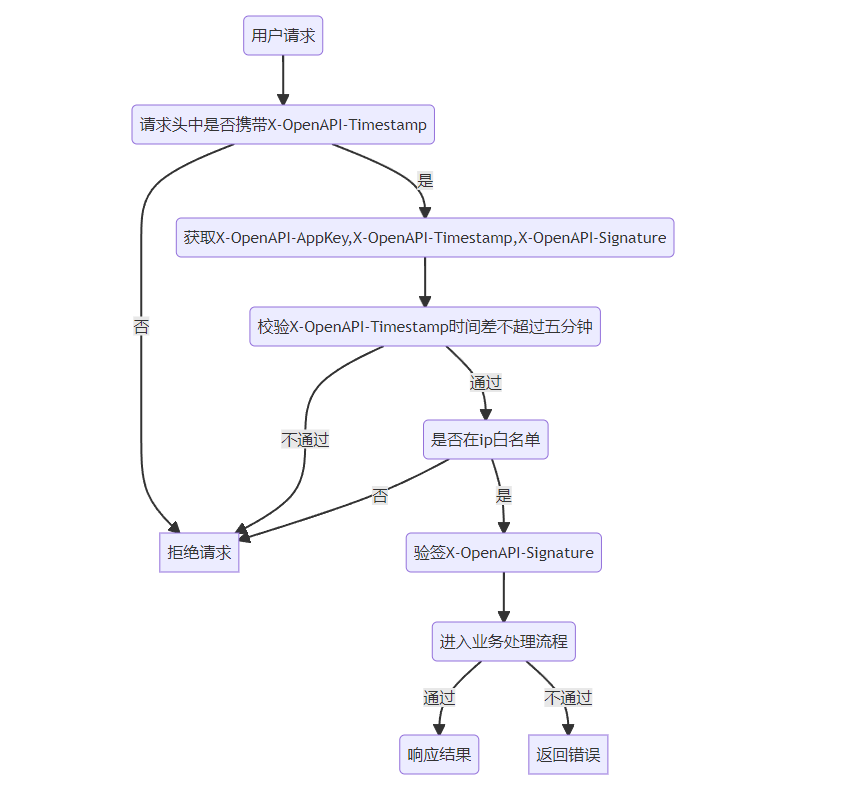
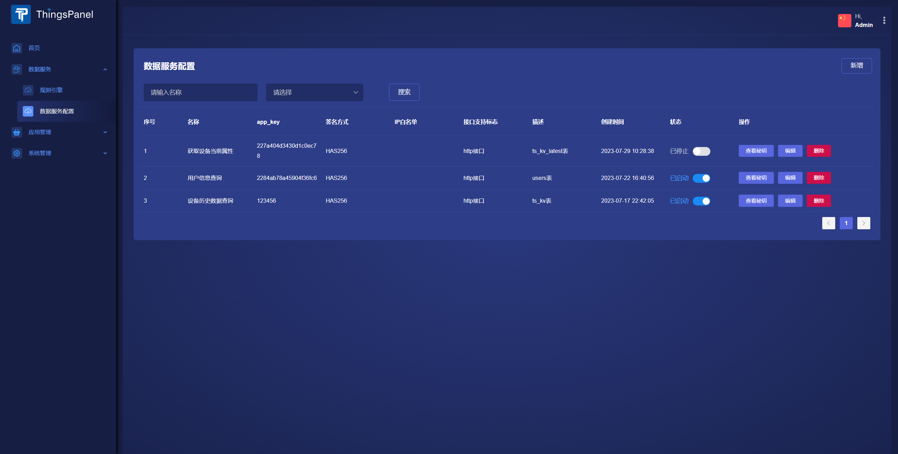
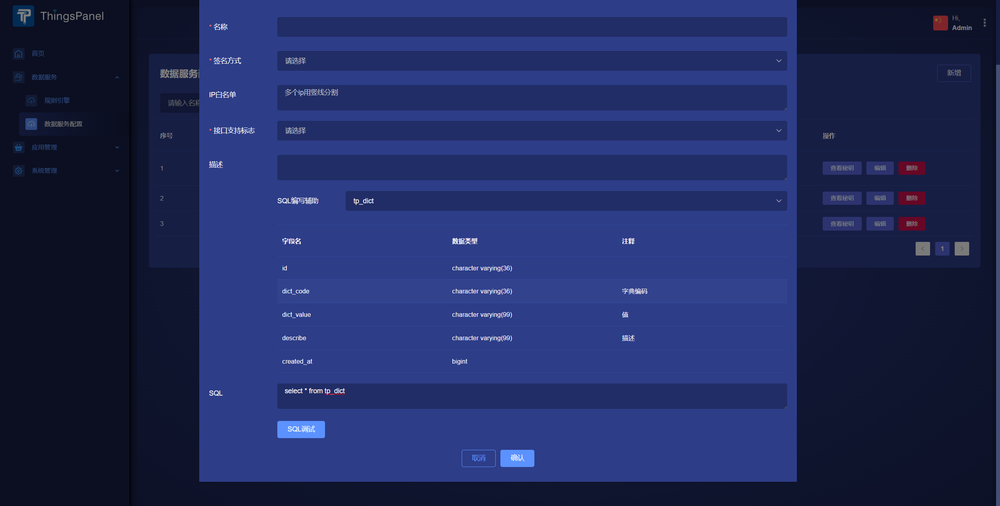
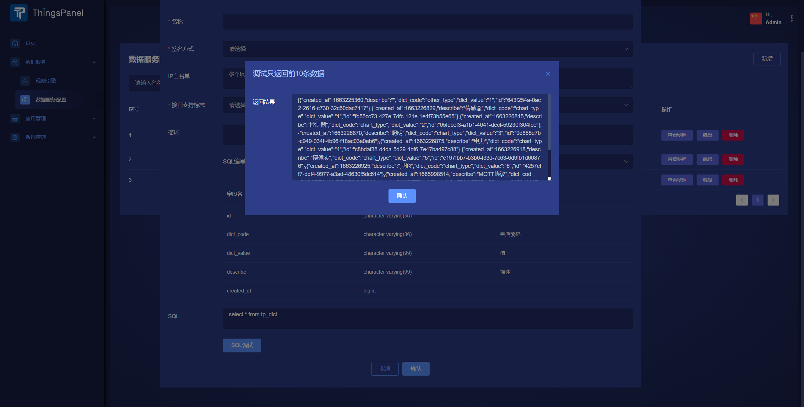

# 数据库接口服务
数据库接口服务（或者可以称之为数据库API服务）是一种中间层服务，它为外部应用提供一个API接口来访问和操作数据库，而不是直接允许外部应用执行原始SQL语句。这种服务为开发者提供了一个更加结构化、统一和安全的方式来与数据库进行交互。
## 流程设计

## 操作步骤
1. 以系统管理员身份登录，进入【**数据服务**】->【**数据库接口服务**】

2. 点击**新增**按钮,填写表单
3. **SQL编写辅助**可以查看数据库表和表结构以便于编写sql

4. 编写完sql可以点击**SQL调试**按钮查看sql语句返回结果来调试sql（注意：sql调试只返回前10条数据）

## 对接
对接说明可以查看接口文档中的**数据库接口服务说明**
### 接口文档
https://apifox.com/apidoc/shared-6c4d585c-1c22-4aa3-8ed9-0e09f27bbfdf
### 请求头参数说明
- X-OpenAPI-AppKey
    - 标识数据库接口服务应用密钥的key，与之对应有一个密钥；
- X-OpenAPI-Timestamp
    - 毫秒，标识开放API的时间戳；
    - 通过时间戳可以检验请求是否过期,过期拒绝，默认5分钟
- X-OpenAPI-Signature
    - 数据库接口服务的数字签名。
    - 签名算法：时间戳+密钥，然后使用SHA25或MD5加密算法对其进行哈希计算
### 其他说明
1. 此sql中不能有除查询相关的关键字外的其他关键字（不能有比如：update、delete、drop等）
2. 默认最大1000条数据（可根据接口中的per_page自定义条数），api请求中可设置分页查询
