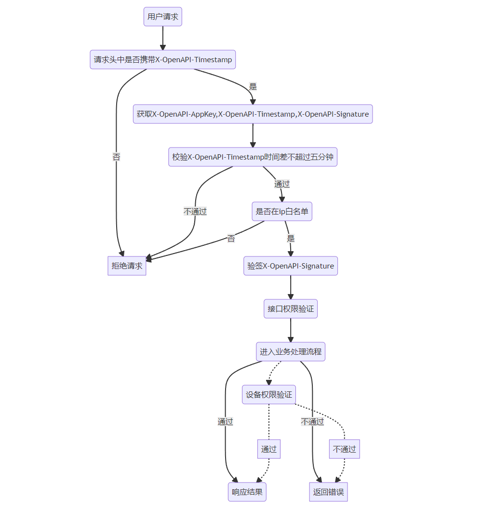
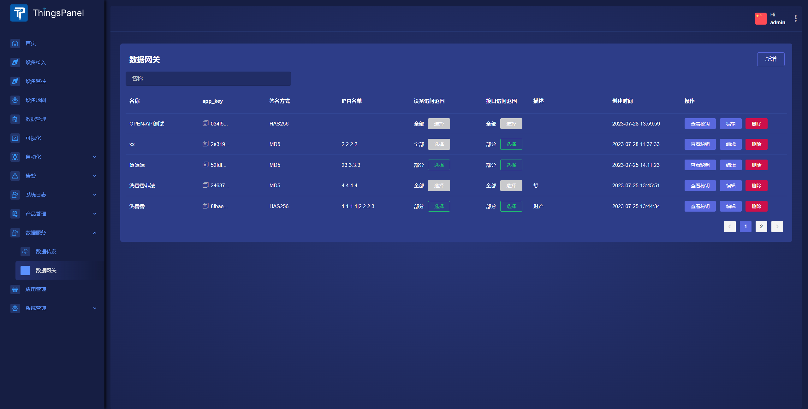
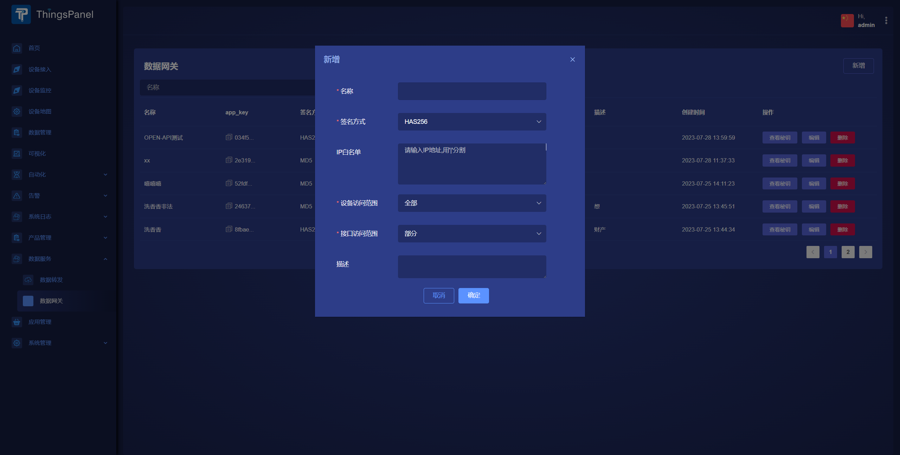
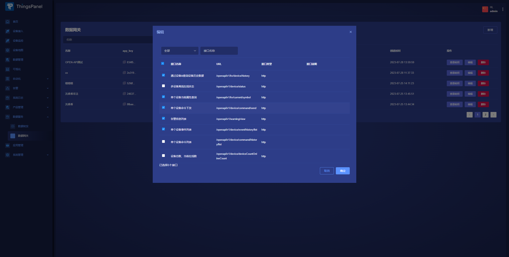
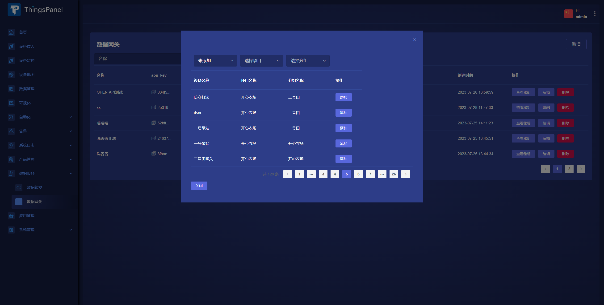

# 数据网关
通过数据网关配置访问权限，可以将系统的一部分数据通过接口提供出去，从而使得外部应用、服务或其他系统能够以一种统一、安全并且高效的方式来访问和使用这些数据，无需关心数据的存储细节和实现机制。
## 流程设计

## 操作步骤
1. 以系租户或租户用户身份登录，进入【**数据服务**】->【**数据网关**】

2. 点击**新增**按钮,填写表单

3. **设备访问范围**和**接口访问范围**可选择部分或全部
4. 选择部分接口活设备范围的，在保存表单后可继续选择具体设备或接口

## 对接
对接说明可以查看接口文档中的**数据网关说明**
### 接口文档
https://apifox.com/apidoc/shared-6c4d585c-1c22-4aa3-8ed9-0e09f27bbfdf
### 请求头参数说明
- X-OpenAPI-AppKey
    - 标识数据库接口服务应用密钥的key，与之对应有一个密钥；
- X-OpenAPI-Timestamp
    - 毫秒，标识开放API的时间戳；
    - 通过时间戳可以检验请求是否过期,过期拒绝，默认5分钟
- X-OpenAPI-Signature
    - 数据库接口服务的数字签名。
    - 签名算法：时间戳+密钥，然后使用SHA25或MD5加密算法对其进行哈希计算

