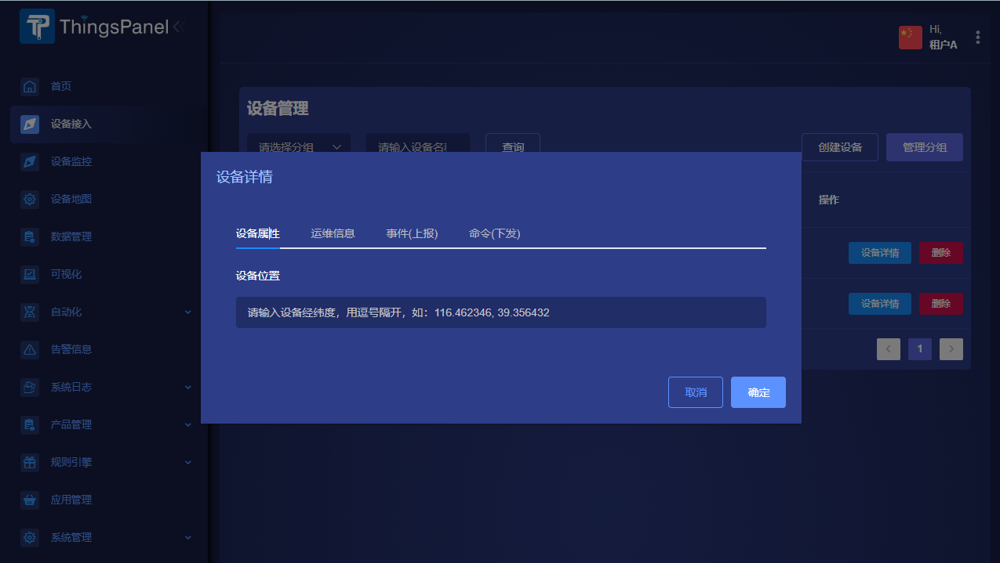
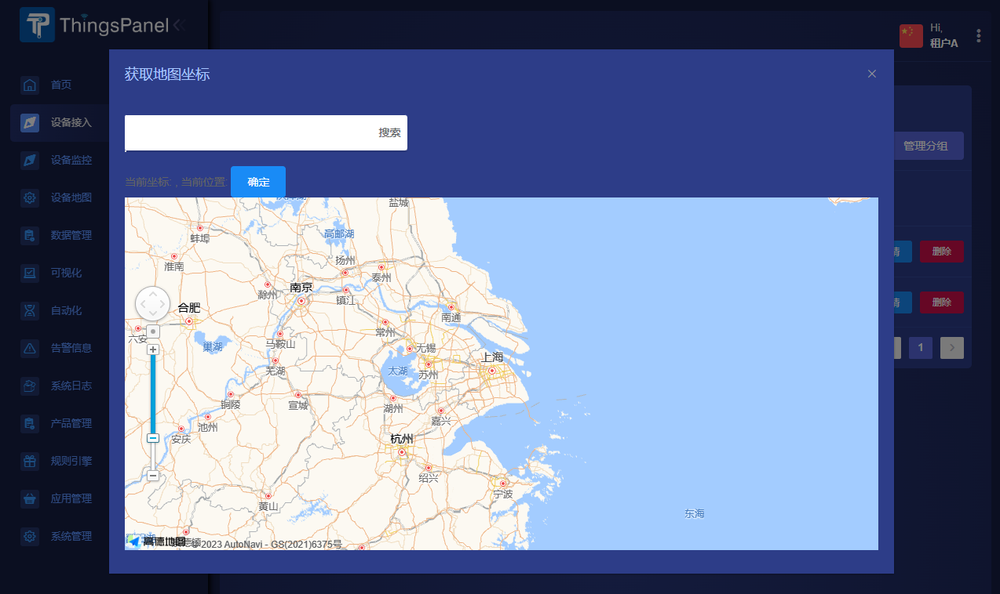
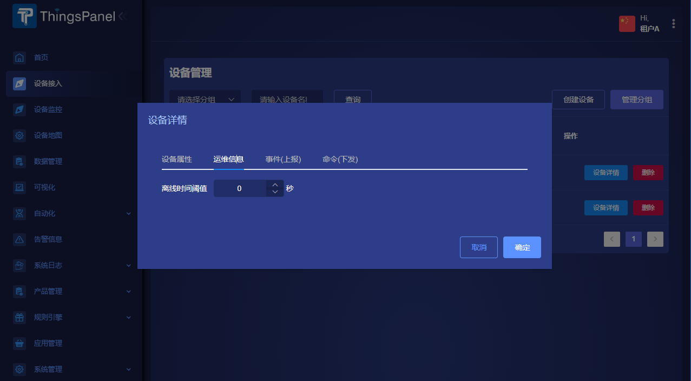
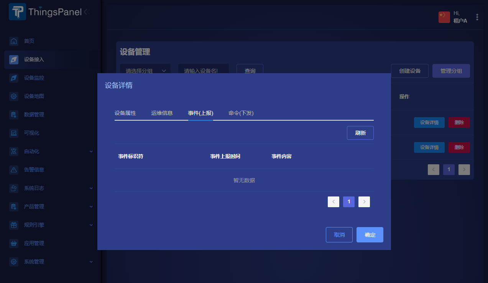
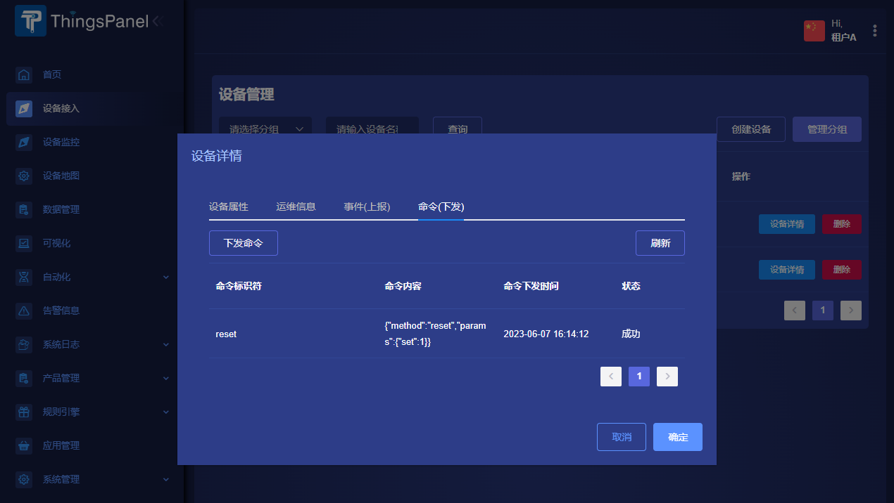

# 设备接入

设备接入实现了对不同类型协议与报文格式的设备接入，对设备进行了统一管理。

* 从设备接入选择项目后进入设备管理页面可对设备进行管理。
* 在设备列表页面可对设备进行查看、添加、修改和删除操作。

:::tip

ThingsPanel的设备分组可比做磁盘的分区（比如C盘），子设备分组可比做文件夹，设备像就是一个个文件。

:::

## 设备创建

:::info

操作步骤可参考[`创建设备`](./getting-started-with-example/create-device)。

:::

## 设备详情

### 设备属性
- 设备位置：点此处可在地图上选择设备位置，随后可在设备地图上展示该设备的位置

### 运维信息
- 离线事件阈值：设置后，设备的在线离线状态按照上次推送事件间隔计算，超过设置的时间未推送会显示设备离线（适合有休眠功能的设备）

### 事件（上报）
- 设备上报的事件可在此处查看

### 命令（下发）
- 可以在此处给设备发送自定义命令或提前在物模型中配置好的命令
- 可以查看发送过的历史命令

