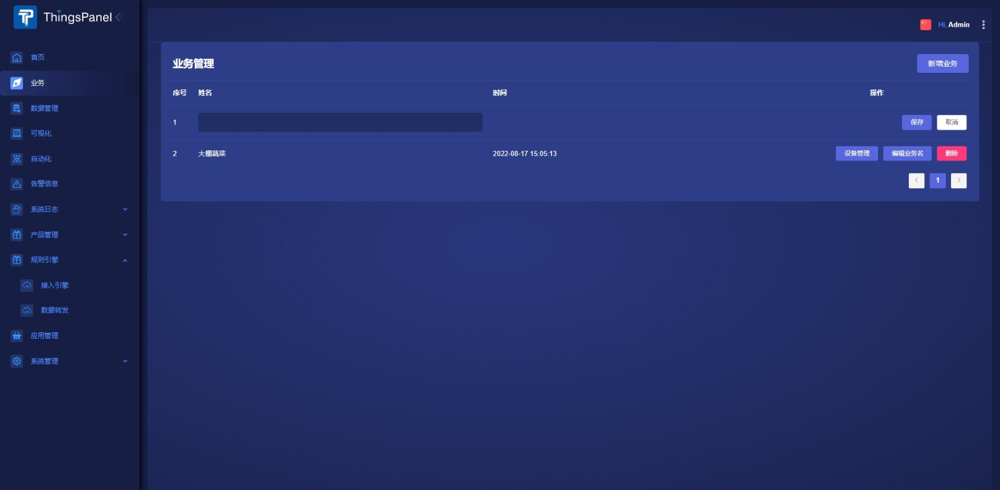
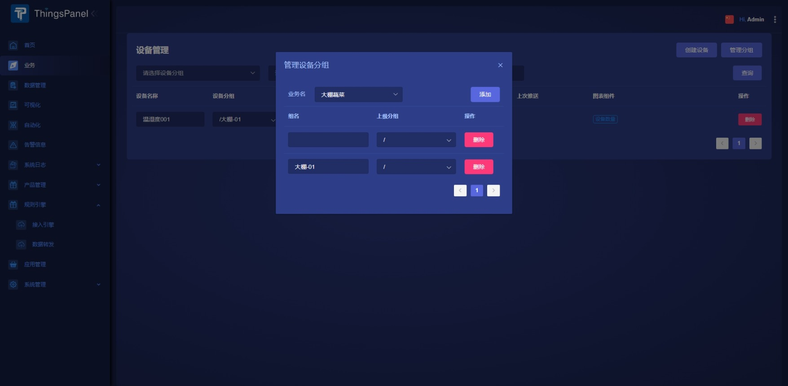
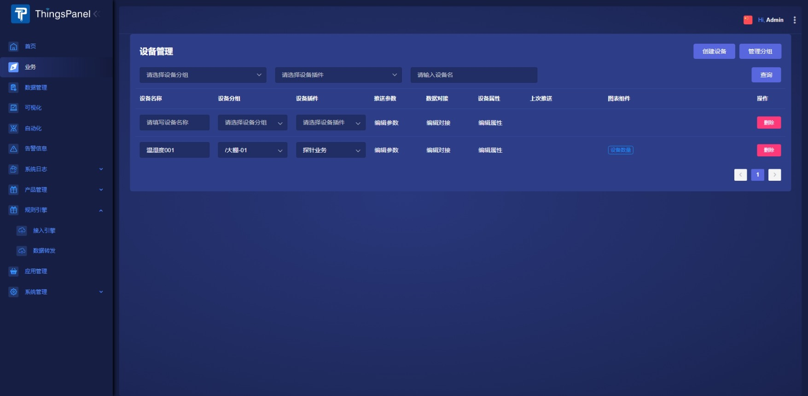
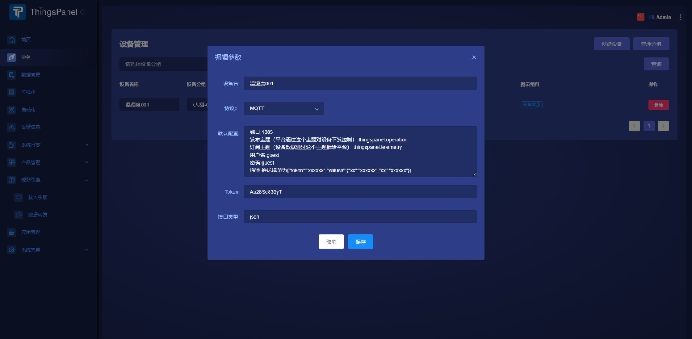
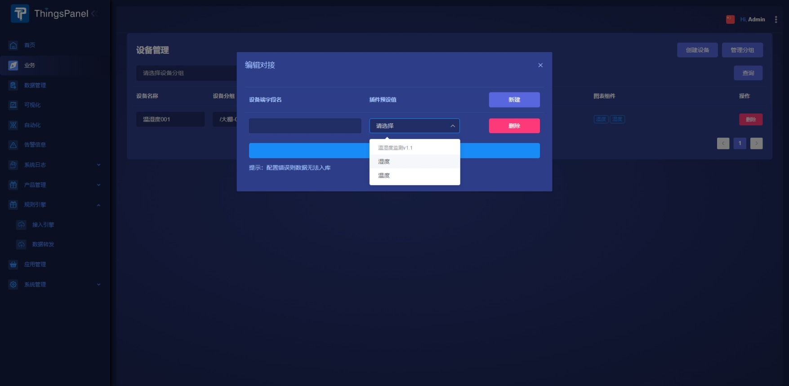

# 创建设备

本章节指导如何从零添加一个设备。

## 新增项目

:::tip

设备依赖于设备分组，设备分组依赖于项目，所以在创建设备前需要先创建项目和设备分组。

:::
> **项目->新增项目：**

* 选择`项目`主菜单，点击`新增项目`按钮，输入项目名称点`保存`按钮便新增了一个项目。

## 新增设备分组

> **项目->设备管理->管理分组->添加：**

* 点击这个项目操作栏的`设备管理`按钮，进入项目的设备列表页面。
* 创建设备前需要有设备分组，点击列表右上角`管理分组`按钮，弹出对话框。
* 在管理设备分组对话框上点击`添加`按钮，输入组名关闭对话框即创建了分组。

:::info

可以给设备分组添加`子分组`，子分组下也允许添加子分组。

:::

## 新增设备

> **项目->设备管理->创建设备：**

* 回到设备管理页面，点击`创建设备`按钮，根据提示填写设备名称，选择设备分组，选择设备插件即可创建设备。

## 填写设备的属性

:::tip

创建好设备后，我们还需要填写设备的基本属性用来对接设备。

:::

* 点击这个设备`推送参数`列`编辑参数`标签，弹出编辑参数对话框。
* 选择设备的协议，根据提示继续输入其余内容，设备需要根据默认配置框中的提示推送数据。

* 接着点击`数据对接`列的`编辑对接`标签，弹出编辑对接对话框，点击新建填写插件预设值对应的设备端字段名即可。

:::tip

此时设备已创建完成，可使用mqtt或socket工具根据协议默认配置框中的提示，模拟推送消息测试。

:::
