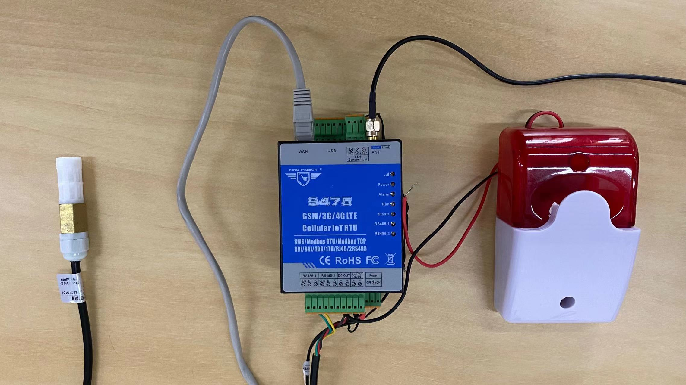
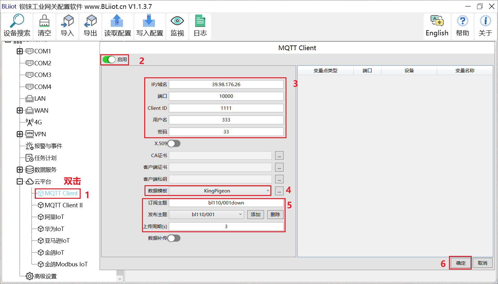
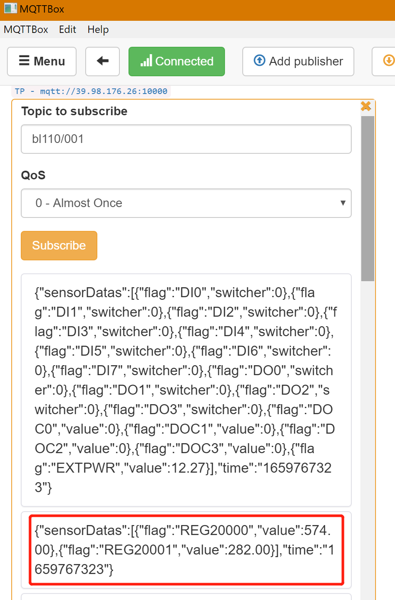

# 推送数据

## 连接设备

将买到的设备连接起来，这个大概要花10分钟左右时间（具体连接方式咨询网关提供商）。

## 在设备端的配置

要配置的重要项目有：**IP地址、端口、主题**。如果有验证的话，不要填错**用户名密码**。
在以上例子中，网关单独配置了推送主题。服务器端对该网关（金鸽）单独进行了解析。

## 通过MQTTBox查看网关设备推送的数据
可以看到数据已经收到了。如下图温度282°（为设备直接发来的原始数据）
