# 设备插件

## 一、说明
设备接入时需要映射每个设备的属性，这是一项极其繁琐的工作，我们通过绑定设备插件可以实现一次映射该设备的所有属性， 同时,在设备插件中还提供了绑定图表的功能，用户无需再重复添加图表，绑定数据源的操作。

## 二、操作步骤
### 1). 插件列表
**应用管理** -> **插件列表**  
在插件列表页面可以查看插件的信息，并且进行编辑、导出、卸载等。
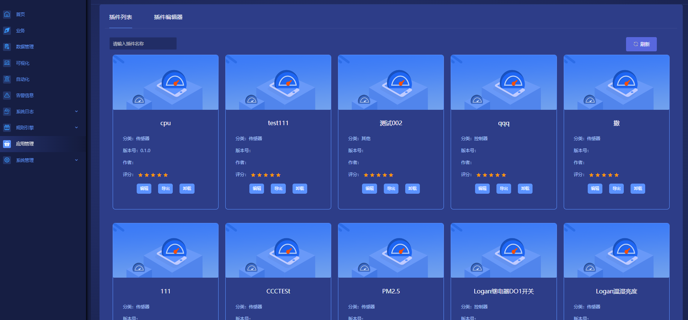

### 2). 插件编辑器
**应用管理** -> **插件编辑器**  
在这里选择自定义插件，如果您从官网的应用市场或其他人的分享里找到了想要的插件，也可以复制插件代码，点击`导入插件`，将该插件导入到系统中。
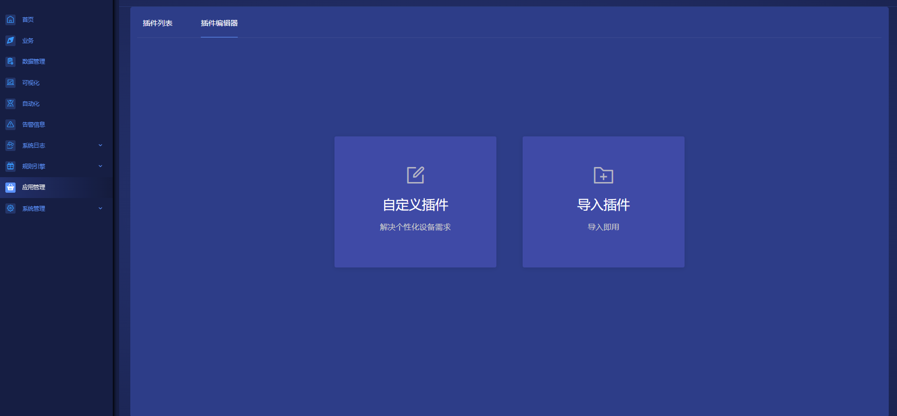

点击自定义插件后的界面如图所示：

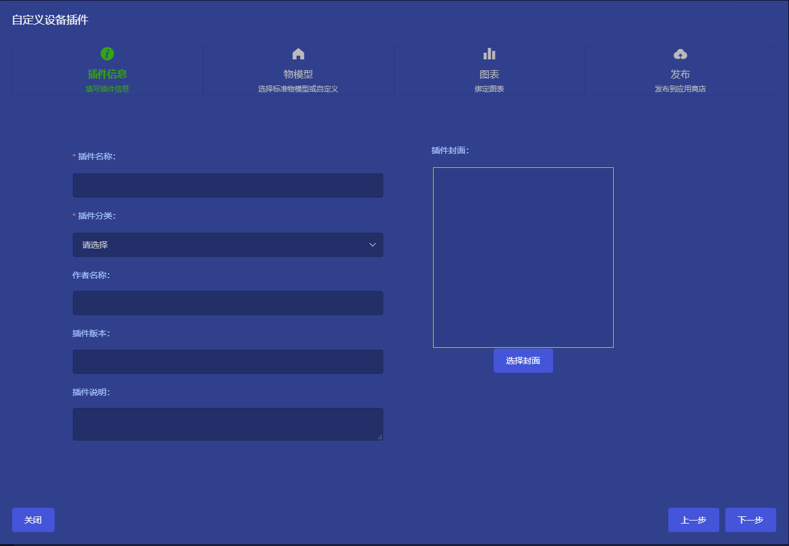

#### 第一步：填写插件信息
在这里填写插件的名称，选择插件分类以及填写其他信息，如作者、版本、简介等。  
比如：名称为温湿度插件，分类选择传感器。  

填写完插件信息后点击下一步。

#### 第二步：选择或自定义物模型
在这里用户可以选择标准物模型或者自定义物模型
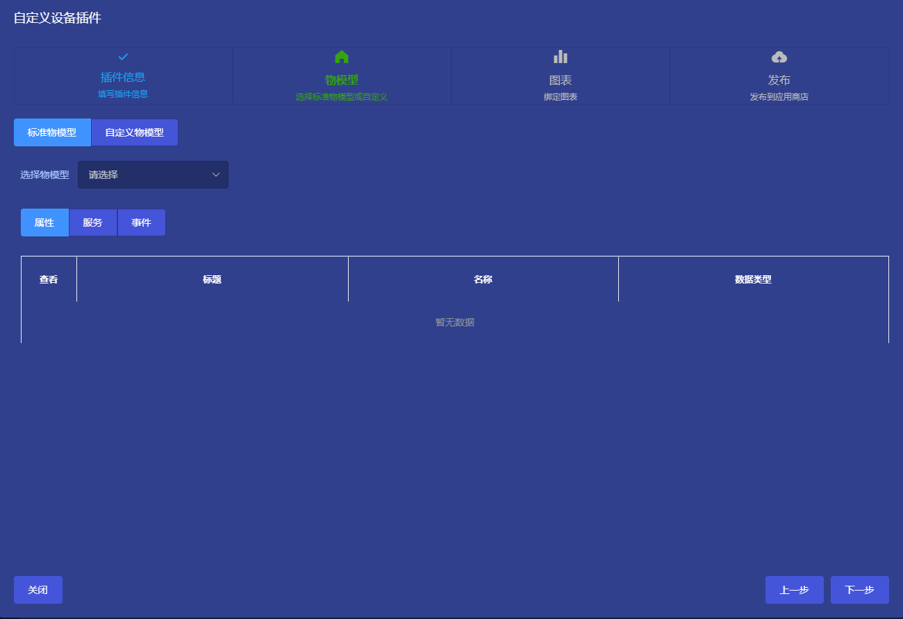

 选择标准物模型  
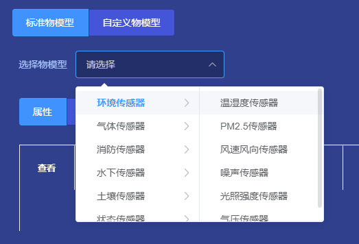

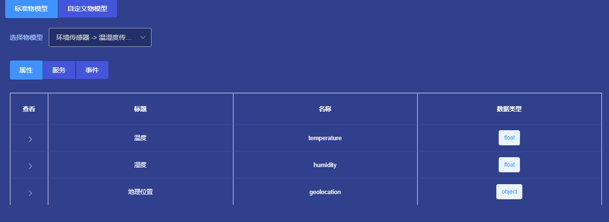

如果标准物模型无法满足您的需求的话，可以选择自定义  

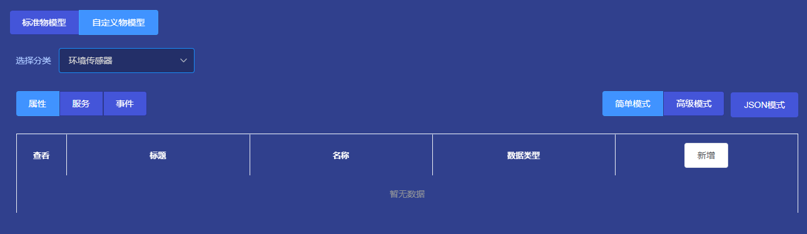

选择物模型分类，添加您需要映射的设备属性

共有三种模式可供选择  

**简单模式**：  
只需要添加标题和名称
标题由用户自定义，可以是中文或英文，如温度、湿度、风速、光照等等。
名称是设备要映射的属性，必须与设备的属性对应。  
点击新增按钮，在标题栏填入"温度"，在名称栏填入"temp"，点击保存。
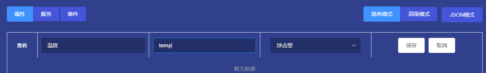

如果您想编辑更多信息，比如该属性的取值范围、步长、单位等等，请选择高级模式，然后点击新增

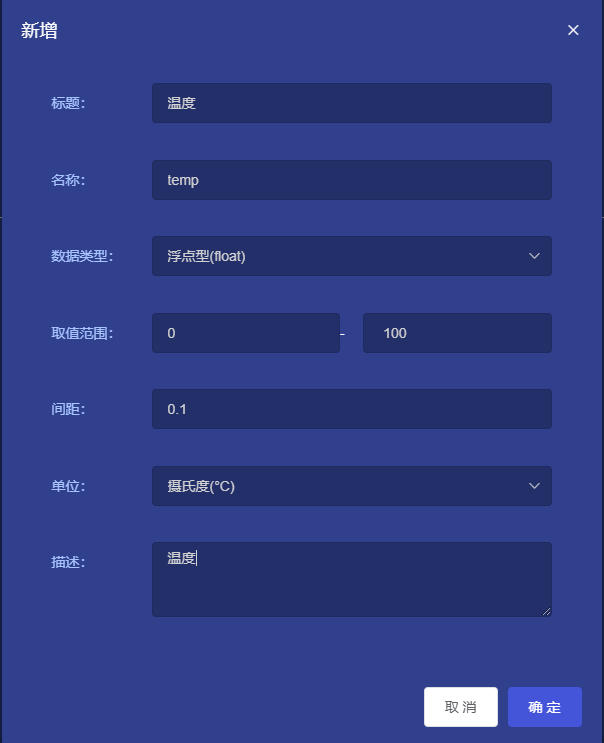

我们将取值范围设置为0-100，单位设置为摄氏度，点击保存。
然后再添加一个湿度属性，如图所示：

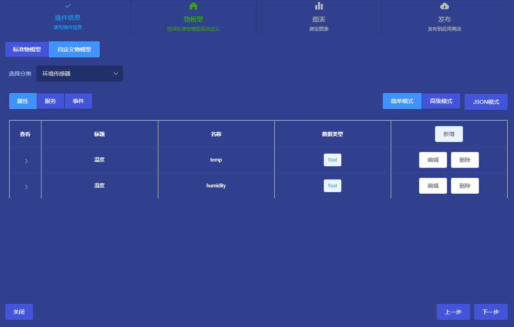

物模型定义完成之后，点击下一步进入绑定图表面板。

#### 第三步：绑定图表
这个页面的作用是将图表和我们上一步定义的物模型属性绑定。  
我们可以给温度属性绑定一个仪表盘，给湿度属性绑定另外一个仪表盘
再给温度属性绑定一个历史曲线图。

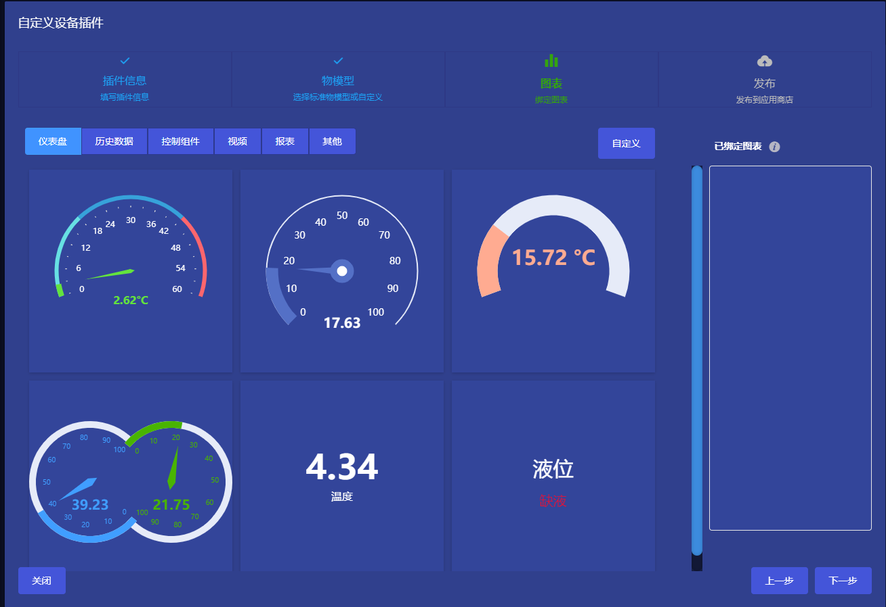

选定一个图表单击，在弹出的对话框中选择我们上一步定义的物模型属性。  
填入图表名称，这个名称由用户自己定义，这里取名"温度仪表盘"，如图所示：

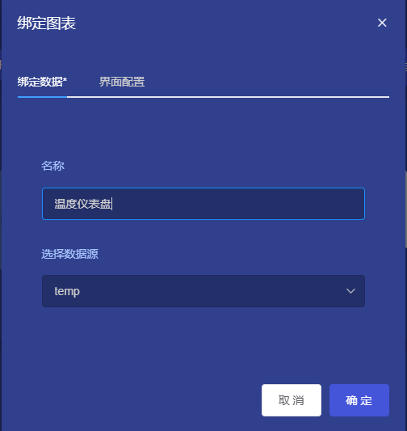

点击确定就绑定成功了，在右侧的已绑定图表的列表中可以看到，如图：  

我们再绑定一个湿度仪表盘。

然后点击历史数据  
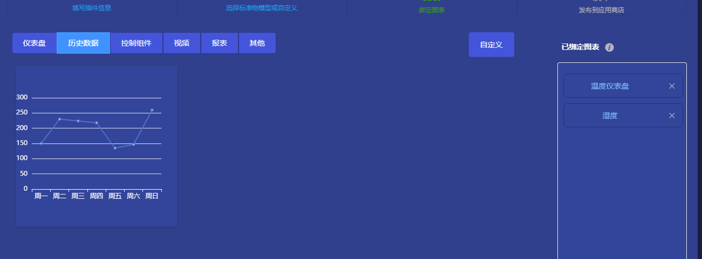

绑定温度历史曲线图  
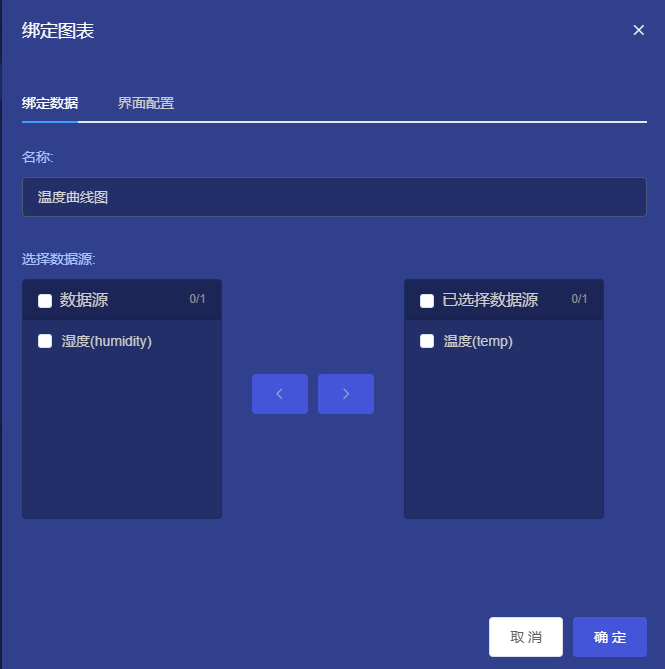

绑定湿度历史曲线图  
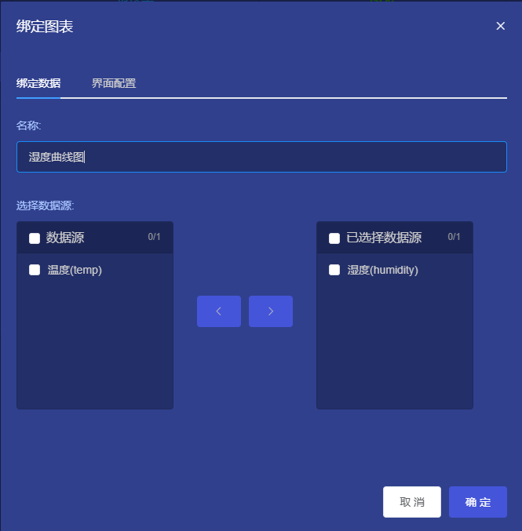

绑定后的列表如图：  
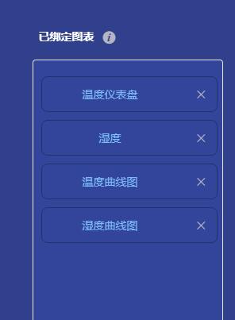

图表绑定完成后，就可以点击下一步发布插件了。

#### 第四步：发布
发布页面如图所示：  
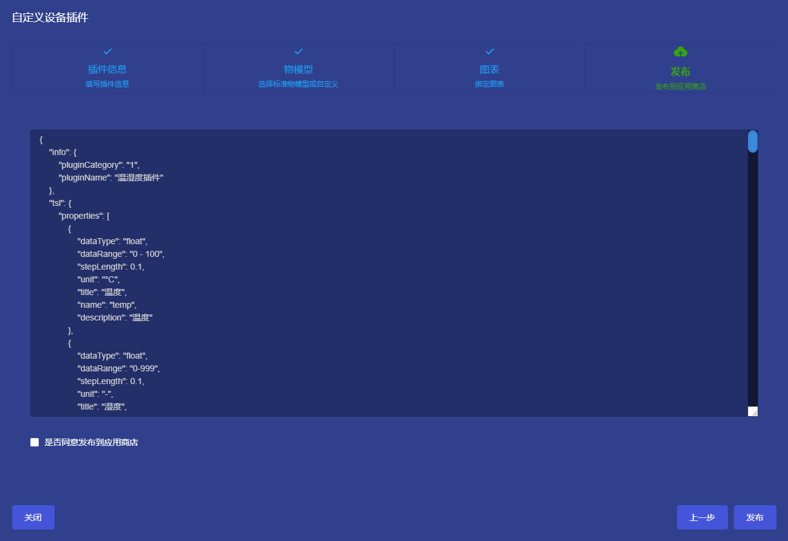

点击发布，插件就发布到系统中了。  
然后回到插件列表页面，点击刷新按钮或刷新浏览器，可以看到刚定义的插件已经出现在插件列表里了。

### 3). 使用插件
插件发布成功之后，就可以在设备管理页面进行绑定了。

点击项目菜单，选择一个项目，进入设备管理页面  

创建一个名为温湿度的设备

点击绑定插件
我们之前编辑插件时，插件信息里选择的是传感器分类，在左侧的插件列表树里的传感器节点下找到我们发布的温湿度插件，点击该插件，如图：

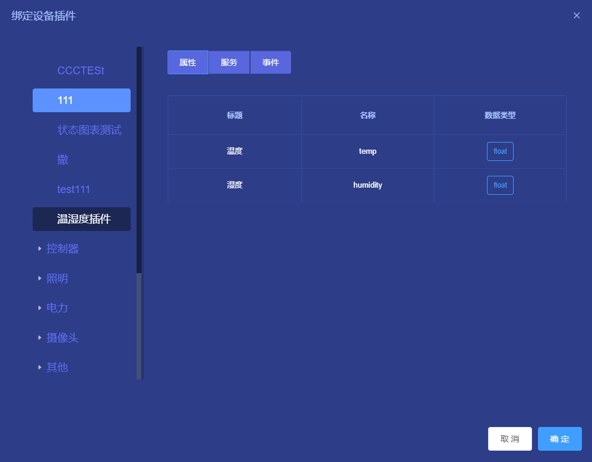

然后点击确定，完成绑定。

此时，该设备就可以推送报文了。

点击编辑参数  

在弹出的对话框中可以看到该设备的认证信息和连接信息等  
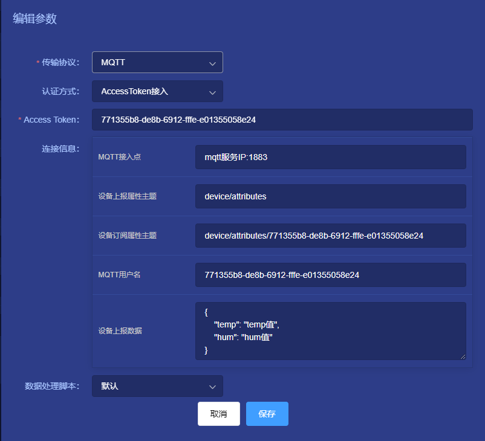

### 4). 可视化
当设备成功推送数据后，在可视化里就可以看到数据了

点击可视化菜单，选择一个项目，进入可视化页面  
在左侧设备树中找到刚才的温湿度设备并点击，可以看到在插件中绑定的图表出现在右侧面板中了。
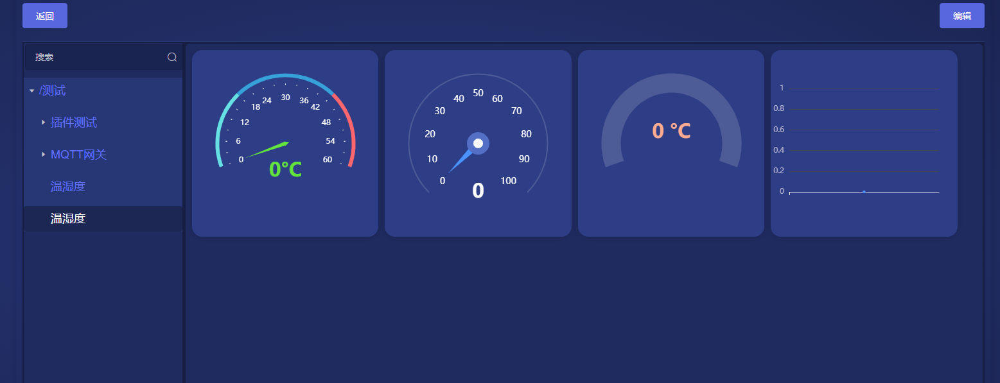

