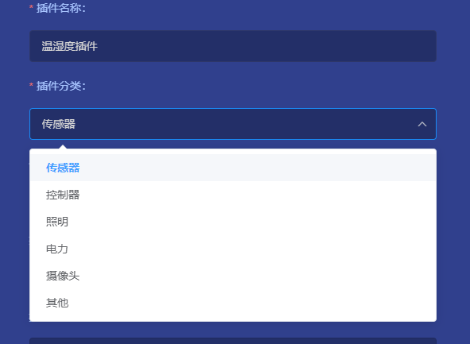
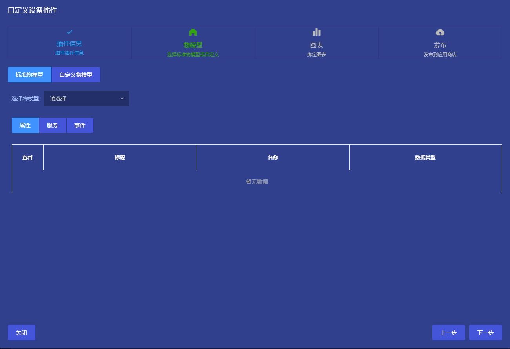
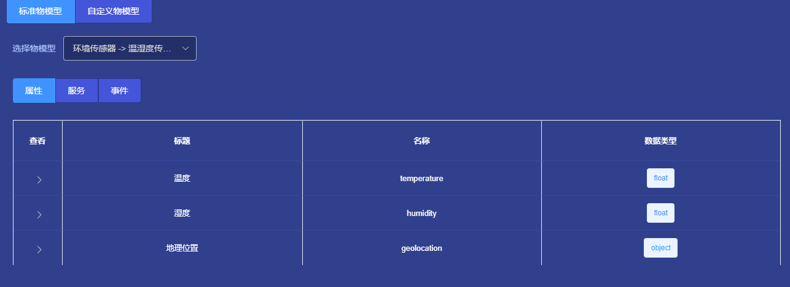
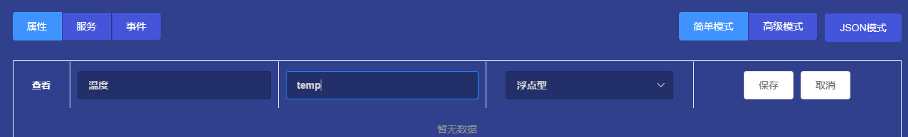
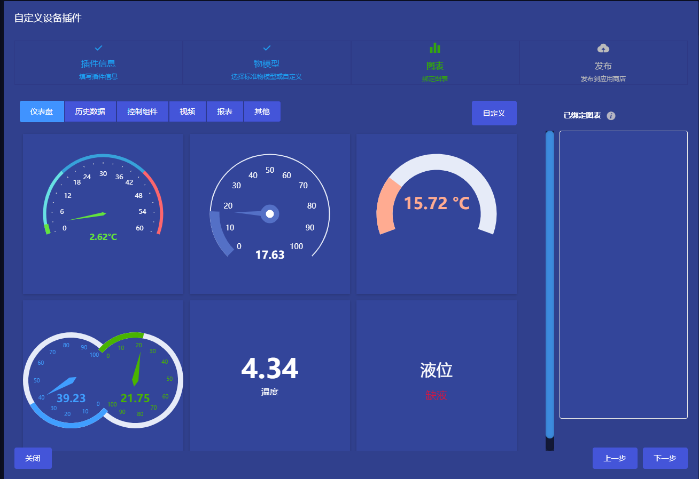
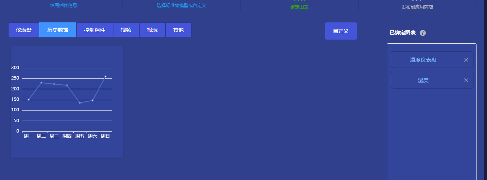
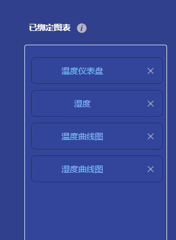
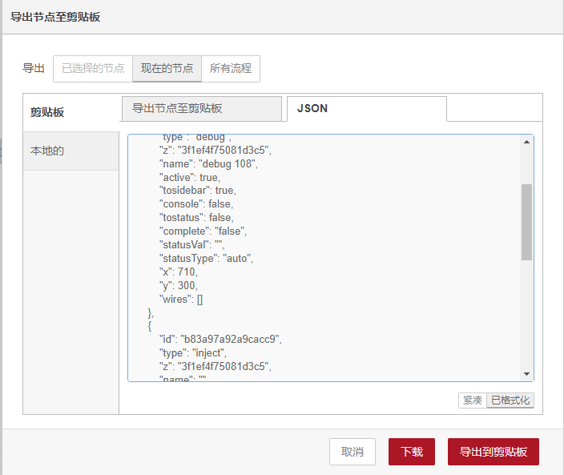

# 发布插件
## 关于ThingsPanel应用市场

ThingsPanel应用市场是一个在线商店，用户可以在其中找到各种物联网应用程序和服务。ThingsPanel应用市场包含了各种类型的插件，例如设备插件、协议插件、解析脚本、规则引擎等等。所有的插件都可以通过自定义发布到应用市场，供所有人下载和使用。

## 如何使用ThingsPanel应用市场

使用ThingsPanel应用市场非常简单，您只需要按照以下步骤操作即可：

1. 打开ThingsPanel应用市场，并在插件类别下搜索您需要的插件。
2. 浏览插件的详细信息，包括插件的功能、使用方法、支持的设备、协议等等。
3. 复制插件代码，在ThingsPanel中进行安装。
4. 如果插件需要进行配置，请在插件的配置界面中进行必要的设置。
5. 使用插件来构建和管理您的物联网应用程序和服务。

## 如何发布自己的插件到ThingsPanel应用市场

如果您是设备制造商、开发者或服务提供商，您可以自定义开发插件，并将其发布到ThingsPanel应用市场供所有人下载和使用。要发布插件，请按照以下步骤操作：

1. 创建新的插件，并定义插件的功能、使用方法、支持的设备、协议等等。
2. 测试插件，并确保它能够正常运行。
3. 将插件提交到ThingsPanel应用市场审核。
4. 如果插件通过审核，它将被发布到应用市场供所有人下载和使用。

### 设备插件

设备插件是一种用于扩展设备支持的插件，包含了物模型和图表单元，用户创建设备后，只要绑定设备插件就可直接推送并查看数据，无需一一映射设备属性，无需绑定图表。

#### 视频教程如下：  
<iframe src="//player.bilibili.com/player.html?aid=316788098&bvid=BV11P41147yt&cid=1222050093&page=1" scrolling="no" border="0" width="800" height="400" frameborder="no" framespacing="0" allowfullscreen="true"> </iframe>

#### 文档教程如下：

打开ThingsPanel后台管理系统，打开应用管理 -> 设备插件生成器 -> 自定义插件

#### 第一步：填写插件信息
在这里填写插件的名称，选择插件分类以及填写其他信息，如作者、版本、简介等。  
比如：名称为温湿度插件，分类选择传感器。  

填写完插件信息后点击下一步。

#### 第二步：选择或自定义物模型
在这里用户可以选择标准物模型或者自定义物模型

 选择标准物模型  

如果标准物模型无法满足您的需求的话，可以选择自定义  

选择物模型分类，添加您需要映射的设备属性

共有三种模式可供选择  

**简单模式**：  
只需要添加标题和名称
标题由用户自定义，可以是中文或英文，如温度、湿度、风速、光照等等。
名称是设备要映射的属性，必须与设备的属性对应。  
点击新增按钮，在标题栏填入"温度"，在名称栏填入"temp"，点击保存。

如果您想编辑更多信息，比如该属性的取值范围、步长、单位等等，请选择高级模式，然后点击新增

我们将取值范围设置为0-100，单位设置为摄氏度，点击保存。
然后再添加一个湿度属性，如图所示：

物模型定义完成之后，点击下一步进入绑定图表面板。

#### 第三步：绑定图表
这个页面的作用是将图表和我们上一步定义的物模型属性绑定。  
我们可以给温度属性绑定一个仪表盘，给湿度属性绑定另外一个仪表盘
再给温度属性绑定一个历史曲线图。

选定一个图表单击，在弹出的对话框中选择我们上一步定义的物模型属性。  
填入图表名称，这个名称由用户自己定义，这里取名"温度仪表盘"，如图所示：

点击确定就绑定成功了，在右侧的已绑定图表的列表中可以看到，如图：  

我们再绑定一个湿度仪表盘。

然后点击历史数据  

绑定温度历史曲线图  

绑定湿度历史曲线图  

绑定后的列表如图：  

图表绑定完成后，就可以点击下一步发布插件了。

#### 第四步：发布
发布页面如图所示：  

点击发布，插件就发布到应用市场中了。  

### 规则引擎
规则引擎是物联网平台的一个极其重要的功能模块，是处理复杂逻辑的引擎,它按照用户设定的条件，在设备和物联网平台之间进行消息的处理和传递。要发布规则引擎，请按照以下步骤操作：

点这里[编辑规则引擎](../rule-instance/rule_instance.md)
规则引擎编辑完成后，在画布上右键，选择导出

复制导出的JSON数据

登录应用市场http://r.thingspanel.cn/

打开用户中心，点击发布插件。

填写名称、作者、说明、版本号
把刚才规则引擎JSON数据拷贝到代码框里，点击确定，即发布成功。
发布后等待管理员审核，审核通过后就可以在应用市场看到您发布的规则引擎了。

### 解析脚本
解析脚本是一种用于解析设备数据的工具。它们允许您定义设备数据的格式和内容，并将其转换为易于理解的形式。要使用解析脚本，请按照以下步骤操作：

打开设备接入，选择或创建一个项目，点击设备管理按钮进入设备管理页面。

在设备上点击编辑参数，没有设备可自行创建。

点击数据处理脚本，在弹出的下拉列表中点击自定义协议。

然后在弹出的对话框中填入公司名称、产品名称、上行解析脚本、下行解析脚本

点击发布即可发布到应用市场，如果没有登录，还需用您的应用市场账号登录。

## 总结

ThingsPanel应用市场是一个非常重要的平台，它可以为用户提供各种物联网应用程序和服务，为设备制造商、开发者和服务提供商提供一个更广泛的市场来推广和销售他们的应用程序和服务，为物联网领域提供一个重要的平台来展示和提供各种物联网应用程序和服务。希望本文档能够帮助您理解ThingsPanel应用市场的功能和使用方法。如果您有任何问题或建议，请随时与我们联系。