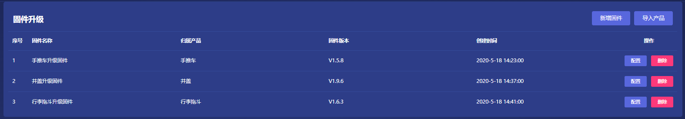
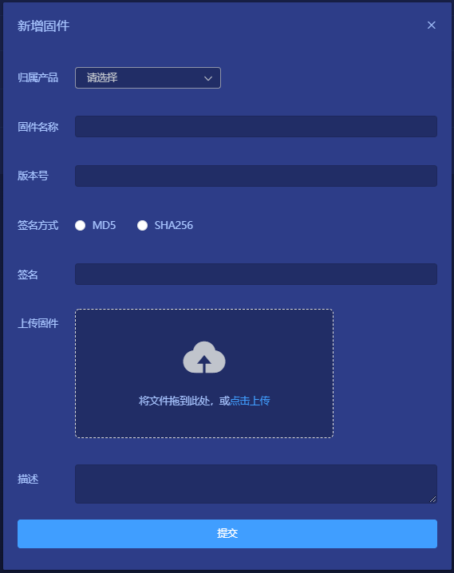

# 固件升级（OTA）

## 1. 说明
OTA全称"Over-The-Airtechnology"，即空中下载技术，通过移动通信的接口实现对软件进行远程管理，简单来说就是对固件的远程升级。

## 2. 操作步骤
### 1). 列表
**产品管理** -> **固件升级**  
在列表页面可以查看当前已升级的固件的信息，包括固件名称，归属产品，版本号，以及升级时间。

### 2). 新增固件
**产品管理** -> **固件升级** -> **新增固件**  
归属产品：在下拉框中选择要升级的固件所属的产品分类。  
固件名称：是用户自定义的名称，用来标识该固件。  
版本号：用户自定义，用于区分同一固件多次升级的不同版本,示例：V1.0.1.
签名方式：分为MD5和SHA256的加密方式
上传固件：把要升级的固件的升级包拖动到这里，或点击上传。

### 3). 配置
**产品管理** -> **固件升级** -> **配置**  

### 4). 删除
**产品管理** -> **固件升级** -> **删除**  