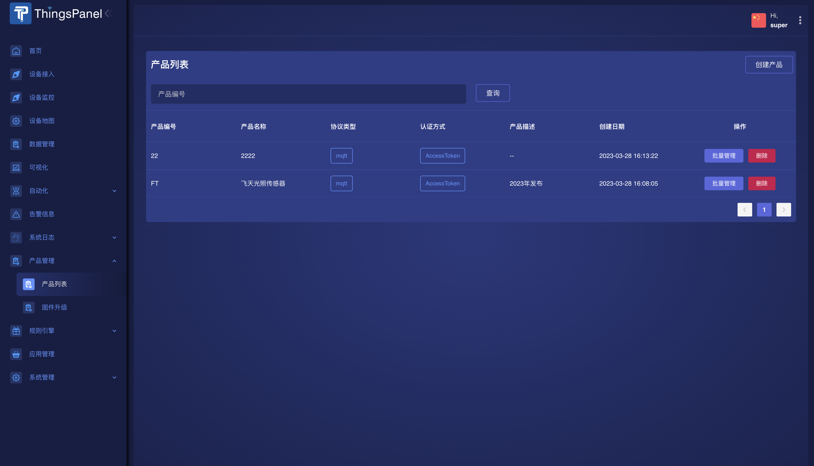
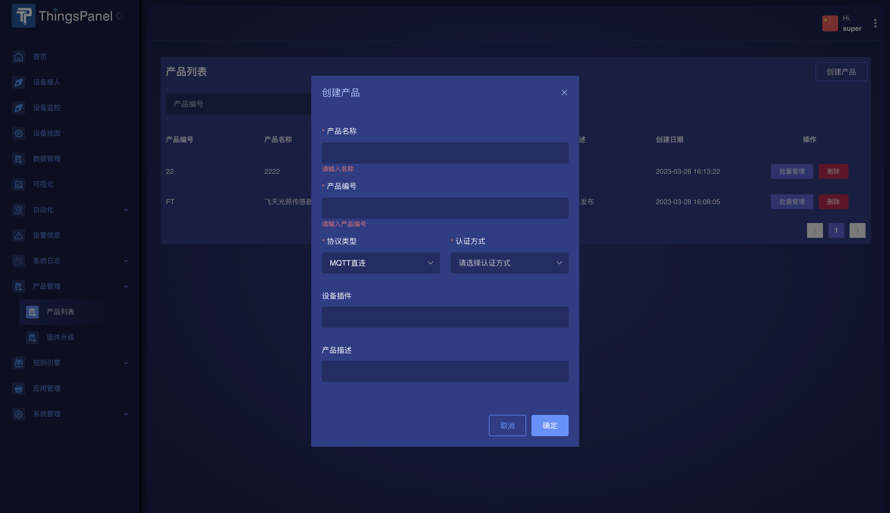
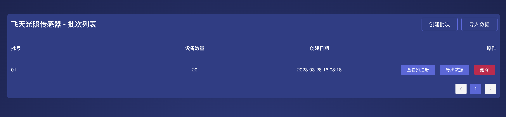
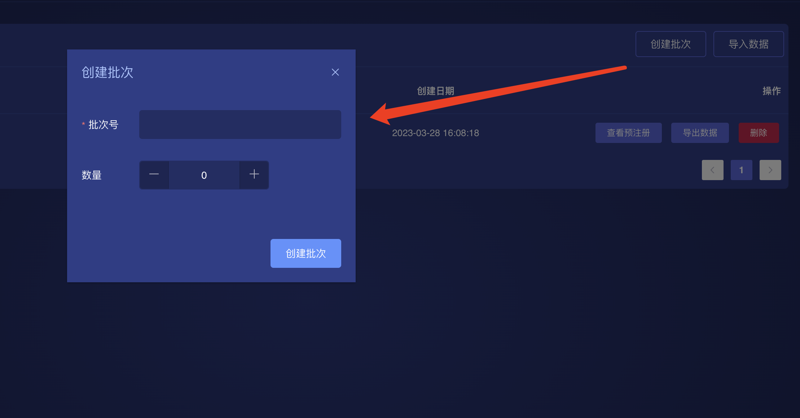
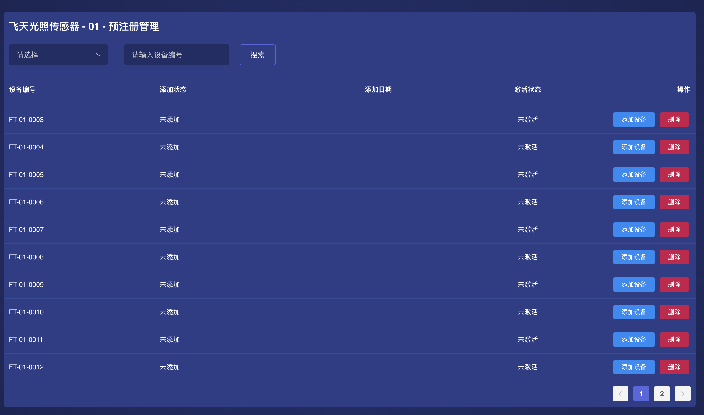
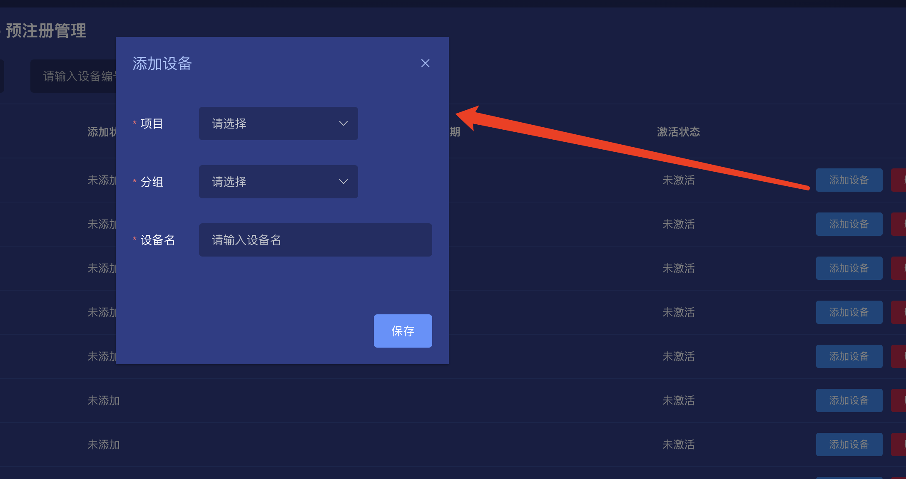
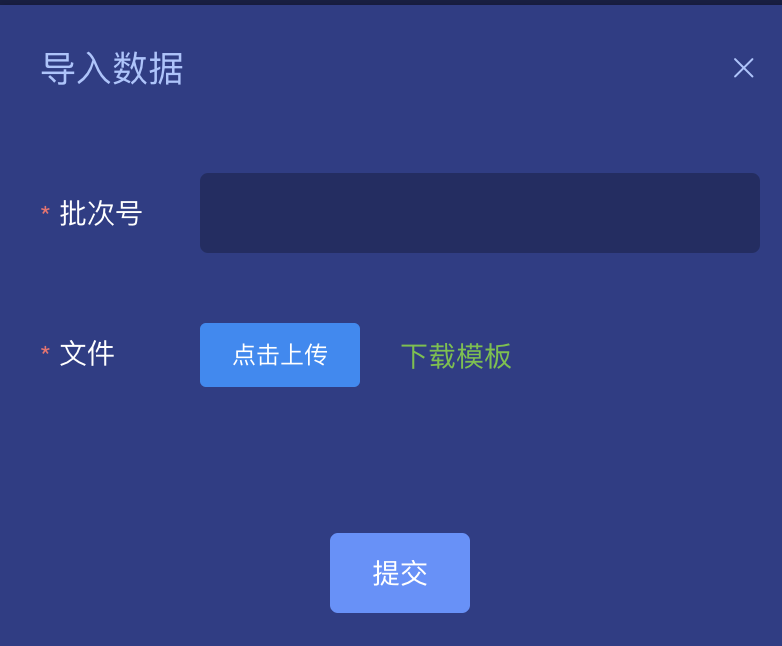

# 产品管理 

## 1. 功能说明

产品管理主要解决量产的数据准备和设备预注册的问题，具体的功能有：

- 创建产品：选择设备插件、绑定协议、选择认证方式，为设备预注册提供基础配置。
- 批量管理：可创建设备批次并导出数据，也可以导入数据，支持一机一密。
- 二维码数据：可导出二维码数据供生产和用户端APP扫码快速添加设备。
- 手动激活：可以手动激活设备
- 预注册管理：查看设备激活状态

## 2. 操作步骤
###  产品列表

###  创建产品
这里的功能包括创建产品、绑定产品的设备插件、绑定协议与认证方式添加产品描述。

###  批量管理

####  创建批次
可创建多个批次 

####  查看预注册

 查看设备激活状态。

#####  手动激活设备

####  导入数据

