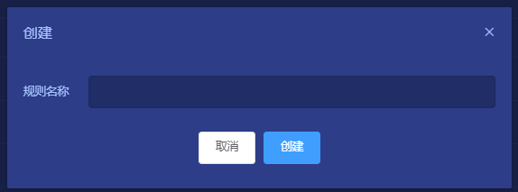
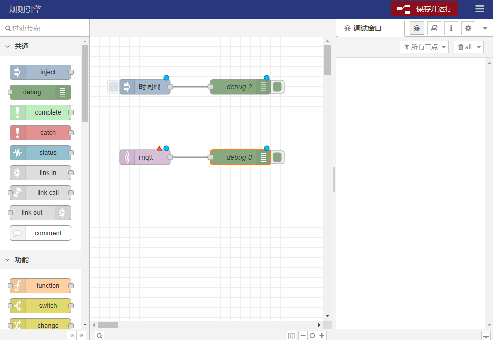

# 数据转发
设备使用device/attributes或gateway/attributes主题将属性上报至平台，在规则引擎中可以通过订阅attributes/relaying/{AccessToken}可获取设备上报的属性（需要使用创建设备时候生成的认证信息登录mqtt客户端-与设备登录的认证一致），然后将数据处理后以各种方式转发出去。
## 1. 说明
基于一款可视化的流编程工具，可以非常轻松的实现对设备的数据转发。

## 2. 操作步骤

### 1). 创建转发规则
**规则引擎** -> **数据转发** -> **创建转发规则**  
点击`创建转发规则`按钮，填入自定义的规则名称。

### 2). 编辑
**规则引擎** -> **数据转发** -> **编辑**  
创建好规则后，就可以点击`编辑`按钮进入可视化的流编程工具，编辑节点。  
流编程工具的具体操作方法可查看： [`规则引擎`](./rule_instance)
如图：

编辑完后不要忘了点击`保存并运行`，否则规则不会生效。

### 3). 启动/暂停
**规则引擎** -> **数据转发** -> **启动**/**暂停**  
当我们在流编程工具中编辑好一个规则并保存后，就可以直接在ThingsPanel中`启动`/`暂停`了，无需再打开流编程工具。

