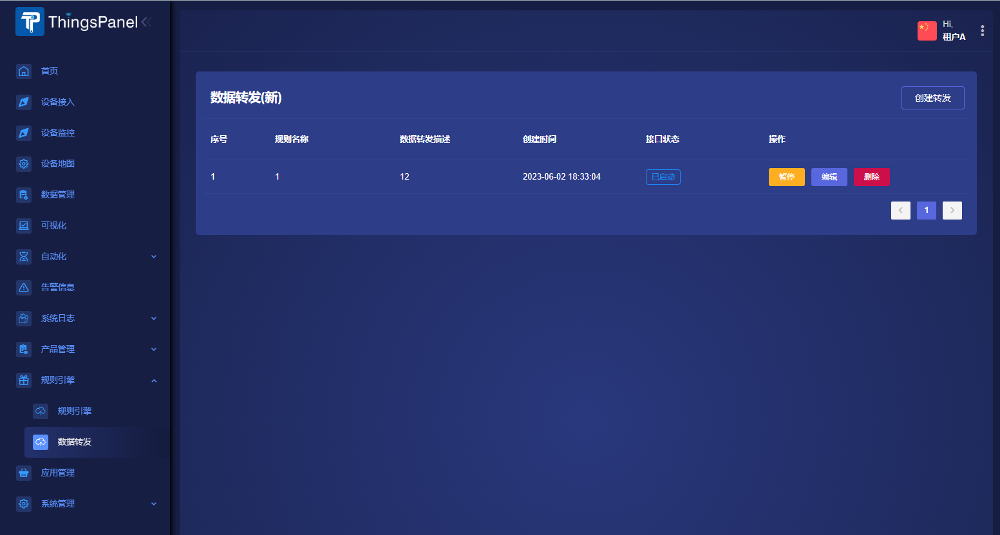
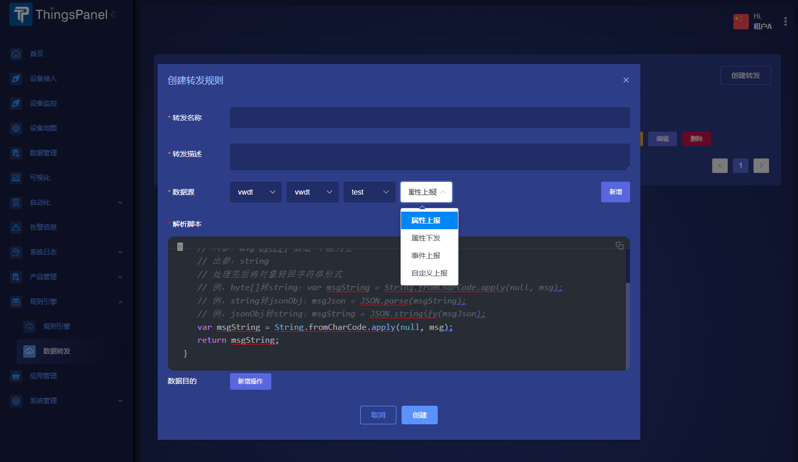
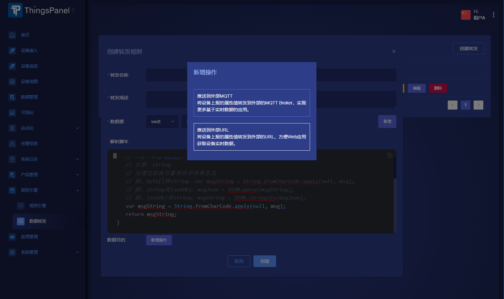
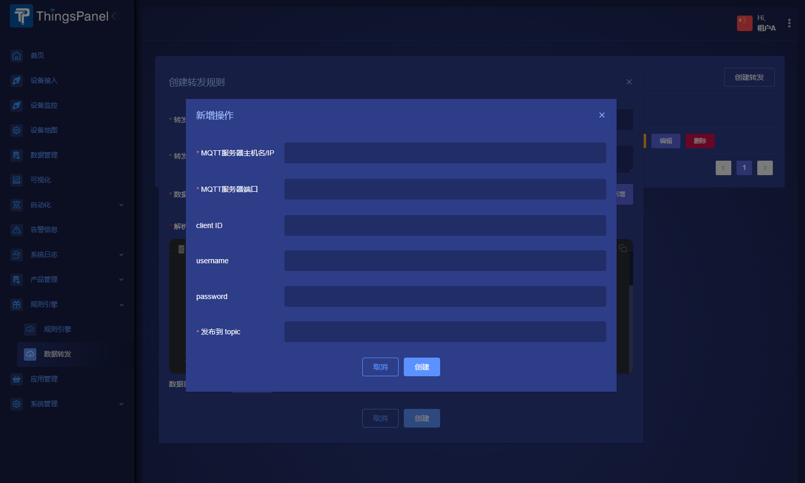

# 数据转发
可在设备与平台传递消息的途中，将消息转发出去

## 操作步骤

### 1). 创建转发规则
点击`创建转发`按钮

### 2). 填写转发规则
- 可选的数据源有属性上报、属性下发、事件上报

- 解析脚本对数据源的数据做对应处理后再转发（数据源都为平台数据规范）
- 数据目的目前有有外部MQTT和外部URL两种

### 3). 启动/暂停
创建后可以启动和暂停

