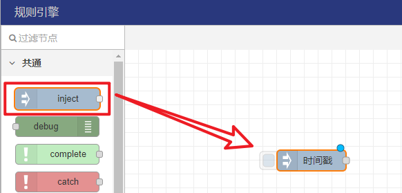
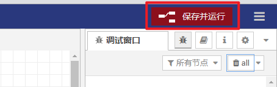
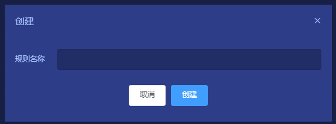
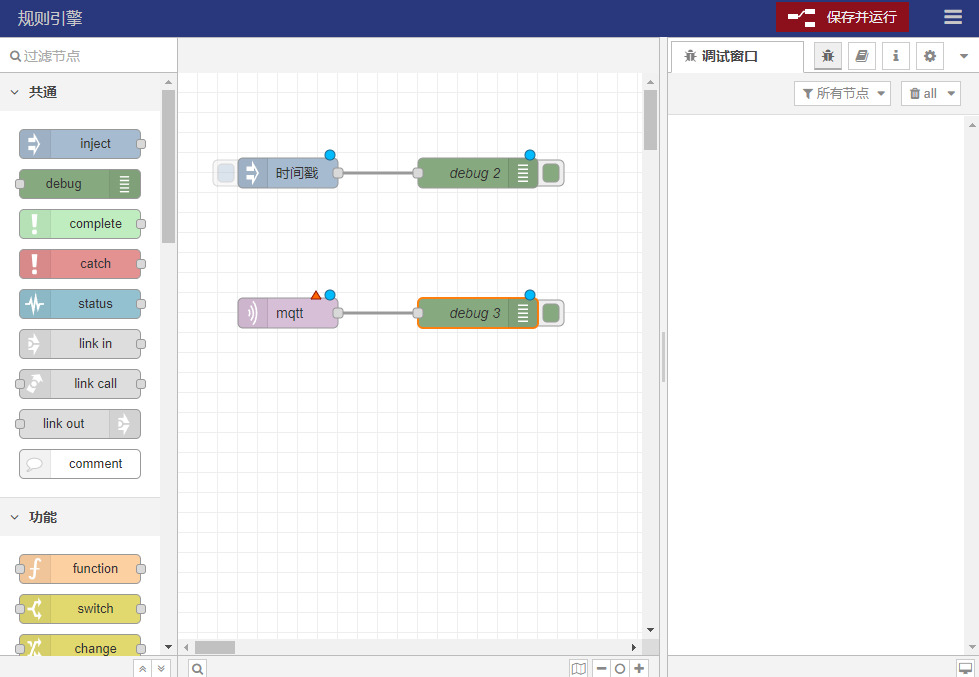

# 规则引擎

## 1、概述
规则引擎是物联网平台的一个极其重要的功能模块，是处理复杂逻辑的引擎,它按照用户设定的条件，在设备和物联网平台之间进行消息的处理和传递。

## 2、入门指南

### 1. 添加注入节点
注入节点允许您将消息注入流中，在左侧的节点中找到`inject`节点，把它拖动到编辑器中。如图所示：  

### 2. 添加调试节点
`debug`节点会在调试侧栏中输出调试信息，在左侧的节点中找到`debug`节点，把它拖动到编辑器中。

### 3. 将两者连接在一起
通过在一个节点的输出端口与另一个节点的输入端口之间拖动来将 Inject 节点和 Debug 节点连接在一起。    
效果如图：  

### 4. 部署
此时，节点仅存在于编辑器中，必须部署到服务器中才能生效。  
点击右上角的"保存并运行"按钮。  

### 5. 查看调试信息
点击"注入"按钮。在调试信息栏中我们会看到输出的信息。  
  

## 3、示例

### 1). 创建接入规则
**规则引擎** -> **接入引擎** -> **创建接入规则**  
点击`创建接入规则`按钮，填入自定义的规则名称。  

### 2). 编辑
**规则引擎** -> **接入引擎** -> **编辑**  
创建好规则后，就可以点击`编辑`按钮进入可视化的流编程工具，编辑节点。  
流编程工具的具体操作方法可查看： [`规则引擎`](./rule_instance)
如图：  

编辑完后不要忘了点击`保存并运行`，否则规则不会生效。

### 3). 启动/暂停
**规则引擎** -> **接入引擎** -> **启动**/**暂停**  
当我们在流编程工具中编辑好一个规则并保存后，就可以直接在ThingsPanel中`启动`/`暂停`了，无需再打开流编程工具。  

