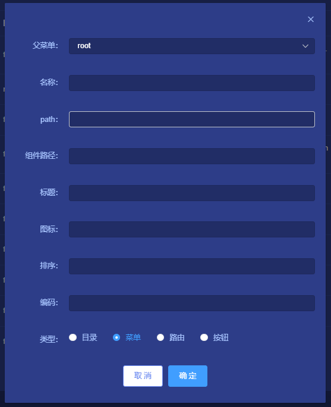
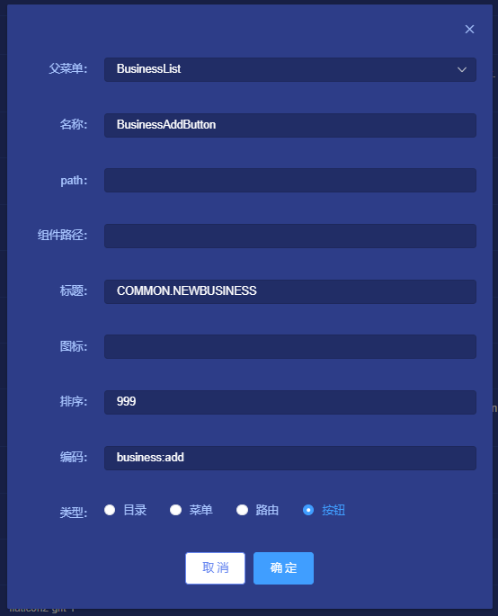

# 权限管理

## 1、说明
系统管理员创建权限，每条权限对应目录/菜单/路由/按钮。创建好之后在角色管理页面分配给对应的角色。

## 2、操作步骤

### 1). 添加权限
**系统管理** -> **权限管理** -> **添加权限**   

### 2). 编辑
**系统管理** -> **权限管理** -> **编辑**  

### 3). 删除
**系统管理** -> **权限管理** -> **删除**  

