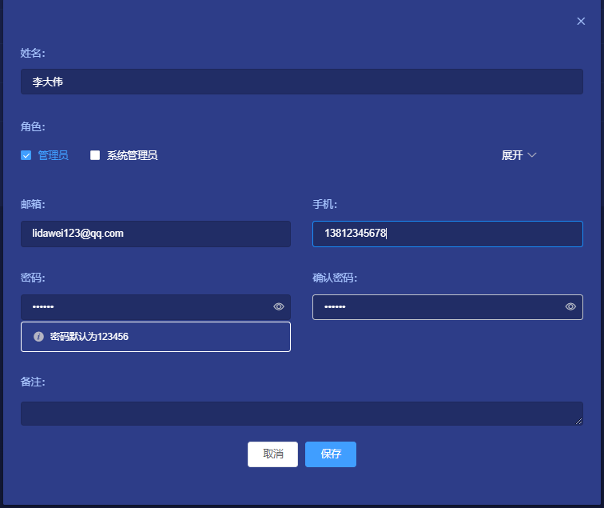

# 用户管理

## 1、说明
系统管理员可以创建多个用户(职员)，每个用户(职员)分配一个或多个角色(职位)，每个角色(职位)拥有不同的权限。

## 2、操作步骤
 
### 1). 添加用户
**系统管理** -> **用户管理** -> **添加用户**  
点击添加用户按钮，在弹出的对话框中填入姓名、邮箱、电话、可以使用默认密码123456，也可以自己设置密码。  
同时，我们可以给该用户分配对应的角色(职位)，勾选上对应的角色就可以了。  
最后，点击保存，该用户就创建好了。  

### 2). 用户列表

