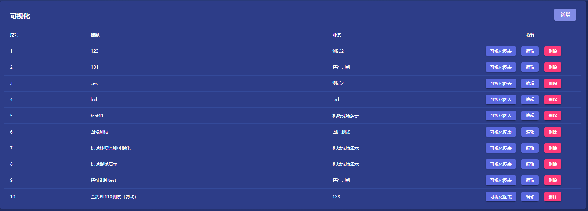
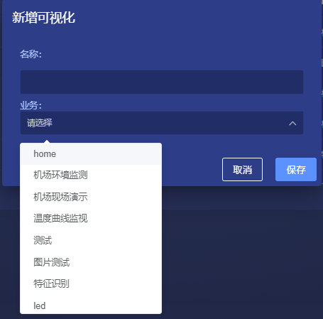
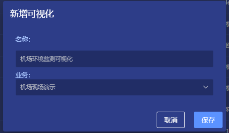

# 可视化

## 1. 说明
在ThingsPanel的可视化模块中，用户可以自定义设备的可视化图表，以及用于和设备进行交互的组件。

## 2. 操作步骤

### 1). 列表
**可视化**

### 2). 新增
**可视化** -> **新增**  
填入自定义的名称，在业务列表中选择对应的业务，点击`保存`。  

 

### 3). 编辑
**可视化** -> **编辑**  

### 4). 删除
**可视化** -> **删除**  

### 5). 可视化图表
**可视化** -> **可视化图表**   
新增了一条可视化数据后，点击`可视化图表`按钮可进入可视化图表管理界面。  
