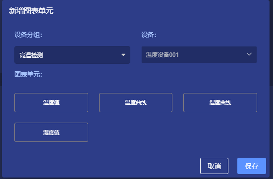

# 可视化图表

## 1. 说明
在ThingsPanel的可视化模块中，用户可以自定义设备的可视化图表，以及用于和设备进行交互的组件。  

## 2. 功能
当用户通过可视化页面，进入可视化图表界面时，首先会向用户展示该业务的设备总览。  
包括设备总数，离线设备数，在线设备数。  如图：  

如果没有显示设备总览，可以点击右上角的`+`按钮添加设备总览图表。  

用户可以通过选择设备分组下拉列表来展示想要查看的可视化图表或交互组件

然后点击`+`按钮为该分组添加图表

