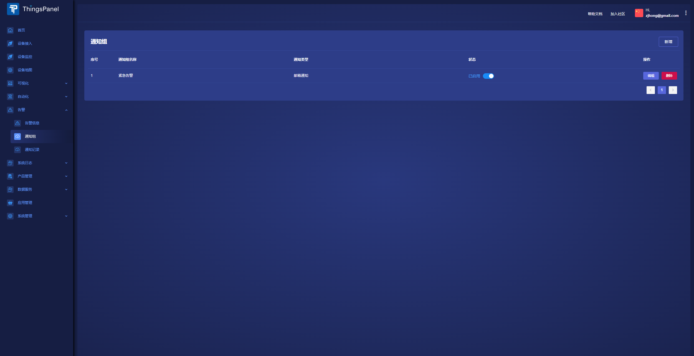
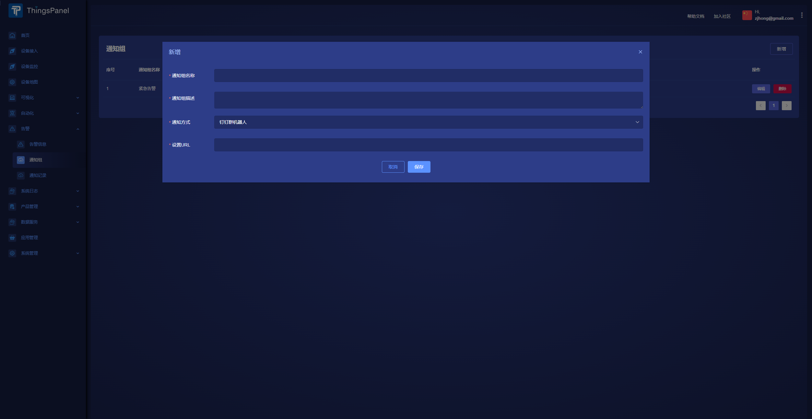

# 通知组
ThingsPanel提供的告警通知方式，包括：
- 邮件
- 短信
- 企业微信群机器人
- 钉钉群机器人
- 飞书群机器人
- webhook

要使用这些通知方式，我们需要创建通知组。

## 创建通知组
1. 进入**告警**-**通知组**

2. 点击**新增**按钮创建通知组

## 通知方式介绍

### 邮件通知
需要在系统管理员权限下配置邮箱服务信息才可生效

### 短信通知
需要在系统管理员权限下配置短信服务才可生效

### 企业微信群机器人/钉钉群机器人/飞书群机器人
选择后填入推送连接即可

### webhook
具体待补充
