# 快速安装并接入设备

本章节将指导您快速安装ThingsPanel，并实现接入设备，查看设备数据。
## 先决条件
* 需要先安装好Docker（[安装docker社区版](https://docs.docker.com/engine/installation/)）
* DockerCompose（[安装Docker Compose](https://docs.docker.com/compose/install/)）
* Git
* 使用MQTT模拟器，可使用MQTTbox、MQTT X、 MQTT.fx ，或者使用设备推送数据。

:::info

可参考[`Docker安装环境搭建`](./system-installation/docker_installation)案例。

:::

## 通过Docker容器安装ThingsPanel

通过容器化部署是搭建ThingsPanel的最快方式。

```bash title="第一步、获取docker-compose源码:" showLineNumbers
git clone https://github.com/ThingsPanel/thingspanel-docker.git
```

```bash title="第二步、进入目录并启动服务:" showLineNumbers
cd thingspanel-docker&&docker-compose -f docker-compose.yml up
```

```text title="第三步、登录:" showLineNumbers
输入网址:服务器IP:8080
输入账户:super@super.cn
输入密码:123456
```

:::info

更详细的`步骤`请参考[`Docker安装`](./system-installation/docker_installation)。

:::

## 设备接入与查看数据的步骤
:::info

- 添加设备：需要添加项目、分组、输入设备名。
- 推送数据：使用系统提供的推送参数推送。
- 查看数据：在设备监控的未知。 

:::
## 30秒接入一个温湿度设备并查看数据【适合老手】


## 详细步骤【适合新手】

### 创建设备

1、在**设备管理**菜单中，点击**新建项目**按钮，输入**项目名称**，例如环境监测。


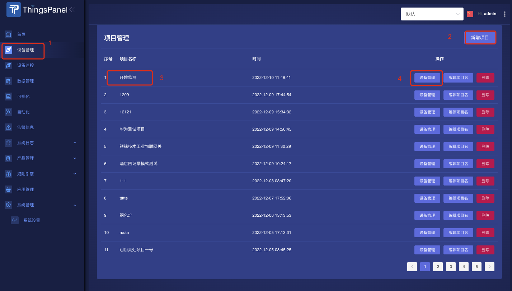
2、创建设备，并输入**设备名称**、选择**分组**、设定为**设备**（直连设备）
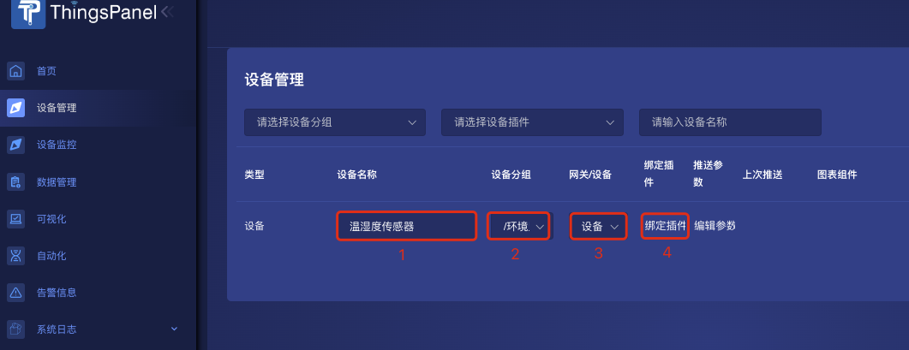
3、选择[`设备插件`](../overview.md)
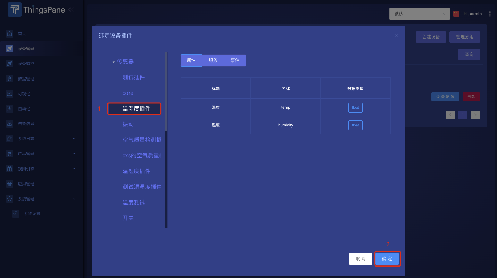

4、获得**推送参数**
点击链接
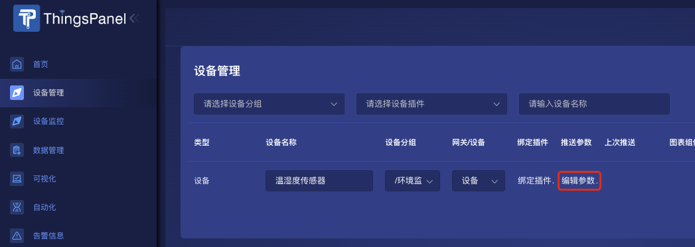
查看详细的推送参数，**使用如下参数配置设备**
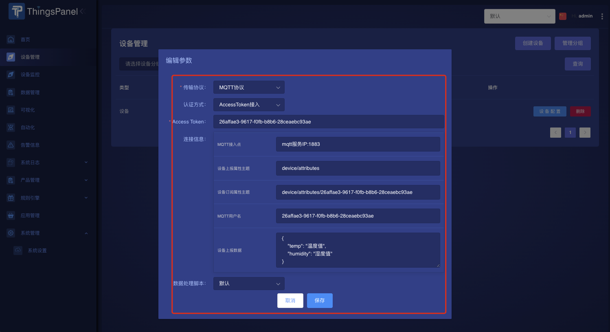

### 推送数据

**推送参数说明**：
- AccessToken：作为MQTT的用户名
- mqtt服务IP:1883：如域名是dev.thingspanel.cn，则在推送模拟软件中输入dev.thingspanel.cn,端口1883（设备同理）.
- device/attributes：推送数据所使用的主题
  
示范报文
```
{
    "temp": "温度值",
    "humidity": "湿度值"
}
```
需要改成
```
{
    "temp": "28",
    "humidity": "66"
}
```
意为：温度28度，湿度66%。**temp与humidity不可更改！**

**配置连接**

配置好的界面如图，其它可不填写：
MQTT X连接配置
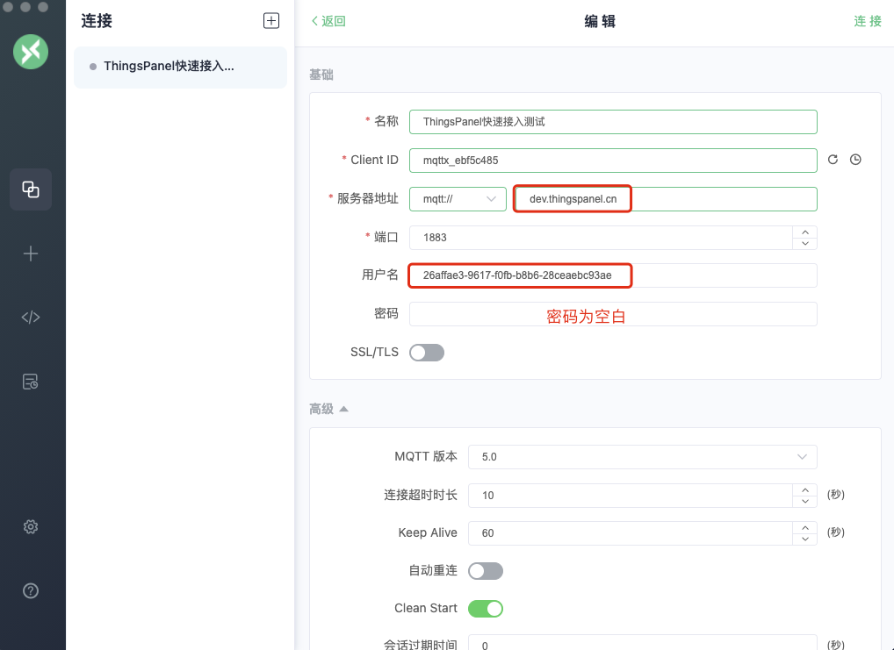

如图配置，点击连接即可成功连接MQTT服务器。

**推送数据**

填写主题与报文。

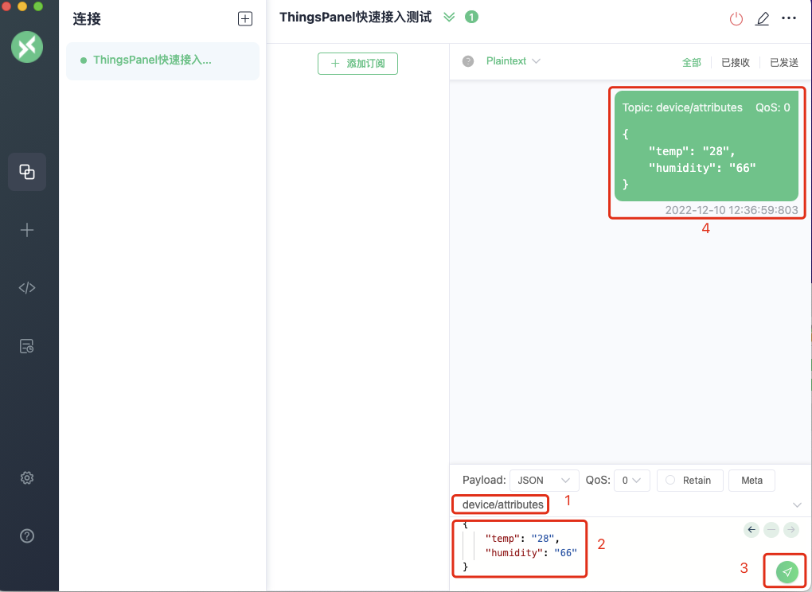

### 查看数据

在**设备监控**菜单中，点击查看刚刚创建的**环境监测**项目
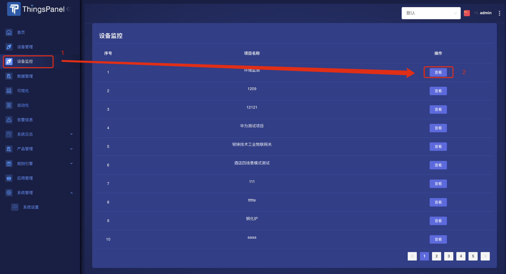

点击后出现下图，可**查看刚推送的设备数据**

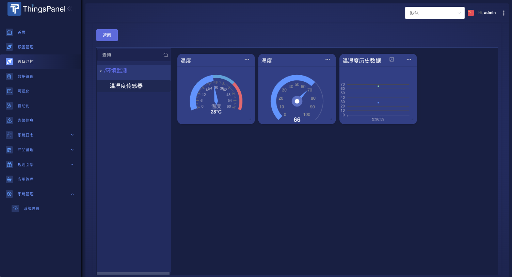

与此同时在如下两个菜单中，也可以查看：
- 消息上次推送的时间，在**设备管理**菜单中。
- 刚刚推送上来的详细数据，在**数据管理**菜单中

分别如图
查看刚刚推送的数据

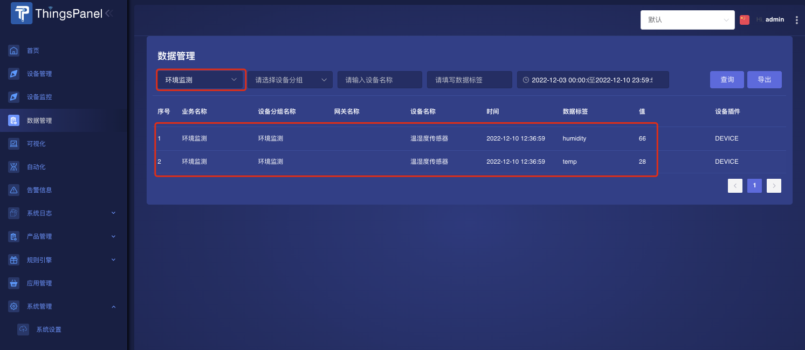

查看设备上次推送时间
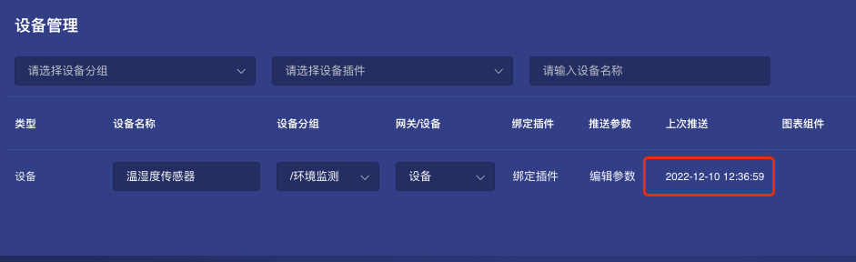


  

:::info

mqtt客户端工具推荐：[`点击下载mqtt.fx工具`](https://file.bemfa.com/hw/zip/mqtt/mqttfx1.7.1_windows_64.exe)  [`点击下载mqttx`](https://mqttx.app/)  
工具使用推荐参考文档：[`点击浏览`](https://cloud.tencent.com/developer/article/1662831)

:::


