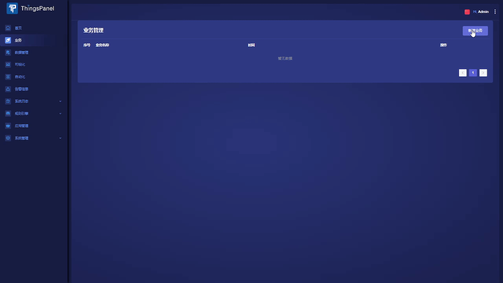

# 快速安装并接入设备

本章节将指导您快速安装ThingsPanel，并实现接入设备，查看设备数据。
## 先决条件
* 需要先安装好Docker、Docker Compose、Git
* 使用MQTT模拟器，可使用MQTTbox、 MQTT.fx ，或者使用设备推送数据。

## 通过Docker容器安装ThingsPanel

通过容器化部署是搭建ThingsPanel的最快方式。

```bash title="第一步、获取docker-compose源码:" showLineNumbers
git clone https://github.com/ThingsPanel/thingsPanel-go-docker.git
```

```bash title="第二步、进入目录并启动服务:" showLineNumbers
cd thingsPanel-go-docker
docker-compose -f docker-compose.yml up
```

```text title="第三步、登录:" showLineNumbers
输入网址:服务器ip:8080
输入账户:super@super.cn
输入密码:123456
```

:::info

更详细的`步骤`请参考[`Docker安装`](./system-installation/docker_installation)。

:::


## 接入一个温湿度设备并查看数据



```text title="第一步、创建业务、创建设备:" showLineNumbers
1. 创建业务
2. 创建设备
3. 绑定插件
5. 编辑参数
```

```text title="第二步、推送数据（可使用MQTT工具推送模拟数据）:"
1. mqtt用户名为AccessToken
```

```text title="查看数据和可视化:"
1. 点击数据管理查看数据
2. 点击可视化通过图表展示数据
```

:::tip 设备对接

详细对接请参考
[`mqtt对接`](../equipment-access/mqtt)

:::

