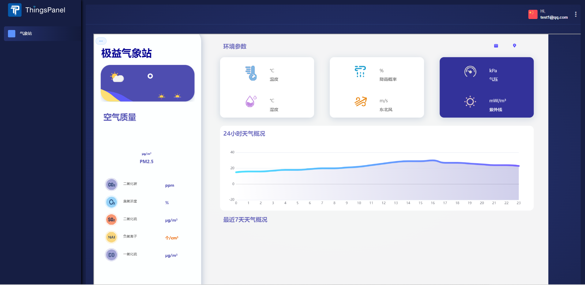
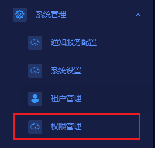
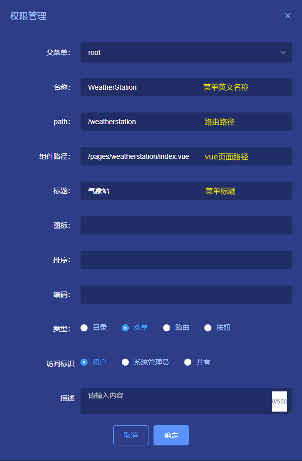
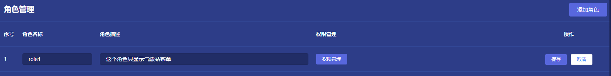
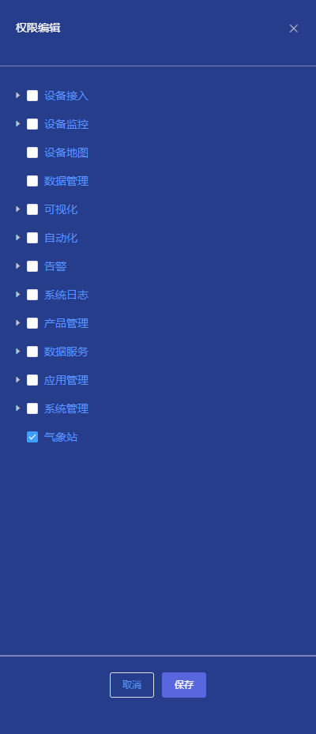
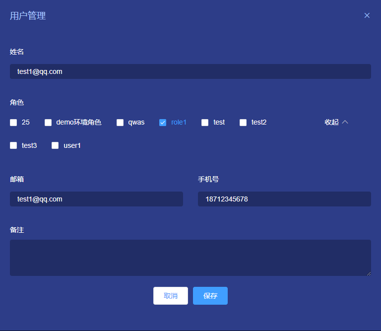

# 构建自己的前端页面

## 一、概述
前端页面是用户与物联网平台进行交互的界面。它可以包含各种元素，如导航菜单、数据展示、图表、表单等。当使用物联网平台时，用户通常希望能够自定义其前端页面以满足特定的需求。在以下文档中，我将为您提供一些指导，以帮助用户定制自己的前端页面。

例如，我们要实现的用户登录后的效果如下所示：

## 二、开发步骤

### 1. 自定义菜单和路由
启动项目，用超级管理员账号登录，然后在左侧菜单点击**系统管理** -> **权限管理** 打开权限管理页面。  

在权限管理页面点击**添加权限**按钮，在弹出的添加权限的对话框里填入菜单的信息  

菜单和路由配置好之后，点击确定保存，然后点击右上角的退出按钮，退出登录。

### 2. 给角色分配权限
用租户管理员账号登录，点击左侧菜单的**系统管理** -> **角色管理** 打开角色管理页面。

点击添加按钮添加一个角色role1，点击保存

然后点击该角色的权限管理，在弹出的右侧对话框把其他选项全部取消勾选，只选择气象站。  

点击确定保存。

### 3. 给用户分配角色
点击左侧菜单的**系统管理** -> **用户管理** 打开用户管理页面。  
指定一个用户，点击编辑按钮，给该用户分配role1角色。

### 4. 自定义页面
用开发工具打开前端项目，在`src/view/pages`目录下新建一个文件夹，名称为weatherstation。  
在weatherstation目录内新建一个Vue页面，名称为index.vue。  
在index.vue中编写代码，定制自己的页面。

### 5. 查看效果
启动项目，用刚才分配了role1角色的用户登录。
效果如图：

