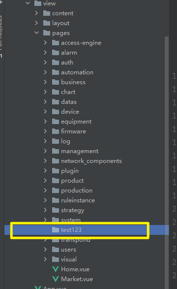
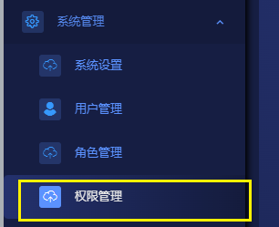
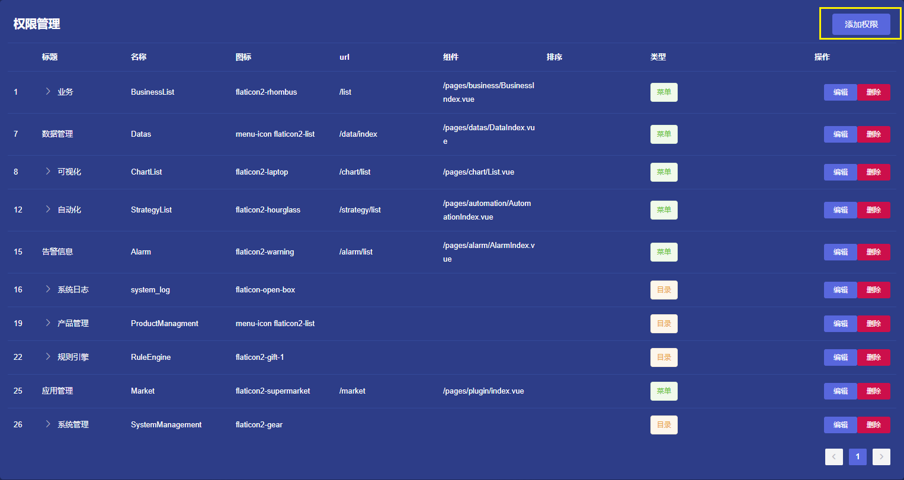
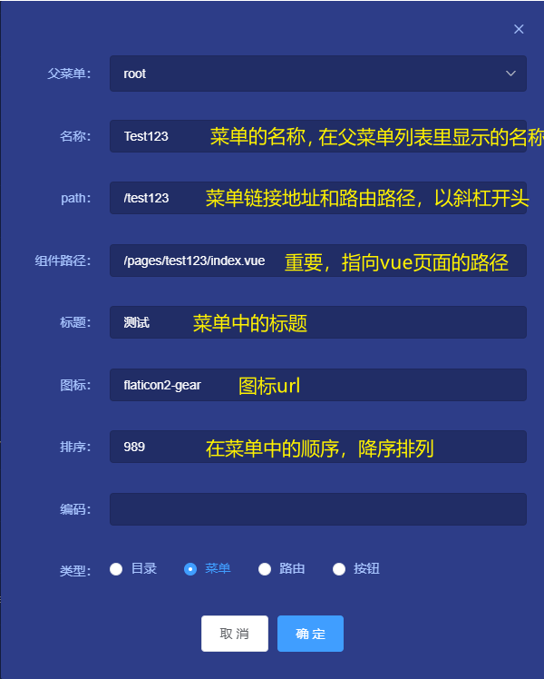
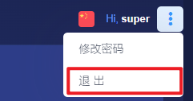
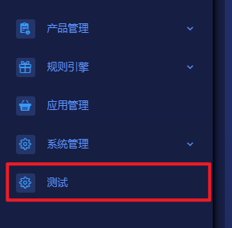
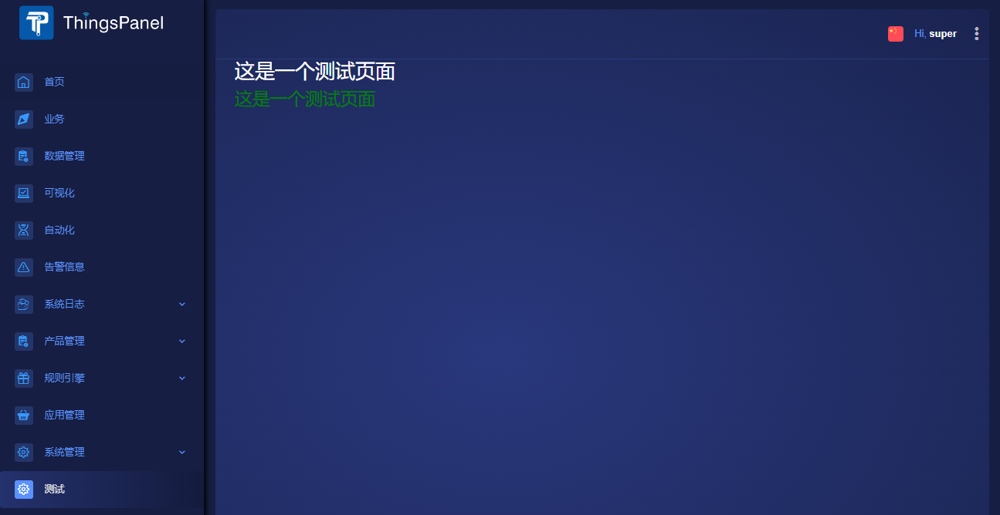

# 菜单和页面

## 一、概述
如果系统提供的菜单或页面无法满足您的需求，可以开发自己想要的页面然后在权限管理页面新建菜单，链接到您的自定义页面。

## 二、开发步骤

### 1. 编写Vue页面
用开发工具打开前端项目，在`src/view/pages`目录下新建一个文件夹，名称由开发者自己定义，本例中命名为`test123`


在test123目录内新建一个Vue页面，名称为index.vue。记住这里的路径 **/pages/test123/index.vue** ，等会添加菜单时要用到。  
index.vue代码如下：
```aidl
<template>
  <div>
    <h1 style="color:white">这是一个测试页面</h1>
    <h2 style="color:green">这是一个测试页面</h2>
  </div>
</template>

<script>
export default {
  name: "index"
}
</script>

<style scoped>

</style>
```

页面编写完成后就可以添加菜单了。
### 2. 添加菜单
启动项目，在左侧菜单点击**系统管理** -> **权限管理** 打开权限管理页面。  

:::tip
注意：只有超级管理员才有权限查看或编辑权限管理页面，修改之前一定要先备份数据库。
:::
在权限管理页面点击`添加权限`按钮  


在弹出的添加权限的对话框里填入菜单的信息  


点击确定保存，然后点击右上角的退出按钮，退出登录  


重新登录后，我们刚才添加的菜单已经出现在左侧菜单中了。  


点击测试菜单，就可以打开我们编写的Vue页面了。  



