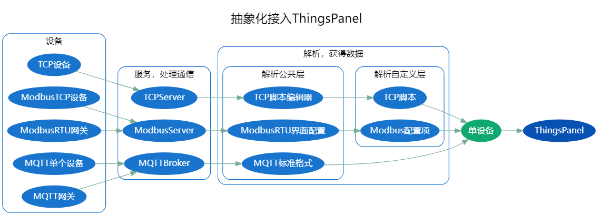
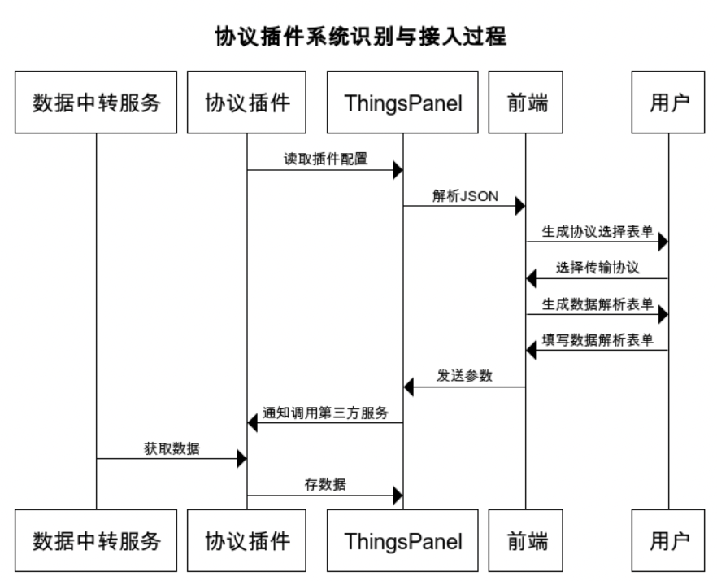

# 协议插件开发


## 协议插件解决什么问题

物联网的协议纷繁复杂，种类多样，常规的就有MQTT、TCP、HTTP、SOAP、Modbus、 OPC-UA、Bacnet、KNX、LwM2M、SNMP等，每个协议通信模式、报文规范均不相同。这给业务带来了巨大的复杂性，使得系统臃肿低效、难以扩展、维护困难、成本居高不下。

因此我们设计了协议插件系统，用来解决这个问题。

协议插件可以：
- 解决多协议接入问题
- 与平台解耦，增加了整个系统的易维护性、可扩展性和系统的稳定性
- 降低系统复杂性
- 增加代码复用性

## 解决问题的思路


上图是对设备接入核心流程进行的抽象：
- 服务和通信层；不同协议的设备使用各自的通信方式连接不同协议的服务
- 解析并获取数据；首先是公共解析层，是这个协议的通用解析方式；然后是自定义解析层，对公共解析后的数据进行二次处理
- 通过前面步骤最终都处理成单设备数据，达到了数据统一存储和展示的条件

## 和系统的其他组件是如何关联的




- 协议插件是独立运行的系统
- 平台从协议插件获取json配置报文，解析后生成交互界面供用户配置设备，最后设备配置信息保存。
- 设备与协议插件建立连接后，协议插件从平台获取设备的配置信息
- 根据配置信息解析设备的数据发送到平台进行存储和展示
- 从平台到设备的数据也是类似的处理方式

## 协议插件有什么功能

- 提供设备接入配置服务，使设备能和协议插件建立连接
- 获得并转发消息

## 协议插件的开发要求、先决条件

- 会一门后端编程语言
- 熟悉你要写的协议，同时也了解MQTT协议的机制（消息交换的通信方式使用的是MQTT）
- 使用平台对接过直连设备和网关设备

有了以上条件，就能够编写协议插件了，在开发插件过程有问题可以多和我们沟通；

## 如何开发的思路

1. 实现插件表单配置接口；平台通过这个接口获取信息生成界面供用户填写设备配置信息。
1. 编写设备链接服务；设备与协议插件链接成功后，我们就可以得到设备的认证信息，使用认证信息通过平台提供的接口就能得到用户填写的设备配置信息；
1. 开启线程/纤程保持与设备的连接；
1. 保存设备的配置信息以及线程/纤程到缓存或者内存中；
1. 接收设备消息；根据设备的配置转换消息发送给平台；
1. 接收平台消息；根据设备的配置转换平台消息发给设备；
1. 实现其他接口；
1. 插件与平台通信的实现；参考下面交换数据相关内容。

### 协议插件需要提供的接口

| 接口                          | 接口描述              |接口链接|
| ----------- | ---------- | ---------- |
| /api/form/config              | 获取插件表单配置      |[传送](https://www.apifox.cn/apidoc/shared-34b48097-8c3a-4ffe-907e-12ff3c669936/api-43746721) |
| /api/device/config/update     | 修改设备表单配置        |[传送](https://www.apifox.cn/apidoc/shared-34b48097-8c3a-4ffe-907e-12ff3c669936/api-43903019)|
| /api/device/config/add        | 新增网关子设备        |[传送](https://www.apifox.cn/apidoc/shared-34b48097-8c3a-4ffe-907e-12ff3c669936/api-43925736)|
| /api/device/config/delete        | 删除设备配       |[传送](https://www.apifox.cn/apidoc/shared-34b48097-8c3a-4ffe-907e-12ff3c669936/api-43965145)|

### thingspanel提供给插件的接口

| 接口                          | 接口描述              |接口链接|
| ----------- | ---------- | ---------- |
| /api/plugin/device/config           | 设备连接时送来密钥，根据密钥获取设备信息(包含表单信息) | [传送](https://www.apifox.cn/apidoc/shared-34b48097-8c3a-4ffe-907e-12ff3c669936/api-43535958)      |
| /api/plugin/register | 设备自动注册接口 | [传送](https://www.apifox.cn/apidoc/shared-34b48097-8c3a-4ffe-907e-12ff3c669936/api-51644896)      |

### 交换数据相关

#### 插件推送数据到平台

协议插件发送主题如下：

1. 直连设备或子设备消息
```text
mqtt用户：root  （使用thingspanel-go配置文件中的用户名和密码）
发布主题：device/attributes
报文规范：{"token":device_token,"values":{key:value...}}
或自定义报文：{"token":device_token,"values":自定义报文}
token：设备AccessToken或子设备AccessToken
```
2. 网关设备消息
```text
mqtt用户：root  （使用thingspanel-go配置文件中的用户名和密码）
发布主题：gateway/attributes
报文规范：{"token":device_token,"values":{sub_device_addr1:{key:value...},sub_device_add2r:{key:value...}}}
或自定义报文：{"token":device_token,"values":自定义报文}
token：设备AccessToken或子设备AccessToken
```

#### 平台推送数据给插件


协议插件订阅主题如下：

```text
mqtt用户：root  （使用thingspanel-go配置文件中的用户名和密码）
订阅主题：plugin/modbus/# (说明：modbus为注册插件时填写的插件订阅主题名称,ThingsPanel平台发来主题#部分是设备或子设备的AccessToken)  
报文规范：{key:value...}
```


## 如何部署到现有系统
1. 在平台注册协议插件或使用协议插件接口注册
1. 独立运行协议插件

## 开发完如何测试

可以对接到我们提供demo平台测试


