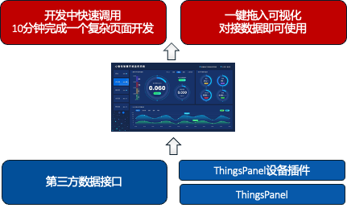
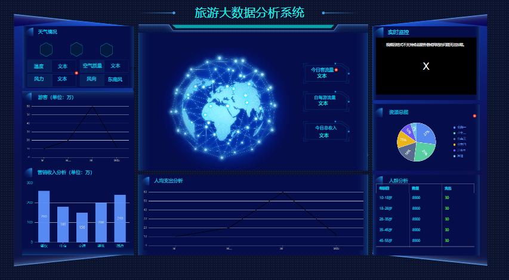
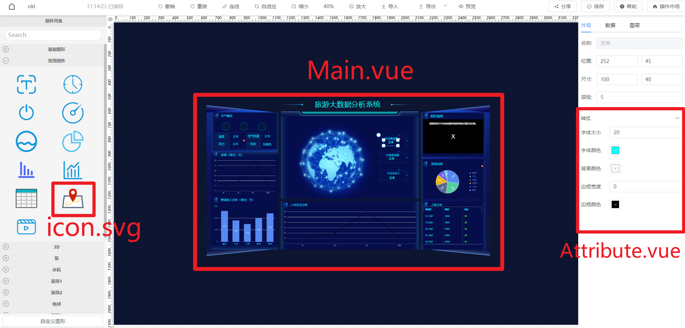
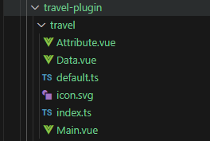
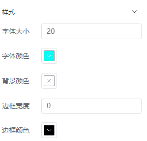
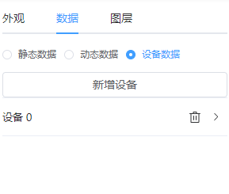
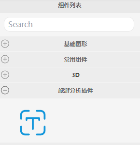
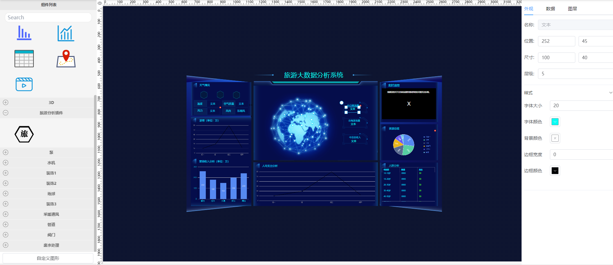
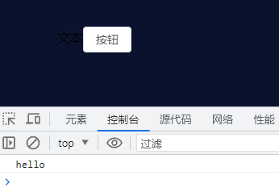

# 依赖型插件

依赖型插件是一个可搭建各种行业方案的开发方案,或者**行业积木**。

依赖型插件的优点是：
- **快速拼装解决方案**，效率比低代码更高。
- **方案与底层平台分离**，将个性化层与标准通用层完全分离。
- **并行开发解耦**，使大规模项目并行开发达到最高速度。
- **跨项目复用**，不同的项目之间，可以直接复制安装并引用。

## 举例说明

一个消防机组依赖型插件，包含了发电机、储能电池、水泵等设备的监控与管理等功能与界面单元。

在任何需要消防机组的项目中，例如智慧楼宇，可以直接安装这个消防机组插件，就能将与这个机组管理相关的图表组件、报表、大屏都一次性加载并复用。因此大大节省了开发时间。


## 依赖型插件依赖关系图



## 如何开发依赖型插件

按照ThingsPanel可视化插件开发规范**开发可视化插件**，具体参考：[可视化插件开发](./visualPlugin.md)

如图所示，这是一个旅游大数据分析系统插件。  
开发效果样例图:  


可视化插件的视图主要由3部分组成
- 左侧组件列表中可拖拽的图标视图**icon.svg**
- 拖拽到画布上后显示的节点视图**Main.vue**
- 右侧面板的样式视图**Attribute.vue**和数据视图**Data.vue**
  


### 开发步骤：
1. **在项目的src/plugins目录下新建一个travel-plugin文件夹作为旅游分析系统的插件主目录。**   
2. **然后在trave-plugin目录下再新建一个travel文件夹。**  
3. **在travel目录下创建Main.vue、Attribute.vue、Data.vue、index.ts。**  
4. **将准备好的icon.svg文件放到插件的travel目录里。svg文件可以在这里 https://www.iconfont.cn/ 下载**  

目录结构如下：  


5. **在Main.vue中编写依赖型插件的主视图，参考开发效果样例图。**  
6. **在Attribute.vue中编写依赖型插件的配置样式的面板，如图所示：**    
  
Attribute.vue代码如下：  
```
<template>
    <el-collapse v-model="activeNames">
        <el-collapse-item title="样式" name="style">
            <el-form v-model="formData" label-width="80px" label-position="left">
                <el-form-item label="字体大小">
                    <el-input type="number" v-model="formData.fontSize"></el-input>
                </el-form-item>

                <el-form-item label="字体颜色">
                    <tp-color-picker v-model="formData.color" />
                </el-form-item>

                <el-form-item label="背景颜色">
                    <tp-color-picker v-model="formData.backgroundColor" />
                </el-form-item>

                <el-form-item label="边框宽度">
                    <el-input type="number" v-model="formData.borderWidth"></el-input>
                </el-form-item>

                <el-form-item label="边框颜色">
                    <tp-color-picker v-model="formData.borderColor" />
                </el-form-item>
            </el-form>
        </el-collapse-item>
    </el-collapse>
</template>

<script>
export default {
  components: {},
  props: {},
  data() {
    return {
        formData: {
            fontSize: 20,
            color: '#000000',
            backgroundColor: '',
            borderWidth: 0,
            borderColor: '#000000'
        }
    }
  },
  methods: {}
}
</script>
<style lang="scss" scoped></style>
```
7. **在Data.vue中编写依赖型插件的数据绑定面板，如图所示：**  
  
Data.vue代码如下：
```
<template>
  <div style="height:100%">
    <el-row style="margin-bottom: 10px">
        <el-radio-group v-model="formData.bindType">
          <el-radio v-for="item in bindOptions" :label="item.value" size="small">{{ item.label}}</el-radio>
        </el-radio-group>
    </el-row>
    <el-row style="height:100%">
        <!-- 静态数据 -->
        <el-input v-if="formData.bindType==='static'" :rows="20" type="textarea" v-model="formData.static"></el-input>
        <!-- 动态数据 -->
        <el-form-item v-else-if="formData.bindType==='dynamic'" style="width:100%">
          <el-input :rows="2" type="textarea" v-model="formData.dynamic"></el-input>
        </el-form-item>
        <!-- 设备数据 -->
        <div class="w-full" v-else-if="formData.bindType==='device'" >
          <slot></slot>
        </div>
        
    </el-row>
  </div>
</template>

<script>
export default {
  components: {},
  props: {},
  data() {
    return {
        formData: {}
    }
  },
  methods: {}
}
</script>
<style lang="scss" scoped></style>
```

8. **在travel/index.ts文件中导出组件，示例代码如下：**
```
import Travel_Attribute from './Attribute.vue';
import Travel_Data from './Data.vue';
import Travel_Main from './Main.vue';
import Travel_Icon from './icon.svg';
export { Travel_Attribute, Travel_Data, Travel_Main, Travel_Icon }
```
9. **在travel-plugin/index.ts文件中导出并配置插件的名称、分组、宽高等属性，示例代码如下：**
```
import { Travel_Attribute, Travel_Data, Travel_Icon, Travel_Main } from "./travel";

export default {
    views: [
        {
            name: "travel",
            description: "",
            group: "旅游分析插件",
            size: { width: 200, height: 100 },
            icon: Travel_Icon,
            Main: Travel_Main,
            Attribute: Travel_Attribute,
            Data: Travel_Data
        }
    ]
}
```
10. **在plugins/index.ts文件中导出插件，示例代码如下：**
```
// ...
import travelPlugin from './travel-plugin';
export default {
    travelPlugin,
    // 导出其他插件
}

```
11. 此时就可以启动项目查看效果了。  
在项目根目录下输入命令`pnpm run dev`，启动成功后，在浏览器输入localhost:5173/editor打开编辑器。  
在编辑器左侧组件列表的分组中找到旅游分析插件。  
  
把组件拖拽到中间的画布上，效果如图所示：
  

## 数据交互

### 编辑时交互
当用户在右侧样式面板和数据面板配置了样式或绑定了数据后，还需要和画布上的节点进行交互，比如在样式面板配置了背景颜色或文字大小，画布上的节点需要相应的做出改变。
1. **样式交互**  
**当Attribute.vue中的数据发生改变时，我们通过如下代码把改变后的样式数据传递出去。**
```
this.$emit("onChange", { style: { ...val }});
```

Attribute.vue示例代码如下：
```
data() {
    return {
        formData: {
            // ...
        }
    }
},
watch: {
    formData: {
        handler(val) {
            // 监听formData，当formData的值改变时，把改变后的数据传递出去
            this.$emit("onChange", {
                style: { ...val }
            });
        },
        deep: true
    }
}
```
然后就可以在Main.vue中监听样式数据了。  
Main.vue示例代码:
```
props: {
    style: {
        type: Object,
        default: () => ({})
    }
},
watch: {
    style: {
        handler: function (val, oldVal) {
            if (JSON.stringify(val) === "{}") return;
            console.log(val);
            // 获取改变后的样式数据后，要执行的代码
        },
        immediate: true,
        deep: true
    }
}
```

2. **数据绑定交互**  
**Data.vue中的数据发生改变时，我们通过如下代码把改变后的数据传递出去,**
```
this.$emit("onChange", { data: { bindType: this.bindType, ...val }});
```

Data.vue示例代码如下：
```
<script>
export default {
  data() {
    return {
      formData: {
        bindType: 'static',
        static: "文本"
      },
      bindOptions: [
        { value: 'static', label: '静态数据' },
        { value: 'dynamic', label: '动态数据' },
        { value: 'device', label: '设备数据' }
      ]
    }
  },
  watch: {
    formData: {
      handler(val) {
        this.$emit("onChange", {
          data: { bindType: this.bindType, ...val }
        });
      },
      deep: true
    }
  }
}
</script>
```
在Main.vue中监听数据
```
<script>
export default {
  props: {
    data: {
      type: Object,
      default: () => ({})
    }
  },
  watch: {
    data: {
      handler(val) {
        if (JSON.stringify(val) === "{}") return;
        console.log(val);
        // 获取改变后的数据后，要执行的代码
      },
      deep: true,
      immediate: true
    }
  }
}
</script>
```

### 查看时交互
当用户预览或查看可视化时，想要向编辑器传递数据。  
比如我们在主视图Main.vue里加入了一个按钮，当点击了按钮时通知编辑器用户按下了按钮，让编辑器处理这个按钮的点击事件。通过如下代码实现：
```
this.$emit('change', 要传递的数据)
```
示例代码如下：
```
<template>
  <div style="width:100%;height:100%;">
    <el-button @click="handleClick">按钮</el-button>
  </div>
</template>

<script>
export default {
    // ...
    methods: {
        handleClick() {
          this.$emit('change', "hello")
        }
    }
}
</script>
<style lang="scss" scoped></style>

```
然后在src\display\components\DisplayComponent.tsx中的onChange方法接收。
```
methods: {
    onChange(value: any, _callback: any) {
        console.log(value)
    }
}
```
点击预览按钮打开可视化预览界面，打开控制台，点击按钮  
  

## 如何使用依赖型插件

1. 创建依赖型插件所依赖的设备插件。
2. 在应用管理中安装依赖型插件。
3. 创建并接入设备，成功采集数据。
4. 打开可视化、拖入依赖型插件所包含的大屏、图表组件。
5. 点击大屏或者图表组件，绑定数据。
6. 正常使用。