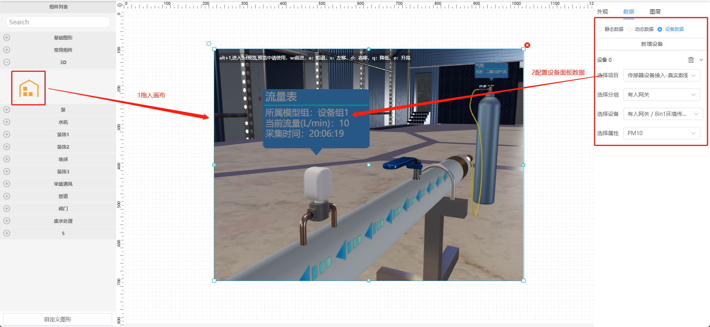

# 可视化3D插件开发

接下来我们为官方插件开发一个可以拖拽到画布上的3D场景组件，

1. 可以通过右侧属性面板3d场景中设备标签的文字大小，文字颜色和背景颜色。
2. 通过数据面板设置设备标签中的展示文字
3. 通过绑定设备在设备标签上显示接口数据
   最终效果如下图：
   
   如上图所示，插件开发完成后，我们只需两步就可完成3d场景的搭建，和数据接入，是不是非常方便，接下来我们进入开发过程

# 开发文档

## 第一步：创建组件所需的文件

官方插件所在的目录是src/plugins/tp-plugins文件夹，我们在这个文件夹里创建threejs-demo的目录，并在threejs-demo目录创建以下4个文件：
index.ts、Main.vue、Data.vue、Attribute.vue，并为在左侧列表展示图标添加一个icon.svg
其中

1. index.ts 为数据导出出口文件
2. Main.vue 插件的主要组件
3. Data.vue 数据绑定面板组件
4. Attribute.vue 属性调整面板组件
5. icon.svg 左侧列表的图标

## 第二步：准备3d引擎文件：engine.js

准备好你开发好的3d场景文件engine.js，该文件除了你需要做好以下准备，我将它放在了./threejs-demo/scene/lib 目录中

1. 三维功能定制；
2. 接口封装，比如freshAttributes接口；
3. 注册场景加载完成的回调事件addEventListener('sceneLoaded', (\{ flag \}) => {})
4. 键盘操作模式操作模式（无鼠标光标模式），快捷键为alt+1，除了此快捷键外，其他操作键可自定义，但需要在之后的编写中，给用户提示，此项要非常注意，因我们编辑器占用大量鼠标操作事件，因此编辑模式下场景的中移动的操作，不建议以鼠标为主

## 第三步：准备数据修改的数据仓库,数据仓库我们用的是  pinia，我将该文件的命名为 sceneRenderBackstage.js，并放在./threejs-demo/stroe/ 目录下

```js pinia
import {defineStore} from 'pinia';

import {shallowRef} from 'vue'
//import { SceneBackstage } from '@/engines/lib/main'
import {SceneBackstage} from '../scene/lib/engine.js';

export const useSceneDemo = defineStore('sceneDemo', {

    state: () => {
        return {
            scene: shallowRef(null),	//返回场景对象
        };
    },
    actions: {
        //功能：创建SceneRender，并返回场景对象
        createSceneRender(containerDiv) {
            this.scene = new SceneBackstage(containerDiv);	//创建场景，并返回场景对象
        },

        //功能：注册场景加载完成的回调，一般用于设置历史数据或默认数据
        initData(fn) {
            this.scene.addEventListener('sceneLoaded', fn)
        },
        //功能：设置数据面板的样式方法
        setColor(textColor
            , bgColor, fontSize) {
            if (this?.scene?.hotspotMgr) {
                this.scene.hotspotMgr.models.forEach((key, wal) => {
                    key.textColor = textColor
                    key.bgColor = bgColor
                    key.fontSize = fontSize
                    key.update()
                })
            }
        },
        //功能：获取数据面板的样式方法
        getColor() {
            let obj = {
                fontSize: 30,
                textColor: 'fff',
                bgColor: '#00AEFF',
            }
            console.log(this.scene.hotspotMgr.models, "32832139213")

            this.scene.hotspotMgr.models.forEach((key, wal) => {
                obj.textColor = key.textColor
                obj.bgColor = key.bgColor
                obj.fontSize = key.fontSize
            })
            return obj

        },
        //功能：修改绑定的数据，调用案例2
        freshSensors(sensorValue) {
            //可以更新单个，或者同时更新一组设备数据
            //设备对应三维中的从左向右进行ID匹配
            if (!sensorValue) {
                let sensorValue = [
                    {sensorId: 1, gatherTime: '2023-06-01 15:48:08', gatherValue: 98.71},
                    {sensorId: 2, gatherTime: '2023-06-01 15:48:08', gatherValue: 1.83},
                    {sensorId: 5, gatherTime: '2023-06-01 15:48:08', gatherValue: 84.96},
                    {sensorId: 6, gatherTime: '2023-06-01 15:48:08', gatherValue: 176.41},
                    {sensorId: 7, gatherTime: '2023-06-01 15:48:08', gatherValue: 16.4}
                ];
            }

            this.scene.freshSensors(sensorValue);
            return sensorValue
        },
        //功能：动态数据更新，调用案例1
        freshAttributes(AttributesObj) {
            //单个
            let AttributesObj1 = {cylinderName: "二氧化碳气瓶"};
            //this.scene.freshAttributes(AttributesObj1);
            //多个
            if (!AttributesObj) {
                let AttributesObj = {
                    cylinderName: "二氧化碳气瓶",
                    pumpPower: '可变负压抽采泵'
                }
            }
            this.scene.freshAttributes(AttributesObj);
            return AttributesObj
        },
    },
});
```

## 第四步：编写属性面板Attribute.vue

此文件为固定模板，按实际情况修改你的属性表单即可，我们会将这个表单以style这个属性传入主文件main.vue的props中
你将在第六步看见我们如何使用他们
请注意示例代码中/*** 的地方，这些注释会对你的开发有帮助

```vue

<template>
  <el-collapse v-model="activeNames">
    <el-collapse-item title="样式" name="style">
      <!-- 根据你开发的样式编辑能力和接口进行表单设计-->
      <el-form v-model="formData">
        <el-form-item label="字体大小">
          <el-input v-model="formData.fontSize"></el-input>
        </el-form-item>
        <el-form-item label="字体颜色">
          <tp-color-picker v-model="formData.color"/>
        </el-form-item>

        <el-form-item label="背景颜色">
          <tp-color-picker v-model="formData.bgColor"/>
        </el-form-item>
      </el-form>
    </el-collapse-item>
  </el-collapse>
</template>

<script lang="ts">
import {defineComponent} from "vue";
import {useSceneDemo} from "@/plugins/tp-plugin/threejs-demo2/store/sceneRenderBackstage";

const sceneStore = useSceneDemo()
export default defineComponent({
  data() {
    return {
      activeNames: 'style',
      formData: {
        fontSize: 30,
        color: '',
        bgColor: '',
      }
    }
  },
  watch: {
    formData: {
      handler(val) {
        this.$emit("onChange", {
          style: val
        });
      },
      deep: true
    }
  }
  ,
  mounted() {
    if (this.formData.color === '') {
      //*** 此处为获取你的默认值方法，如果没有该方法，你可以直接再上面的表单数据中写死 ****
      let obj = sceneStore.getColor()
      this.formData.fontSize = obj.fontSize
      this.formData.color = obj.textColor
      this.formData.bgColor = obj.bgColor
    }

  }


})


</script>

<style lang="scss" scoped>

</style>
```

## 第五步：编写数据面板：Data.vue

此文件也为固定模板，如果你对vue非常熟悉，你可以调整数据面板的结构和样式，否则请尽量不要修改其中的代码，我们会将改文件中的静态数据，设备绑定数据，分别用
value，data的属性，传入main.vue的props中，你将在第六步看见我们如何使用他们
请注意示例代码中/*** 的地方，这些注释会对你的开发有帮助

```vue

<template>
  <div style="height:100%">
    <el-row style="margin-bottom: 10px">
      <el-radio-group v-model="formData.bindType">
        <el-radio v-for="item in bindOptions" :label="item.value" size="small">{{ item.label }}</el-radio>
      </el-radio-group>
    </el-row>
    <el-row style="height:100%">
      <!-- 静态数据 -->
      <el-input v-if="formData.bindType==='static'" :rows="20" type="textarea" v-model="formData.static"></el-input>
      <!-- 动态数据 -->
      <el-form-item v-else-if="formData.bindType==='dynamic'" style="width:100%">
        <el-input :rows="2" type="textarea" v-model="formData.dynamic"></el-input>
      </el-form-item>
      <!-- 设备数据 -->
      <div class="w-full" v-else-if="formData.bindType==='device'">
        <slot></slot>
      </div>

    </el-row>
  </div>
</template>

<script setup>

import {onMounted, onUnmounted, reactive, ref, watch} from "vue";
//***此处为静态数据的准备示例，这个地方，你改成你自己的数据结构即可，如没有，你可以给空对象，因为后面我们用到了这个变量，将它转换成了json字符串***
const staticData = {
  Attributes: {
    cylinderName: "二氧化碳气瓶",
    pumpPower: '可变负压抽采泵'
  },
  Sensors: [
    {sensorId: 1, gatherTime: '2023-06-01 15:48:08', gatherValue: 98.71},
    {sensorId: 2, gatherTime: '2023-06-01 15:48:08', gatherValue: 1.83},
    {sensorId: 5, gatherTime: '2023-06-01 15:48:08', gatherValue: 84.96},
    {sensorId: 6, gatherTime: '2023-06-01 15:48:08', gatherValue: 176.41},
    {sensorId: 7, gatherTime: '2023-06-01 15:48:08', gatherValue: 16.4}
  ]
}
//以下为固定写法，如无必要请勿修改
const emit = defineEmits(['onChange'])
const props = defineProps({
  data: {
    type: [String, Object],
    default: () => ({})
  }
});
const timers = ref([])
const formData = reactive({
  bindType: 'static',
  static: JSON.stringify(staticData)
})
const formData2 = reactive({
  bindType: 'device',
  device: null
})

const bindOptions = ref([
  {value: 'static', label: '静态数据'},
  {value: 'dynamic', label: '动态数据'},
  {value: 'device', label: '设备数据'}
])
watch(formData, (newValues, oldValues) => {
  console.log(newValues, "4324324")
  emit("onChange", {
    data: {bindType: formData.bindType, ...newValues}
  });
})
onMounted(() => {
  if (JSON.stringify(props.data) !== "{}" && JSON.stringify(props.data) !== "[]") {
    formData.device = JSON.parse(JSON.stringify(props.data));
  }
})
onUnmounted(() => {
  if (timers.value.length > 0) {
    timers.value.map((i) => {
      clearInterval(i)
    })
  }
})

</script>
<style lang="scss" scoped>
.el-radio.el-radio--small {
  margin-right: 10px
}
</style>

```

## 第六步：编写Main.vue

```vue

<!--
 * @Author: wbh
 * @Date: 2022-12-29 21:54:11
 * @LastEditors: wbh
-->
<template>
  <!--  准备遮罩和提示，因拖动冲突，需要再一开始准备遮罩，并把engine.js进入无鼠标模式的快捷设为alt+1（亦可使用其他方式，单需要告知我们）-->
  <div
      :style="{padding:'10px',color:'#fff',position: 'absolute',width: '100%',height: props.isDisplay?'0px':isEnter,backgroundColor:' #00000000',display: 'flex',justifyContent: 'start',alignItems: 'start'}">
    <div style='color: #fff;background-color: #00000044;padding: 4px;font-size: 12px'>
      alt+1,进入3d预览,预览中请使用，w:前进，a：后退，s：左移，d：右移，q：降低，e：升高
    </div>
  </div>
  <!-- 准备渲染需要的div，关键点为ref，场景刷入的时候需要这个-->
  <div class="content" ref="threeBox"></div>
</template>
<!--以下为vue3，组合式api举例，也可以使用其他方式编写-->
<script lang="ts" setup>
//引入处理数据的数据仓库，改处理方式也可写在当前文件中
import {useSceneDemo} from './store/sceneRenderBackstage';
//引入判断是否进入3d预览模式的数据仓库，固定位置
import {useIs3DMode} from '@/store/modules/is3DStroe';
//设备数据的接口，该接口暂时由ThingsPanel提供，后续可使用自己的接口，但需要将接口地址，传出来
import DataAPI from "@/api/data";
//其他需要的引用
import {
  ref,
  watch,
  onMounted,
  onBeforeUnmount,
} from 'vue';
import {isEqual, uniqWith} from "lodash";


//props准备，改数据为固定处理，按如下格式编写即可，其中style为样式配置，value为静态数据，data为设备绑定数据，id是当前node节点Id
const props = defineProps({
  isDisplay: {
    type: Boolean,
    default: false,
  },
  isContentReady: {
    type: Boolean,
    default: true,
  },
  style: {
    type: Object,
    default: () => {
      return {};
    }
  },
  value: {
    type: String,
    default: () => {
      return '';
    },
  },
  data: {
    type: Object || undefined,
    default: () => {
      return undefined;
    },
  },
  id: {
    type: String,
    default: () => {
      return '';
    },
  },
});

//初始 遮罩高度100%防止拖动的时候镜头转动，之后这个值会被改为0
const isEnter = ref('100%')
//3渲染容器的ref
const threeBox = ref();
//数据准备
const is3DMode = useIs3DMode() //是否3d预览模式数据仓库
const sceneStore = useSceneDemo() //设置3d数据场景的数据仓仓库
let deviceDataRequestTimer: any = null //设备请求度定时器返回值
let DataDelayTimer1: any = null //设备数据1延时刷新定时器返回值
let DataDelayTimer2: any = null //设备数据2延时刷新定时器返回值
//监听是否进入3d模式，如果进入，把遮罩高度设为0
watch(() => is3DMode.is3DMode, (newValue, oldValue) => {
  if (newValue) {
    isEnter.value = '0px'
  } else {
    isEnter.value = '0px'
  }
})

function setDeviceData(value: any) {
  if (deviceDataRequestTimer) {
    clearInterval(deviceDataRequestTimer)
    clearTimeout(DataDelayTimer1)
    clearTimeout(DataDelayTimer2)
  }

  if (value?.deviceData?.length > 0) {
    const getDeviceData = () => {
      value?.deviceData.forEach(async (i: any, index: number) => {
        let propertyArr = []
        i.property
        const res = await DataAPI.getCurrentValue({entity_id: i.deviceId})
        if (res?.data?.code === 200 && res?.data?.data?.length > 0) {
          if (index === 0) {
            sceneStore.freshSensors([{sensorId: 1, gatherTime: "", gatherValue: ""},
              {sensorId: 2, gatherTime: "", gatherValue: ""},
              {sensorId: 3, gatherTime: "", gatherValue: ""},
              {sensorId: 4, gatherTime: "", gatherValue: ""},
              {sensorId: 5, gatherTime: "", gatherValue: ""},
              {sensorId: 6, gatherTime: "", gatherValue: ""},
              {sensorId: 7, gatherTime: "", gatherValue: ""},
            ])
            DataDelayTimer1 = setTimeout(() => {
              sceneStore.freshSensors([{
                sensorId: 1,
                gatherTime: res.data.data[0].systime,
                gatherValue: res.data.data[0][i.property]
              }, {
                sensorId: 2,
                gatherTime: res.data.data[0].systime,
                gatherValue: res.data.data[0][i.property]
              }, {
                sensorId: 3,
                gatherTime: res.data.data[0].systime,
                gatherValue: res.data.data[0][i.property]
              }, {
                sensorId: 4,
                gatherTime: res.data.data[0].systime,
                gatherValue: res.data.data[0][i.property]
              }, {
                sensorId: 5,
                gatherTime: res.data.data[0].systime,
                gatherValue: res.data.data[0][i.property]
              }, {
                sensorId: 6,
                gatherTime: res.data.data[0].systime,
                gatherValue: res.data.data[0][i.property]
              }, {sensorId: 7, gatherTime: res.data.data[0].systime, gatherValue: res.data.data[0][i.property]},])

            }, 500)
          }
          if (index === 1) {
            sceneStore.freshAttributes({
              cylinderName: " ",
              pumpPower: '可变负压抽采泵'
            })
            DataDelayTimer2 = setTimeout(() => {
            }, 500)

          }
        }
      })
      return getDeviceData
    }
    deviceDataRequestTimer = setInterval(getDeviceData(), 5000)
  }
}

function setStaticData(value: string) {
  if (deviceDataRequestTimer) {
    clearInterval(deviceDataRequestTimer)
    clearTimeout(DataDelayTimer1)
    clearTimeout(DataDelayTimer2)
  }
  try {
    //文本数据json转换
    let obj = JSON.parse(value);
    //设置静态数据
    sceneStore.freshAttributes(obj.Attributes)
    sceneStore.freshSensors(obj.Sensors)
  } catch (e) {
    console.log('传入的数据不是JSON格式');
  }
}

//渲染3D场景，并刷入默认或历史数据
onMounted(() => {
  //如果存在设备请求，清除设备请求定时器
  if (deviceDataRequestTimer) {
    clearInterval(deviceDataRequestTimer)
    clearTimeout(DataDelayTimer1)
    clearTimeout(DataDelayTimer2)
  }
  //渲染3d场景
  sceneStore.createSceneRender(threeBox.value)
  //调用初始化方法，加入初始化数据
  sceneStore.initData(() => {
    console.log(props.style, "32832139213")
    if (JSON.stringify(props.style) !== '{}') {

      sceneStore.setColor(props.style.color
          , props.style.bgColor, props.style.fontSize)
    }
    if (props.value) {
      console.log(props.value, "3dProps")
      setStaticData(props.value)
    } else {
      if (props.data && JSON.stringify(props.data) !== '{}') {
        console.log(props.data.deviceData, "3dProps")
        if (props.data.deviceData.length > 0) {
          console.log(props.data.deviceData, "3dProps")
          setDeviceData(props.data);
        }
      }
    }

  })
})
//监听样式数据变化，如果变化执行样式设置方法
watch(() => props.style, (newValue, oldValue) => {
  sceneStore.setColor(props.style.color
      , props.style.bgColor, props.style.fontSize)
})
//监听设备绑定数据变化，如果变化执行接口请求，并刷新数据，该数据和静态数据只会存在一个
watch(() => props.data, (newValue, oldValue) => {
  setDeviceData(newValue);
})
//监听静态数据变化，如果变化刷新数据，该数据和设备绑定数据只会存在一个
watch(() => props.value, (newValue, oldValue) => {
  setStaticData(newValue);
})
//组件写在的时候清除所以的定时器
onBeforeUnmount(() => {
  if (deviceDataRequestTimer) {
    clearInterval(deviceDataRequestTimer)
    clearTimeout(DataDelayTimer1)
    clearTimeout(DataDelayTimer2)
  }
})
</script>
<style scoped lang="scss">
.content {
  width: 100%;
  height: 100%;
}
</style>


```

## 第七步：导出组件

接下来在 threejs-demo/index.ts中导出组件.

```js
import Three2_Attribute from "./Attribute.vue";
import Three2_Data from "./Data.vue";
import Three2_Main from "./Main.vue";
import Three2_Icon from "./icon.svg";

export {Three2_Attribute, Three2_Data, Three2_Main, Three2_Icon};
```

## 第八步：配置该3d组件

找到src/plugins/tp-plugins/index.ts

```js
//其他官方默认引用
...
//引入你准备好的插件配置
import {
    Three2_Attribute,
    Three2_Data,
    Three2_Icon,
    Three2_Main,
} from "./threejs-demo2";
//defaultViews 官方默认配置
...
// 你自己的配置数据
const Three2Obj = {
    name: "ThreeJsDemo", //插件节点名称，也就是x6的shape属性，开头必须是ThreeJs，以用来区分其他节点
    description: "", //插件描述，自定义
    type: "3d", //类型，固定，否则可能报错
    group: "3D", //分组，固定，否则可能报错
    icon: Three2_Icon, //左侧列表显示图标，必须
    size: {width: 800, height: 600}, //初始大小
    Main: Three2_Main, //插件入口文件
    Attribute: Three2_Attribute, //插件样式设置面版组件
    Data: Three2_Data, //插件数据绑定面包组件
};

export default {
    views: [
        ...defaultViews,//官方默认配置 请勿修改
        Three2Obj, //加入你的组件配置
    ],
};

```

# 开发视频

录制准备中，敬请期待

# 演示视频

录制准备中，敬请期待