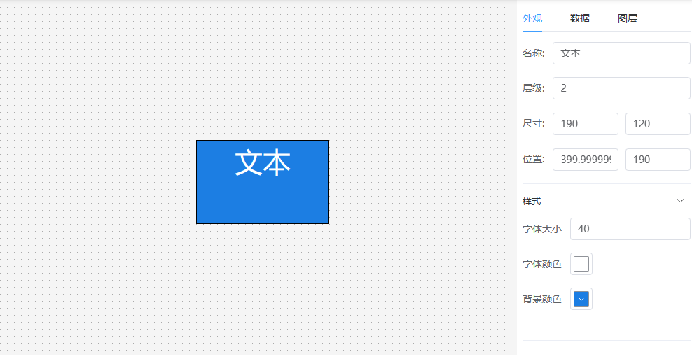
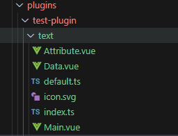
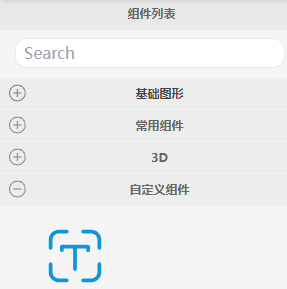
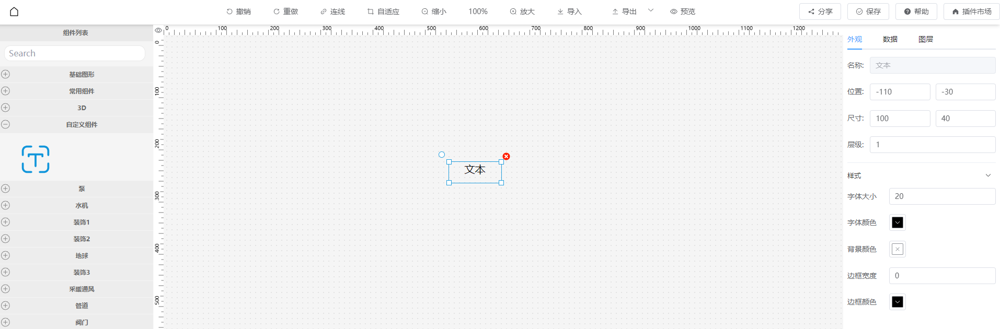

# 可视化插件开发

## 立即上手 开发第一个插件
以文本组件为例，我们为官方插件开发一个可以拖拽到画布上的文本组件，可以通过右侧属性面板调整文字的大小、颜色以及背景框。 通过数据面板设置文本显示的值。
如下图所示：  
  

## 视频教程如下： 
<iframe src="//player.bilibili.com/player.html?aid=956951149&bvid=BV1kp4y137kS&cid=1225254148&page=1" scrolling="no" border="0" width="800" height="400" frameborder="no" framespacing="0" allowfullscreen="true"> </iframe>

## 文档教程如下：
### 第一步：下载visual-editor项目
https://github.com/ThingsPanel/visual-editor  
用代码编辑器打开

### 第二步：创建组件所需的文件
官方插件所在的目录是src/plugins/tp-plugin文件夹。  
我们要开发自己的插件的话，可以在plugins目录再新建一个文件夹，本例中我们新建一个名为test-plugin的文件夹作为插件目录。  
一个插件可以包含多个组件，我们在test-plugin目录里创建`text`目录作为文本组件的目录，然后在text目录里创建以下几个文件：  
index.ts、Main.vue、Data.vue、Attribute.vue 、default.ts、icon.svg  
  

### 第三步：编写Main.vue
```ts
// text/Main.vue
<template>
    <div :style="myStyle" style="width:100%;height:100%">
        {{ value }}
    </div>
</template>

<script>
export default {
  components: {},
  props: {
    value: {
      type: [String],
      default: "文本"
    }
  },
  data() {
    return {}
  },
  computed: {
    myStyle() {
        if (this.style) {
            return this.style
        } else {
            return {
                fontSize: '20px',
                fontColor: '#ffffff',
                backgroundColor: '#409EFF',
                border: '1px solid #000'
            }
        }
    }
  },
  methods: {}
}
</script>
<style lang="scss" scoped></style>
```


### 第四步：编写属性面板Attribute.vue
```ts
// text/Attribute.vue  
<template>
    <el-collapse v-model="activeNames">
        <el-collapse-item title="样式" name="style">
            <el-form v-model="formData">
                <el-form-item label="字体大小">
                    <el-input v-model="formData.fontSize"></el-input>
                </el-form-item>

                <el-form-item label="字体颜色">
                    <el-color-picker v-model="formData.color" />
                </el-form-item>

                <el-form-item label="背景颜色">
                    <el-color-picker v-model="formData.backgroundColor" />
                </el-form-item>
            </el-form>
        </el-collapse-item>
    </el-collapse>
</template>
  
<script>
export default ({
    data() {
        return {
            activeNames: 'style',
            formData: {
                fontSize: 20,
                color: '#ffffff',
                backgroundColor: '#409EFF'
            }
        }
    },
    watch: {
        formData: {
            handler(val) {
                // 当自定义属性改变时，传递给Main.vue的style属性
                this.$emit("onChange", {
                    style: { ...val, fontSize: val.fontSize + 'px' }
                });
            },
            deep: true
        }
    }
})
</script>
  
<style lang="scss" scoped></style>
```

当用户改变了右侧属性面板的值后，需要在画布上的节点反映出来。  
如：修改了属性面板的文字大小或颜色之后，画布上的节点对应的样式也要做出改变。  
使用vue的emit方法，传递onChange事件。
```ts
this.$emit("onChange", {
    style: {
        fontSize： 20,
        // ...
    }
});
```
之后，编辑器会自动将style传递到Main.vue中，Main组件的props属性就会接收到传过来的参数.  
目前仅支持传递style和data.

### 第五步：编写数据面板：Data.vue
```ts
// text/Data.vue
<template>
  <div style="height:100%">
    <el-row style="margin-bottom: 10px">
        <el-radio-group v-model="formData.bindType">
          <el-radio v-for="item in bindOptions" :label="item.value" size="small">{{ item.label}}</el-radio>
        </el-radio-group>
    </el-row>
    <el-row style="height:100%">
        <!-- 静态数据 -->
        <el-input v-if="formData.bindType==='static'" :rows="20" type="textarea" v-model="formData.static"></el-input>
        <!-- 动态数据 -->
        <el-form-item v-else-if="formData.bindType==='dynamic'" style="width:100%">
          <el-input :rows="2" type="textarea" v-model="formData.dynamic"></el-input>
        </el-form-item>
        <!-- 设备数据 -->
        <div class="w-full" v-else-if="formData.bindType==='device'" >
          <slot></slot>
        </div>
        
    </el-row>
  </div>
</template>

<script>
export default {
  props: {
    data: {
      type: [String, Object],
      default: () => ({})
    }
  },
  data() {
    return {
      formData: {
        bindType: 'static',
        static: "文本"
      },
      bindOptions: [
        { value: 'static', label: '静态数据' }, 
        { value: 'dynamic', label: '动态数据'}, 
        { value: 'device', label: '设备数据'}
      ]
    }
  },
  watch: {
    formData: {
      handler(val) {
        this.$emit("onChange", {
          data: { bindType: this.bindType, ...val }
        });
      },
      deep: true
    }
  },
  mounted() {
    if (JSON.stringify(this.data) !== "{}") {
      this.formData = JSON.parse(JSON.stringify(this.data));
    }
  },
  methods: {
    
  }
}
</script>
<style lang="scss" scoped>
.el-radio.el-radio--small {
  margin-right: 10px
}
</style>
```

### 第六步：导出组件
接下来在text/index.ts中导出组件.  
```ts
import Text_Attribute from './Attribute.vue';
import Text_Data from './Data.vue';
import Text_Main from './Main.vue';
export { Text_Attribute, Text_Data, Text_Main }
```

### 第七步：配置
在test-plugin/index.ts文件中进行配置
```ts
import { Text_Attribute, Text_Data, Text_Main, Text_Icon } from "./text";

export default {
    views: [
        {
            name: "文本",      // 组件名称, 不可和其他组件重名
            description: "",
            group: "自定义组件",   // 左侧组件列表的分组名称
            icon: Text_Icon,         // 左侧列表的组件图标，base64或在线图片地址
            size: { width: 120, height: 60 },
            type: "text",     // 组件类型 可选的值有 text | switch | dashboard | pie | histogram | curve | table | map | video | 3d
            Main: Text_Main,    // 将要在画布上渲染的节点
            Attribute: Text_Attribute,   // 点击节点后在右侧属性面板显示的表单
            Data: Text_Data    // 点击节点后在右侧数据面板显示的表单
        },
        {
            ...
        }
    ]
}
```
### 第八步：导出插件
最后，在src/plugins/index.ts导出该插件
```ts
import testPlugin from './test-plugin';
export default { testPlugin } 
```
至此，我们的第一个插件就开发完成了。

`pnpm run dev`  
启动项目后，我们刚编写的文本组件就加载出来了。   

左侧组件列表  
   

拖拽组件到画布上  
 

### 第九步：发布插件  
插件测试完成后，就可以发布到插件市场了。  
[发布插件](./visualPublishPlugin.md)


