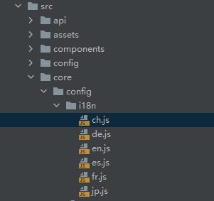
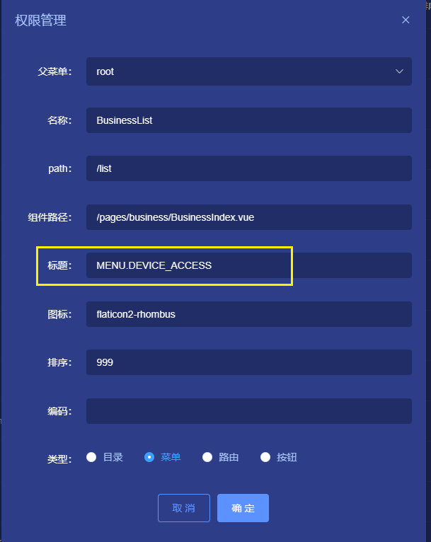

# 国际化

## 一、概述
通过 ThingsPanel 对国际化 (i18n) 的支持，你可以 轻松地实现对 ThingsPanel 平台的翻译工作 。
目前支持两种语言，中文和英文。如果这两种语言不满足您的需求，可以定制其他语言。


## 二、开发步骤

### 1、 新建语言文件
语言文件在src/core/config/i18n/文件夹下



ch.js是中文语言文件，en.js是英文语言文件，其他语种请自定义。  
语言文件的格式如下：
```aidl
export const locale = {
  COMMON: {
    HANDLE: "操作",
    VIEW: "查看",
    EDIT: "编辑",
    DELETE: "删除",
    ADD_LINE: "新增一行",
    DEVICE_GROUP_SELECTOR_PLACEHOLDER: "请选择设备分组",
    QUERY: "查询"
  },
  /**
   * 菜单
   */
  MENU: {
    HOME: "首页",
    DEVICE_ACCESS: "设备接入",
    DEVICE_WATCH: "设备监控",
    DEVICE_MAP: "设备地图",
    DATA_MANAGEMENT: "数据管理",
    VISUALIZATION: "可视化",
    AUTOMATION: "自动化"
  },
  /**
   * 首页
   */
  HOME: {
    QUICK_GUIDE: "快捷指南",
    LAST_VISIT: "最近访问",
    TEXT1: "接入数据需要从设备插件开发开始，也可以下载已有插件，快速接入数据。"
  }
}
```
:::tip
所有的key都是大写，多个单词用下划线隔开  
长文本用TEXT1, TEXT2...  
多次复用的组件的KEY可放在COMMON里  
:::

### 2、使用语言文件
如果只翻译中文和英文，可跳过这一节.  
打开src/core/services/i18n.service.js文件，将您定义的语言添加到languages中
```aidl
languages: [
    {
      lang: "en",
      name: "English",
      flag: process.env.BASE_URL + "media/svg/flags/226-united-states.svg"
    },
    {
      lang: "ch",
      name: "中文",
      flag: process.env.BASE_URL + "media/svg/flags/034-china.svg"
    },
    {
      // 自定义语言
    }
```
其中lang是文件名，name是项目中语言下拉列表的语种名称，flag是语种图标。  
然后您就可以在页面中翻译文本了。

### 3、翻译页面
- Template  
```  
格式： {{ $t(名称)}}  ```
  举例：
```aidl
// 插槽方式
<span class="font-weight-bolder text-dark">
  {{ $t("HOME.QUICK_GUIDE") }}
</span>
```

```aidl
// 传值方式
<el-table-column :label="$t('COMMON.NO')" type="index" width="260"></el-table-column>
```
  

- js  
  格式： this.$t(名称);  
  举例：
```aidl
// vue 2.0
this.$t("PLUGIN.DEVICE_INFO");

// vue 3.0
const self = getCurrentInstance().proxy;
self.$t("PLUGIN.DEVICE_INFO");
```
如果以上方式没有效果，可使用如下方法：

```aidl
import i18n from "@/core/plugins/vue-i18n"

i18n.t('PLUGIN.DEVICE_INFO')
```

### 4、翻译菜单
打开 系统管理 -> 权限管理， 编辑菜单  
在标题中填入翻译文件中对应的key，如图：  

:::tip
只有超级管理员才能编辑/查看权限管理页面
:::
