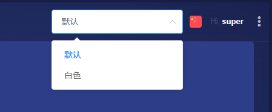
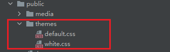
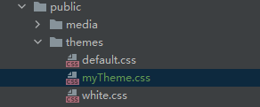
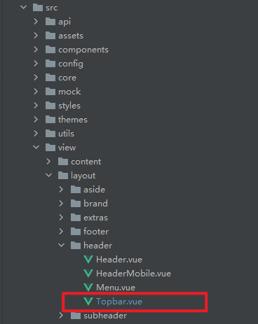
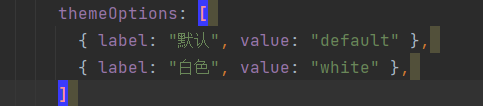
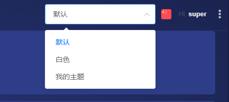

# 多主题开发

## 一、概述
ThingsPanel目前提供了两种主题，深蓝色和白色，如果这两种主题不满足您的需求，可以定制自己想要的主题。



## 二、开发步骤

### 1、 新建样式文件
用开发工具打开前端项目，找到public/themes目录，可以看到两个文件，分别是default.css和white.css。  
其中default.css文件就是深蓝色主题的样式，white.css是白色主题的样式。



我们在themes目录新建一个css文件，名称可自定义，这里取名为myTheme.css，如图：  



接下来，我们定制的主题的样式都在这个文件里完成。

### 2、把定制主题加入多主题列表

打开src/view/layout/header/Topbar.vue文件，如图：



找到data属性里的themeOptions数组



在themeOptions数组中添加一行代码，其中label的值为主题名称（可自定义），value的值是themes目录里样式的文件名。  
注意，value里的值必须和themes目录里的样式文件名对应。
```aidl
themeOptions: [
    { label: "默认", value: "default" },
    { label: "白色", value: "white" },
    { label: "我的主题", value: "myTheme" }
]
```


运行项目,可以看到我们自定义的主题就添加到多主题列表里了。




之后我们就可以通过修改public/themes/myTheme.css来定制自定义主题了。


如果要添加更多的主题，重复1、2步骤即可。
