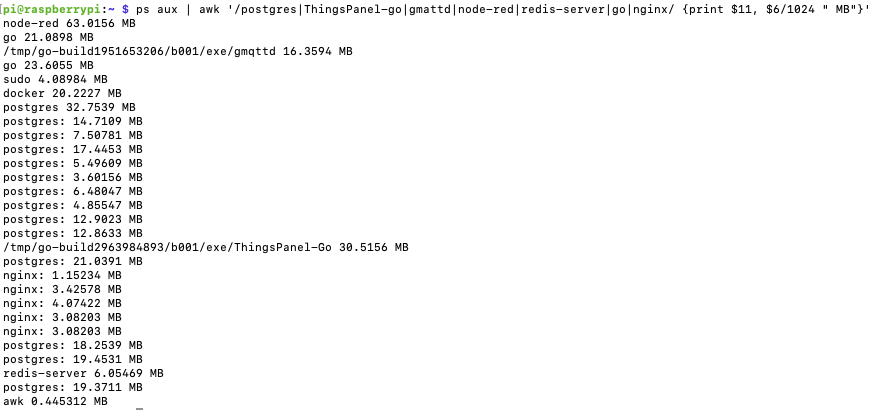
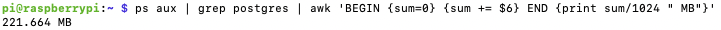
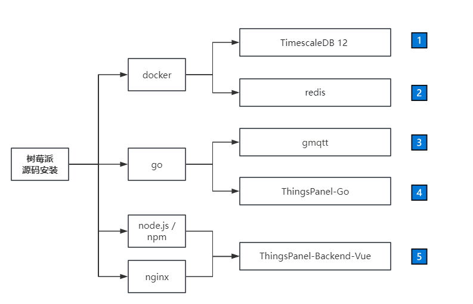
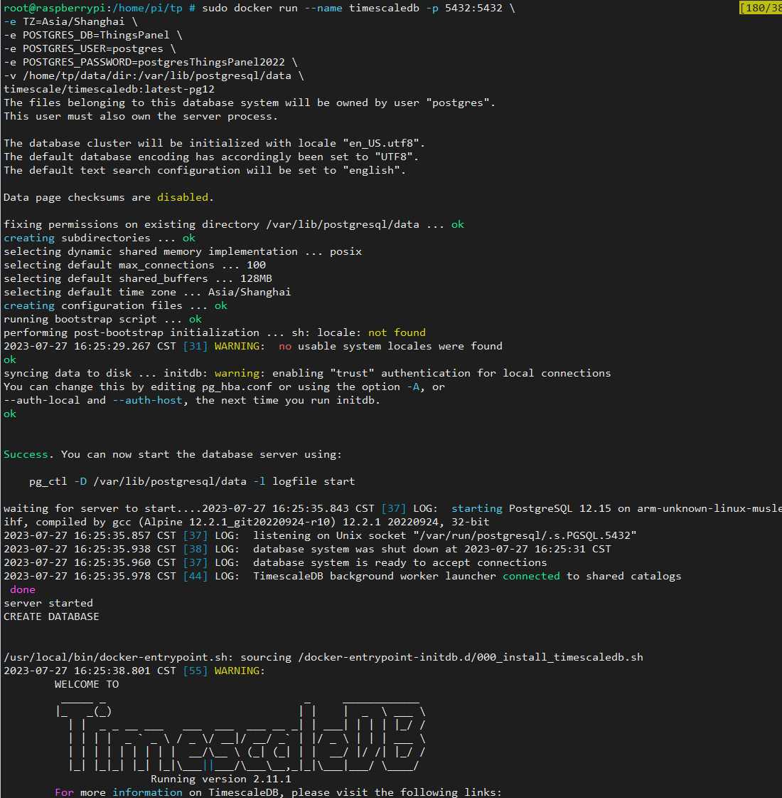
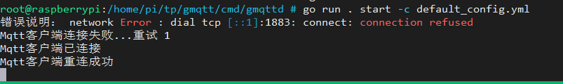
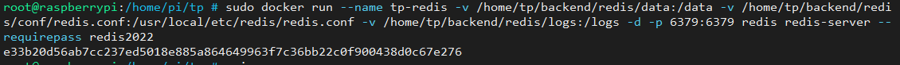
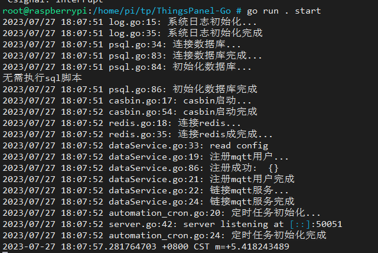
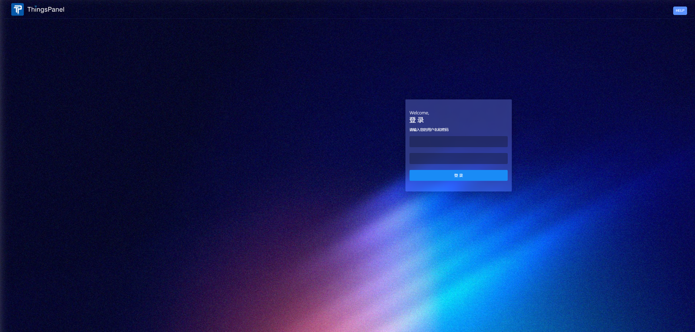
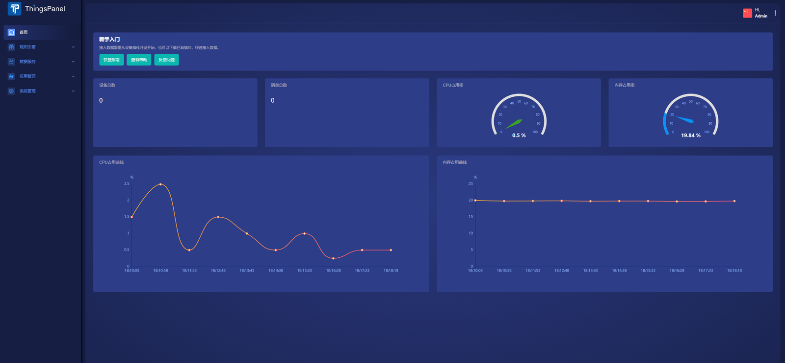

# 树莓派源码安装

本文档的目的在于说明如何在树莓派 4 上通过源码安装 ThingsPanel。安装过程基本与在 x86 服务器安装过程一样。基本参考[源码安装](http://thingspanel.io/zh-Hans/docs/system-installation/source_code.installation)进行安装。

## 安装后打开的界面

与在云服务器上的安装系统完全一样。


## ThingsPanel 在树莓派 4 上的内存占用



总计：386MB，其中 PostgreSQL 就占了 222MB

其中 PostgreSQL 占用为：

```bash
pi@raspberrypi:~ $ ps aux | grep postgres | awk 'BEGIN {sum=0} {sum += $6} END {print sum/1024 " MB"}'
221.664 MB
```



:::tip

Vue.js（或任何前端框架）开发的前端项目的内存占用不同于统计后端进程或服务的内存占用。前端项目运行在浏览器中，因此它的资源消耗应在浏览器环境中进行评估。树莓派上的内存占用实际上会涉及到您用来托管和提供前端资源的服务器（例如，如果您使用的是 Nginx 或 Apache）。

:::

**ThingsPanel 核心系统占用 30MB**

## 整体安装流程步骤概览



### 前置模块

- docker： 部署依赖数据库，减少安装流程，提高效率；（[安装 docker 社区版](https://docs.docker.com/engine/install/)）
- go： 启动后端程序和 gmqtt（[安装 Go](https://go.dev/doc/install)）
- node.js + npm： 编译、部署前端程序（[安装 node.js](https://nodejs.org/zh-cn/download/)）
- nginx： 启动 http 服务，转发前端静态文件（执行 sudo apt install nginx）

## TimescaleDB 12 安装

1.拉取 docker 镜像

`docker pull timescale/timescaledb:latest-pg12`

2.启动 docker 镜像

```
docker run --name timescaledb -p 5432:5432 \
-e TZ=Asia/Shanghai \
-e POSTGRES_DB=ThingsPanel \
-e POSTGRES_USER=postgres \
-e POSTGRES_PASSWORD=ThingsPanel2023 \
-v /home/tp/data/dir:/var/lib/postgresql/data \
timescale/timescaledb:latest-pg12
```

3.启动成功：



## gmqtt 安装

1.github 下载源码：https://github.com/ThingsPanel/gmqtt

2.进入服务目录：

`cd gmqtt/cmd/gmqttd`

3.go 命令启动：

`go run . start -c default_config.yml`

4.启动成功：



## redis 安装

1.指定目录拉取并启动 docker 镜像：

```
docker run --name tp-redis \
-v /home/tp/backend/redis/data:/data \
-v /home/tp/backend/redis/conf/redis.conf:/usr/local/etc/redis/redis.conf \
-v /home/tp/backend/redis/logs:/logs \
-d -p 6379:6379 redis redis-server --requirepass redis2022
```



## ThingsPanel-Go 安装

1.github 下载源码：https://github.com/ThingsPanel/ThingsPanel-Go

`git clone https://github.com/ThingsPanel/ThingsPanel-Go.git`

2.进入项目根目录

`cd ThingsPanel-Go`

3.启动：

`go run . start`

4.运行成功：



## ThingsPanel-Backend-Vue 安装

1.下载源码

`git clone https://github.com/ThingsPanel/ThingsPanel-Backend-Vue.git`

2.安装依赖

`npm install`

3.打包生成 dist 文件(打包前删除.env.dev 和.env.production 文件)

`rm .env.dev&&rm .env.production`

`npm run build`

4.配置 nginx 路由文件： thingspanel.conf

```
server {
    listen 8080;
    #listen 9999;
    # 修改这里的server_name为你本地的服务名
    server_name dev.thingspanel.cn 39.98.176.26 ;
    charset utf-8;

    client_max_body_size 10m;

    underscores_in_headers on;

    root /home/dev/dist;

    location /api{
        proxy_pass  http://127.0.0.1:9999;
        proxy_http_version 1.1;
        proxy_set_header Upgrade $http_upgrade;
        proxy_set_header Connection "upgrade";
        proxy_set_header X-real-ip $remote_addr;
        proxy_set_header X-Forwarded-For $remote_addr;
    }

    location /files{
    add_header 'Access-Control-Allow-Origin' '*';
        add_header 'Access-Control-Allow-Credentials' 'true';
        add_header 'Access-Control-Allow-Methods' 'GET, POST, OPTIONS';
        add_header 'Access-Control-Allow-Headers' 'DNT,User-Agent,X-Requested-With,If-Modified-Since,Cache-Control,Content-Type,Range';
        add_header 'Access-Control-Expose-Headers' 'Content-Length,Content-Range';

        if ($request_method = 'OPTIONS') {
            return 204;
        }
        proxy_pass  http://127.0.0.1:9999;
        proxy_http_version 1.1;
        proxy_set_header Upgrade $http_upgrade;
        proxy_set_header Connection "upgrade";
        proxy_set_header X-real-ip $remote_addr;
        proxy_set_header X-Forwarded-For $remote_addr;
    }

    location /visual {
        alias /home/visual-editor/dist;
        index index.html index.htm;
        try_files $uri $uri/ /visual/index.html;
    }


    location / {
        index       index.html index.htm;
    }

      gzip on;
      gzip_min_length 1k;
      gzip_comp_level 4;
      gzip_types text/plain application/javascript application/x-javascript text/css application/xml text/javascript application/x-httpd-php image/jpeg image/gif image/png;
      gzip_vary on;
      gzip_disable "MSIE [1-6]\.";

}
```

5.将刚才的文件 thingspanel.conf 放入 nginx 配置目录中，一般是/etc/nignx/conf.d/ ;

6.重新启动 nginx

`sudo systemctl restart nginx`

7.浏览器访问前端页面： x.x.x.x:8080



8.输入:

账号：super@super.cn

密码：123456



