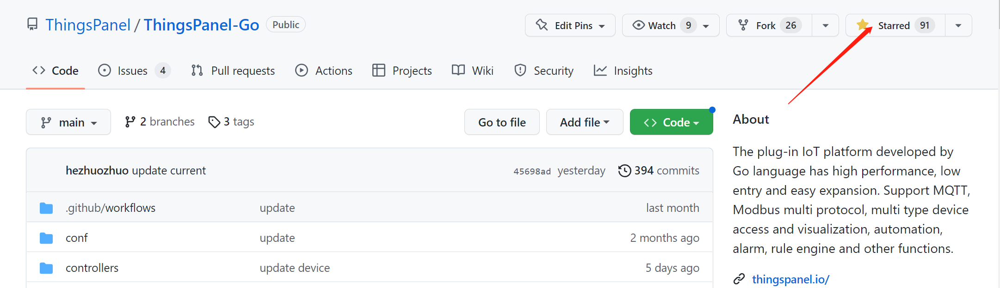
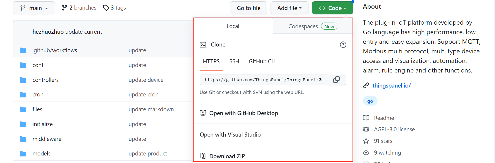

# 源码安装

## 系统环境

启动ThingsPanel之前，请先确定已经安装好以下环境:
1. go 1.18.x [下载](https://go.dev/dl/) [安装](https://go.dev/doc/install)
2. （数据库使用docker简化安装步骤）安装Docker（[安装docker社区版](https://docs.docker.com/engine/install/)）
3. redis 6 [安装](https://redis.io/docs/getting-started/installation/install-redis-from-source/)
  可参考docker安装(如果没有/home/tp/backend/redis/目录会自动创建)：
  ```sh
  docker run --name tp-redis \
  -v /home/tp/backend/redis/data:/data \
  -v /home/tp/backend/redis/conf/redis.conf:/usr/local/etc/redis/redis.conf \
  -v /home/tp/backend/redis/logs:/logs \
  -d -p 6379:6379 redis redis-server --requirepass redis2022
  ```
4. TimescaleDB 12 [安装](https://docs.timescale.com/install/latest/installation-docker/)


### (可参考)timescaledb数据库搭建
1. 获取数据库镜像

```bash
docker pull timescale/timescaledb:latest-pg12
```

2. 创建并运行容器  
POSTGRES_DB 数据库名  
POSTGRES_USER 用户名  
POSTGRES_PASSWORD 密码  

:::tip

此处如果修改了数据库名、用户名或密码请对应修改后端配置文件（./conf/app.conf）

:::

```
docker run --name timescaledb -p 5432:5432 \
-e TZ=Asia/Shanghai \
-e POSTGRES_DB=ThingsPanel \
-e POSTGRES_USER=postgres \
-e POSTGRES_PASSWORD=postgresThingsPanel2022 \
-v /home/tp/data/dir:/var/lib/postgresql/data \
timescale/timescaledb:latest-pg12
```

## GMQTT安装启动
GMQTT是平台接入设备消息的服务，设备消息通过GMQTT进入到平台，平台通过GMQTT发送消息给设备。
1. 进入[GMQTT仓库](https://github.com/ThingsPanel/gmqtt)
2. Star仓库
3. 下载源代码,建议使用git clone下载源代码,注意代码分支,master为最新的开发分支.Tags列对应其他版本.

### 配置文件

```text
./gmqtt/cmd/gmqttd/default_config.yml        --系统配置 
```

./gmqtt/cmd/gmqttd/default_config.yml说明：
```yml
listeners:
  - address: ":1883"   # 接入端口
  - address: ":8883"  # mqtts接入
    tls:
      cacert: "./certs/ca.crt"
      cert: "./certs/server.crt"
      key: "./certs/server.key"
api:
  http:
    - address: "tcp://0.0.0.0:8083"  # http服务配置（ThingsPanel-GO调用，主要用来管理接入的权限）
log:
  level: info # 日志级别 debug | info | warn | error
```

### （推荐）直接运行服务
这里有三种方式可根据实际需要选择其中一种
#### 直接运行
```sh
$ git clone https://github.com/ThingsPanel/gmqtt.git
$ cd gmqtt/cmd/gmqttd
$ go run . start -c default_config.yml
```
#### （推荐）pm2托管
这里建议使用pm2托管（pm2的安装需要node.js环境，安装pm2的步骤非常简单，可百度自行查找）
1. git clone https://github.com/ThingsPanel/gmqtt.git
2. cd gmqtt/cmd/gmqttd，在这个目录下创建gmqtt.sh
3. 将go run . start -c default_config.yml写入gmqtt.sh
4. pm2 start gmqtt.sh即可启动gmqtt（pm2 save后会保存进程状态（运行或停止），在系统重启后会自动恢复到保存状态）

#### docker方式运行服务

```sh
$ git clone https://github.com/ThingsPanel/gmqtt.git
$ cd gmqtt
$ docker build -t gmqtt .
$ docker run -p 1883:1883 -p 8883:8883 -p 8082:8082 -p 8083:8083  -p 8084:8084  gmqtt
```

## ThingsPanel-Go安装启动

平台是前后端分离的架构，ThingsPanel-Go是平台的后端，给前端提供API服务（同时给协议插件提供API服务），需要连接GMQTT和数据库（注意修改./conf/app.conf，与安装数据库时候设置的用户名密码保持一致）。

1. 进入[ThingsPanel-Go仓库](https://github.com/ThingsPanel/ThingsPanel-Go)
2. Star仓库

3. 下载源代码,建议使用git clone下载源代码,注意代码分支,main为最新的开发分支.Tags列对应其他版本.


### 相关目录文件说明

```text
./conf/app.conf                  --系统配置 
./modules/dataService/config.yml --mqtt客户端等
./files/logs/                    --系统日志存放目录
./TP.sql                         --数据库初始化脚本
```

1. ./conf/app.conf配置说明

```yml
httpport = 9999 # api服务端口
# redis配置
redis.conn=127.0.0.1:6379
redis.dbNum=0
redis.password="redis2022"
# 数据库配置
psqladdr = "127.0.0.1"
psqlport = 5432
psqldb = ThingsPanel # 库名
psqluser = postgres # 用户名
psqlpass = postgresThingsPanel2022 # 用户密码
psqlMaxConns = 5 # 空闲连接池中连接的最大数量
psqlMaxOpen = 500 # 打开数据库连接的最大数量
# 日志
maxdays = 60 # 文件最多保存多少天
# 1-紧急级别LevelEmergency 2-报警级别LevelAlert 3-严重错误级别LevelCritical 4-错误级别LevelError
# 5-警告级别LevelWarning 6-注意级别LevelWarning 7-报告级别LevelInformational 8-除错级别LevelDebug
level = 8 # 系统日志级别
sqlloglevel = 3 # sql的日志级别 1-Silent 2-Error 3-Warn 4-Info
maxlines = 10000 # 每个文件保存的最大行数
```
2. ./modules/dataService/config.yml配置说明

```yml
mqtt:
  broker: 127.0.0.1:1883 #mqtt接入地址和端口
  user: root # 平台的mqtt用户名
  pass: root # 平台的mqtt用户密码
  topicToSubscribe: device/attributes # 平台订阅设备属性主题
  topicToPublish: device/attributes # 平台发布设备属性主题前置
  topicToStatus: device/status # 平台订阅设备状态主题
  gateway_topic: gateway/attributes # 平台订阅网关设备属性主题
  topicToCommand: device/command # 平台发布命令主题
  topicToEvent: device/event # 设备上报事件主题
  topicToInform: ota/device/inform # 设备订阅升级信息主题
api:
  http_host: 127.0.0.1:8083 # gmqttAPI服务地址（主要用来管理接入的权限）
plugin:
  http_host: 127.0.0.1:503 # MODEBUS协议插件API服务地址
```

### 运行

GMQTT、redis、TimescaleDB首先启动，更新ThingsPanel-Go相关配置

```sh
$ git clone https://github.com/ThingsPanel/ThingsPanel-Go.git
$ cd ThingsPanel-Go
$ go run . start
```

## ThingsPanel-Backend-Vue安装打包

### 安装node.js 16.14（如果要在服务器打包前端需要安装node.js）
[安装node.js](https://nodejs.org/zh-cn/download/)
1. 点击上面链接进入下载页
2. 往下翻找到`以往的版本`
3. 例如找到16.14点下载然后选node-v16.13.2-linux-x64.tar.xz,执行命令下载
  ```
  wget https://nodejs.org/download/release/v16.13.2/node-v16.13.2-linux-x64.tar.xz
  ```
4. 获取到压缩包后，[node.js二进制安装](https://github.com/nodejs/help/wiki/Installation)

### 前端源码打包
1. 下载源码
  ```bash
  git clone https://github.com/ThingsPanel/ThingsPanel-Backend-Vue.git
  ```
2. 安装依赖
  ```bash
  npm install
  ```
3. 打包生成dist文件(打包前删除.env.dev和.env.production文件)
  ```bash
  rm .env.dev&&rm .env.production
  npm run build
  ```
## visual-editor安装打包（可视化）

### 安装pnpm
1. 在以上node.js安装好的前提下，执行命令安装pnpm
```
npm i -g pnpm
```
### 可视化源码打包
1. 下载源码
```bash
https://github.com/ThingsPanel/visual-editor.git
```
2. 安装依赖
```bash
npm install
```
3. 打包生成dist
```bash
pnpm run build
```

## modbus-protocol-plugin安装启动（可选-MODBUS协议插件）

modbus-protocol-plugin是平台的协议插件，MODBUS协议的设备对接协议插件，协议插件将数据转发到GMQTT进入平台。

1. 进入[modbus-protocol-plugin仓库](https://github.com/ThingsPanel/modbus-protocol-plugin)
2. Star仓库
3. 下载源代码,建议使用git clone下载源代码,注意代码分支,main为最新的开发分支.Tags列对应其他版本.

### 配置文件

```text
./config.yaml        --配置文件
```

./config.yaml说明

```yaml
server:
  address: 0.0.0.0:502 # 设备接入地址
mqtt:
  broker: 127.0.0.1:1883 # gmqtt服务端地址
  username: root
  password: root
  topic_to_publish: device/attributes # 发送主题
  topic_to_subscribe: plugin/modbus/# # 订阅主题
  subscribe_pool: 100 # 客户端订阅处理并发数量
http_server:
  address: 0.0.0.0:503 # 插件http服务地址
thingspanel:
  address: 127.0.0.1:9999 # ThingsPanel平台地址
```

### 运行

```sh
$ git clone https://github.com/ThingsPanel/modbus-protocol-plugin.git
$ cd modbus-protocol-plugin
$ go run . start
```

## rule-engine安装启动（可选-规则引擎）
请参考https://github.com/ThingsPanel/rule-engine 的readme安装
## 前端部署
### 安装nginx
```sh
yum install nginx
```
### nginx配置
安装完成后，进入/etc/nginx/conf.d目录下新建文件tp.conf，将下面内容复制进去,然后将前端打包好的dist内的文件复制到/usr/share/nginx/html，(推荐把/usr/share/nginx/html换成dist路径)；将打包好的可视化dist文件放到/usr/share/nginx/visual-editor/dist与一下配置一致；
**注意如果访问有权限问题，修改nginx.conf配置**
```conf
server {
    listen       8080;
    server_name _;
    root         /usr/share/nginx/html;

    # Load configuration files for the default server block.
    #include /etc/nginx/default.d/*.conf;
    location /api{
        proxy_pass  http://127.0.0.1:9999;
        proxy_http_version 1.1;
        proxy_set_header Upgrade $http_upgrade;
        proxy_set_header Connection "upgrade";
        proxy_set_header X-real-ip $remote_addr;
        proxy_set_header X-Forwarded-For $remote_addr;
    }
    location /files{
        proxy_pass  http://127.0.0.1:9999;
        proxy_http_version 1.1;
        proxy_set_header Upgrade $http_upgrade;
        proxy_set_header Connection "upgrade";
        proxy_set_header X-real-ip $remote_addr;
        proxy_set_header X-Forwarded-For $remote_addr;
    }
    location ^~ /visual {
        alias /usr/share/nginx/visual-editor/dist;
        index index.html index.htm;
        try_files $uri $uri/ /visual/index.html;
    }
    location / {
        index       index.html index.htm;
    }
  
    error_page 404 /404.html;
        location = /40x.html {
    }

    error_page 500 502 503 504 /50x.html;
        location = /50x.html {
    }
}
```
### 重启nginx
```sh
nginx -t
nginx -s reload
```


:::info

安装手册若有没帮助到您的地方，请联系我们。`QQ群1：260150504（满） QQ群2:371794256`

:::

:::info

其他信息请查阅[`代码库`](../system-introduction/code_repository)的README安装步骤。

:::
