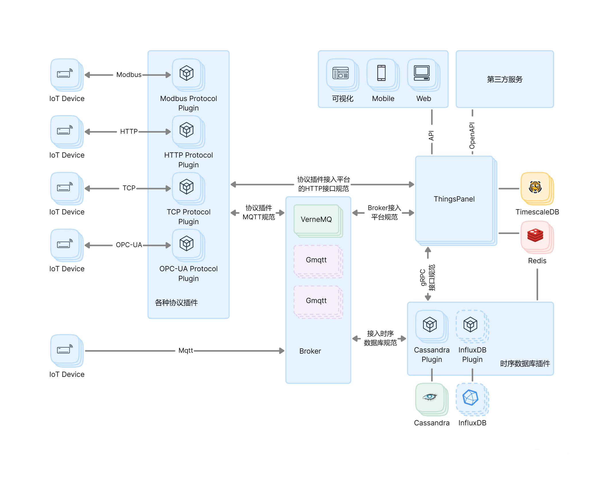

# 系统架构

**ThingsPanel设计为**：
- **扩展性**：使用领先的开源技术构建，可水平扩展平台，使用插件的方式可方便地增加新的功能和适配新的设备。
- **灵活性**：高度的灵活性，可以根据自己的需求和偏好选择合适的组件和插件。
- **容错性**：集群中的每个节点都是相同的，没有单点故障。
- **健壮性**：单个服务器节点可以根据使用情况处理以万级别的设备，集群可以处理数百万级别设备。
  
参见如下架构图及关键组件。

说明：

- **协议插件**：
ThingsPanel支持多种通信协议，包括Modbus、HTTP、TCP、OPC-UA等，通过对应的协议插件与IoT设备进行连接和通信。这种设计可以帮助用户轻松扩展到新的设备和协议，确保与众多IoT设备的兼容性。
- **MQTT Broker集群**：
VerneMQ、EMQX和Mosquitto等知名的MQTT Broker，为IoT设备提供高性能、高可靠性的消息传递服务。可以根据需求选择合适的Broker。
- **数据库**：
支持多种数据库如Cassandra和InfluxDB等分布式存储数据库，这提供了数据的高可用性、扩展性和灵活性，为IoT提供了高效、可靠的数据存储解决方案。可以根据实际需求选择合适的数据库。
- **部署**：
ThingsPanel的架构设计考虑到了高可用性和扩展性，确保没有单点故障，每个组件都可以进行水平扩展。
- **微服务**：
通过插件化的设计，ThingsPanel可以轻松地扩展新的功能和服务，满足不断变化的业务需求。
- **插件化**：
协议、数据库和Broker都是通过插件的形式实现的，这种模块化的设计可以方便地增加新的功能和适配新的设备，同时也使得维护更为简单。
- **跨平台接入**：
ThingsPanel支持多种终端接入，包括移动端、Web端等。这意味着用户可以在任何设备上访问和管理他们的物联网设备。
- **可扩展的API接口**
通过API和OpenAPI的设计，开发者和企业可以轻松地与其他系统进行集成，实现自动化和智能化。
- **集中管理**：
ThingsPanel作为核心的管理平台，可以集中处理多种设备、协议和存储的数据，这简化了管理工作并提高了效率。
