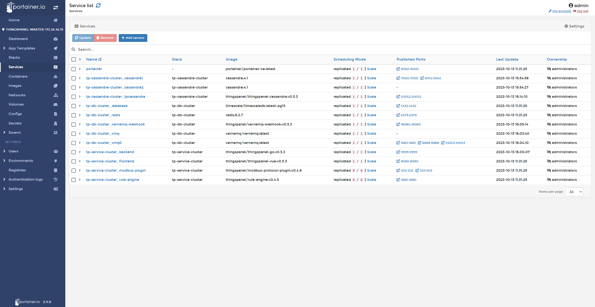

# 测试报告

**1. 测试背景**

为确保物联网平台满足不断增长的设备连接需求，并能够实时、准确地传输数据，我们进行了一系列性能测试。

---

**2. 测试环境**

- **服务器配置**：共计3台服务器，每台配置为4核8G。
- **数据库部署**：Cassandra数据库分布式部署在其中的两台服务器上。
- **设备数量**：2000台和3000台设备分别进行测试。
- **数据频率**：每台设备每秒推送6个数据点。

---

**3. 测试结果**

| 设备数量 | 写入速度  | CPU使用率（%） | 内存使用率（%） | 内网带宽 |
|:-------:|:---------:|:--------------:|:--------------:|:-------:|
| 2000    | 12000/s   | 50 / 51 / 33   | 45 / 47 / 17   | 15M     |
| 3000    | 18000/s   | 76 / 76 / 45   | 45 / 48 / 17   | 25M     |

---

**4. 分析与结论**

- **性能稳定性**：不论是2000台还是3000台设备规模，服务器均展现出强劲的处理性能与稳定性。
  
- **资源利用**：设备数量增加50%时，CPU与内存的使用率变动较小，显示出系统的优异的扩展能力。

- **带宽使用**：带宽使用与数据写入速度保持正比，证实了平台数据处理与网络传输的高效性。

- **预测**：假设每台设备每分钟推送一次（而非每秒），即减少60倍的推送频率，理论上我们可以接入的设备数量将增加至60倍，这意味着在当前资源下，平台有能力支持达到120,000至180,000台设备的稳定运行。

---

**5. 补充说明**

- 随着平台的持续优化和发展，我们将进行更加深入和细致的测试分析，以确保平台在各种应用场景中的高效性和稳定性。

---

如有疑问或需要更多信息，请随时与我们联系。
