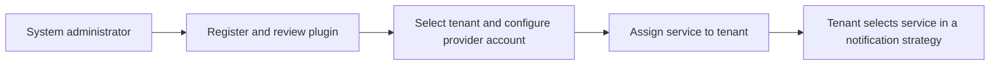

# Notification services and plugins

The system administrator manages the notification plugin directory and provider service accounts for each tenant. Tenants can use only the services assigned to them; provider credentials remain under administrator control.

## 1. Manage notification plugins

1. Sign in with a system administrator account and open **System Management → Notification Configuration** (`/management/notification`).
2. Open the notification plugin directory. Review the plugin ID and version, supported channels, content modes, configuration schema, delivery-receipt capability, and health state.
3. Register or disable a plugin according to your platform's change procedure. A healthy endpoint does not prove that a provider account or recipient is valid.
4. Grant a plugin to the intended tenant. Check the tenant scope before saving; a grant must not make the plugin visible to other tenants.

## 2. Configure a provider service account for a tenant

1. In **System Management → Notification Configuration** (`/management/notification`), open **Service Accounts** and select the target tenant.
2. Create or update the provider account for that tenant. The system administrator controls its credentials. Tenants can inspect safe service details and select the service; they cannot read or replace its secrets.
3. Enter only the fields required by the plugin schema. Credentials are write-only and must not be copied into notes, screenshots, or logs.
4. Save and **Validate** to check the configuration. Neither action sends a notification. A validation result does not prove that a future recipient will receive a message.

*Development-environment screenshot. The shown SMTP instance is disabled; the screenshot illustrates tenant-scoped account configuration and does not show a sendable account or secret values.*

The notification-service deployment bundle includes SMTP by default. After installing the notification service, the system administrator must assign the service and configure a provider account for the intended tenant. Grants and provider accounts are not created automatically. Installation details are in the [SMTP deployment guide](https://github.com/ThingsPanel/thingspanel-notification-smtp#run-the-container-locally).

## 3. System email and alert email

Password-reset messages are sent as part of account operations. Alert email uses the tenant's notification strategy. Configure and check both purposes separately. Configuring alert email does not configure every system email.

## 4. Interpret results correctly

`accepted` means that the provider accepted a submission request. It does not prove that the recipient received or read the message. A delivered result requires a trusted provider receipt; channels without receipts must be shown as accepted without delivery confirmation. An unknown result must not trigger an automatic duplicate send.

## 5. Confirm the service is ready to use

1. Register or inspect a plugin and confirm its manifest details after refresh.
2. Select a test tenant, configure a service account, save and validate it, and confirm that no send occurred.
3. Confirm that the assigned tenant sees safe service details while another tenant cannot see or use the service.
4. In the tenant session, send a test only after explicitly checking the destination and content. Verify the provider result and receipt separately.
5. Test password reset through the existing account flow and confirm that the account email is received.

For source code and plugin packaging, see the [plugin developer guide](../../../developer-guide/notification-plugin.md) and its published repositories: [SDK/template](https://github.com/ThingsPanel/thingspanel-notification-plugin-sdk), [SMTP](https://github.com/ThingsPanel/thingspanel-notification-smtp), [DingTalk](https://github.com/ThingsPanel/thingspanel-notification-dingtalk), [Alibaba Cloud SMS](https://github.com/ThingsPanel/thingspanel-notification-aliyun-sms), and [signed webhook](https://github.com/ThingsPanel/thingspanel-notification-legacy-webhook). A public repository is source material; it does not install or register a plugin in your platform.
