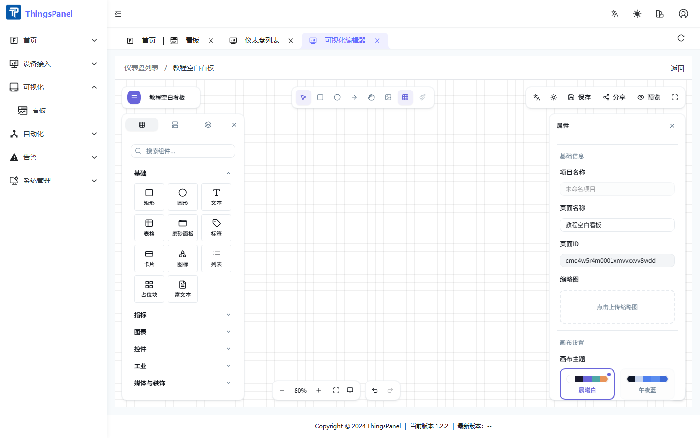

# Editor

Click **Edit** on a dashboard card to open the ThingsVis editor.

## Layout

| Area | Purpose |
|------|---------|
| Left panel | Widget library |
| Canvas | Drag-and-drop layout |
| Right panel | Properties and data bindings |
| Top bar | Save, share, preview, publish |

## Add widgets

1. Search or browse the widget library.
2. **Drag** a widget (e.g. **Value Lite**, **Text**, **Line chart**) onto the canvas and release.

## Save & preview

- **Save**: top bar or Ctrl+S
- **Preview**: top bar or open `/tv-preview?id=xxx`
