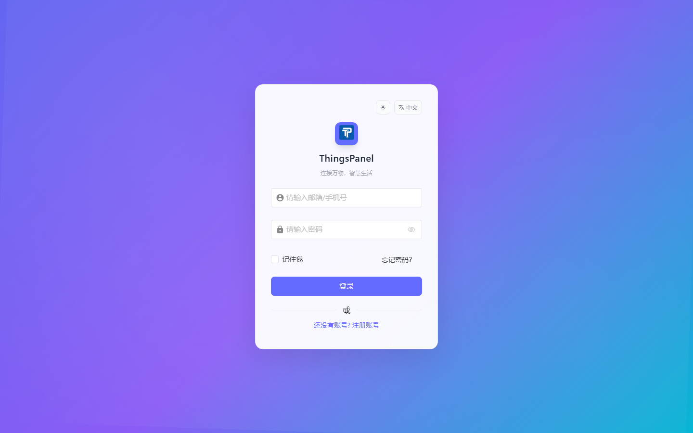
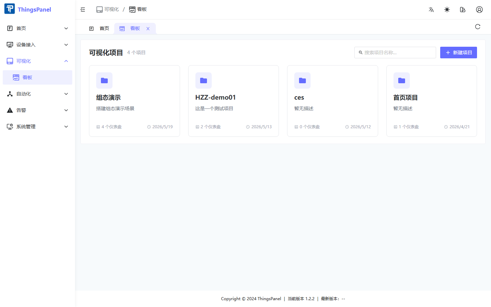

# Dashboard Overview

ThingsPanel **Dashboard** uses the **ThingsVis** engine for industrial monitoring screens and IoT dashboards.

## Concepts

| Term | Description |
|------|-------------|
| **Project** | Container for multiple dashboards |
| **Dashboard** | A single screen with canvas, widgets, and data bindings |
| **Widget** | Charts, value cards, industrial symbols, etc. |

## Demo environment

- URL: `http://192.168.20.102:5002`
- Account: `test@test.cn` / `123456`

## Get started

1. Log in to ThingsPanel.

2. Open **Visualization → Dashboard** in the sidebar.

## Next steps

- [Projects & Dashboards](./thingsvis-project.md)
- [Editor](./thingsvis-editor.md)
- [Data Configuration](./thingsvis-data.md)
- [Advanced](./thingsvis-advanced.md)
