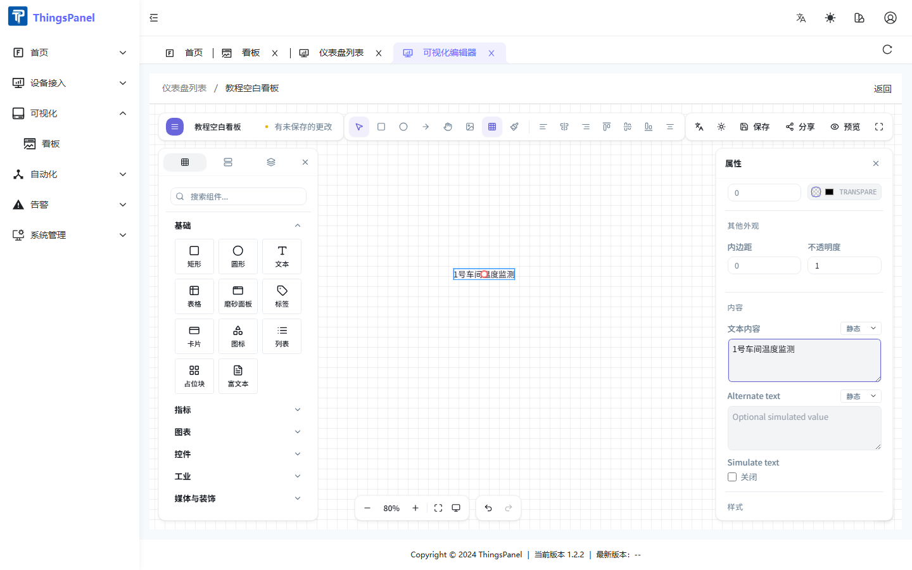

# Text

← [Back to Widget Guide](./thingsvis-widgets)

## Overview

The **Text** widget displays single or multi-line text on a dashboard. Supports static content, field binding, and expressions.

| Item | Value |
|------|-------|
| Library path | Basic → Text |
| Use cases | Titles, labels, dynamic status text |

## Add widget

1. Open the dashboard **Edit** view.
2. Find **Text** under **Basic** in the component library, or search for it.
3. **Drag** the widget onto the canvas and release.

## Properties panel

Select the text widget to configure it in the right **Properties** panel.

### Content

| Property | Description |
|----------|-------------|
| **Text content** | Displayed text; switch **Static / Field / Expression** via the dropdown |
| **Alternate text** | Fallback text, also supports binding modes |
| **Simulate text** | Rotate displayed content at an interval for demos |

### Font & layout

Font size (8–200 px), family, weight, style, horizontal/vertical alignment, line height, letter spacing, and text decoration.

### Style

Text color and optional shadow (color, blur, offset).

## Data binding

1. Select the text widget.
2. Switch **Text content** to **Field**.
3. Configure the [field picker](./thingsvis-data.md) to choose data scope and field.
4. Optionally add a **data transform** expression.

## Canvas shortcuts

| Action | Shortcut |
|--------|----------|
| Move | Drag |
| Delete | Delete |
| Copy | Ctrl+C / Ctrl+V |
| Undo | Ctrl+Z |
