# Device Management

## 1. Description
- Perform functions like adding, editing, deleting, and searching used devices. Configure attributes like groups and tags. Manage telemetry, attribute setting, event reporting, command sending, automation, and alarms for devices.

## 2. Operations

### 2.1 Add Device

- Click Add to choose between Manual Add and Add by Number (Batch/Provisioning).

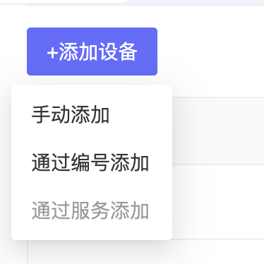

- Manual Add requires entering device name and configuration.

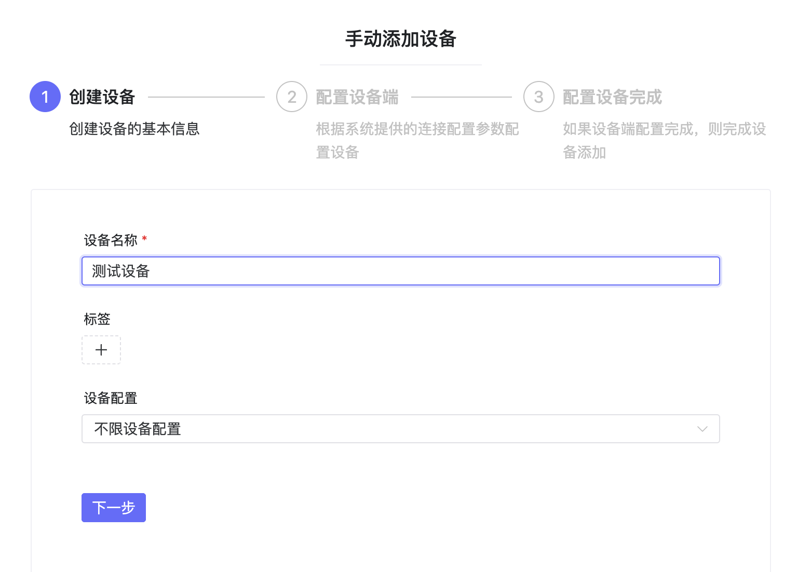

- Add by Number allows adding devices via Device Number generated in Product Management.

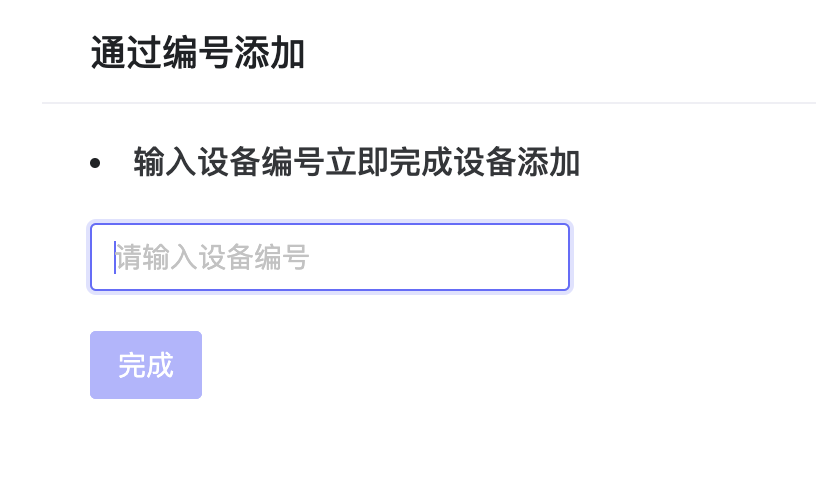

### 2.2 Telemetry

- Telemetry data reported by devices is displayed here. Supports simulated data reporting and control command sending, interacting with devices via key-value pairs.

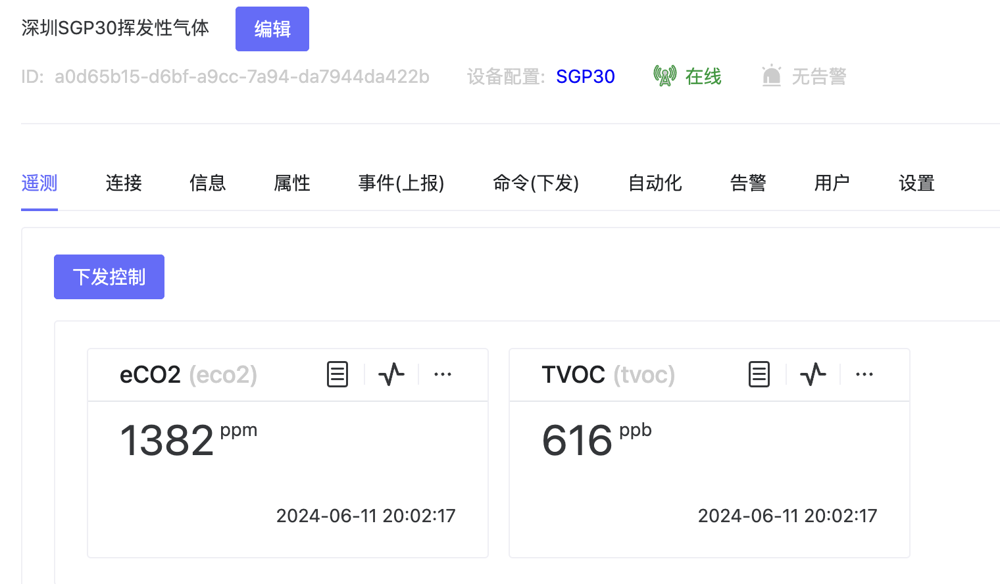

- Simulated data reporting supports reporting custom data for function checking.

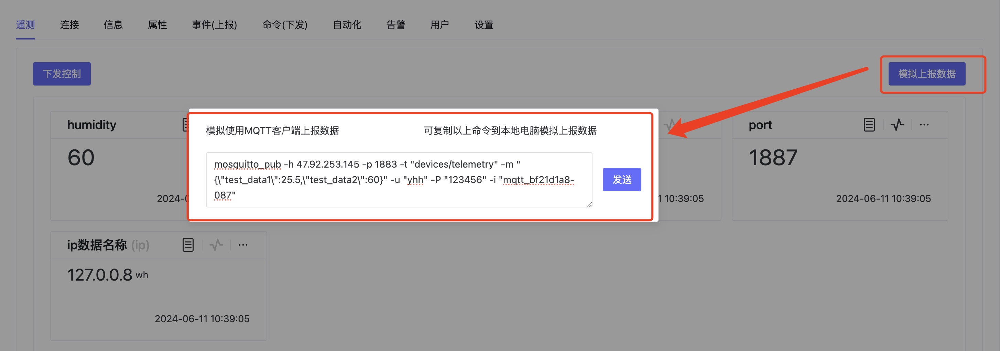

- Command sending allows sending different instructions to control the device and viewing the success/failure status.

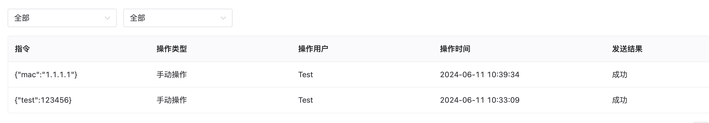

### 2.3 Connection

- View connection info like Username, Password, ClientID, and Topic for data reporting.

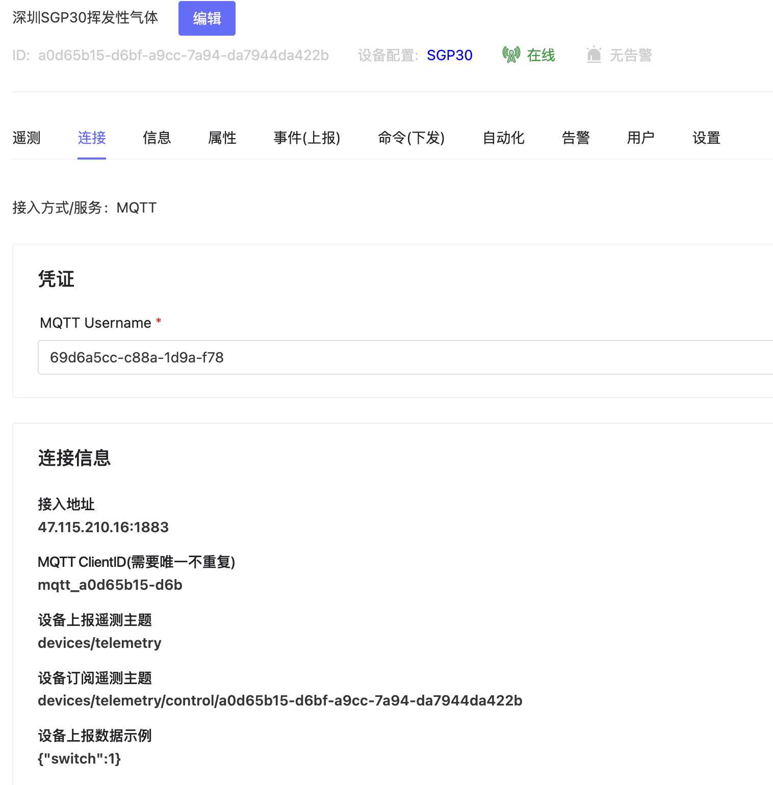

### 2.4 Information

- View device address/location information.

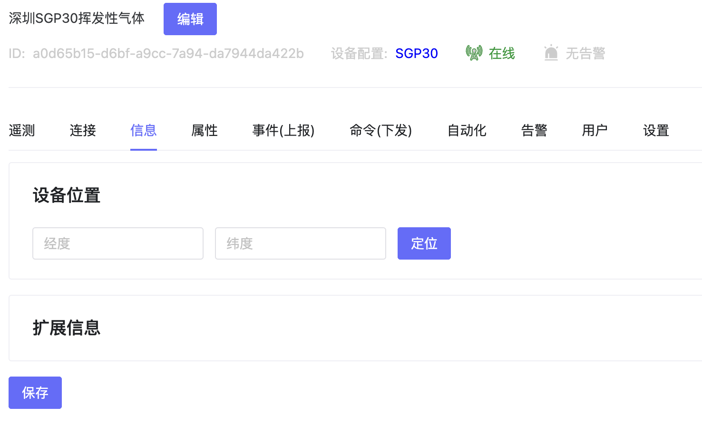

### 2.5 Attributes

- Some fields reported by devices that don't need to be stored as telemetry can be presented as properties. Define meanings for each field and send attribute control to devices.

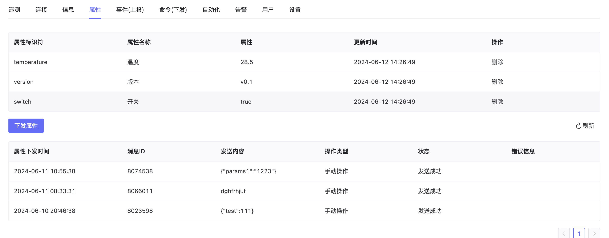

### 2.6 Events (Reporting)

- Display events reported by the device, and view event status and error reasons.

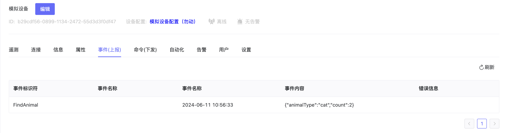

### 2.7 Commands (Sending)

- Control devices by sending commands in custom ways (HTTP, etc.), and view command status and error reasons.

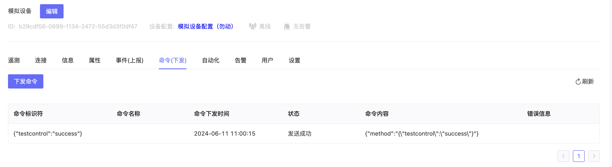

### 2.8 Automation

- Configure operations like triggering alarms or controlling other devices when specific conditions are met. See Automation - Scene Linkage for details.

- If the associated template has scene linkages, they are automatically inherited. Devices can also establish their own scene linkage configurations.

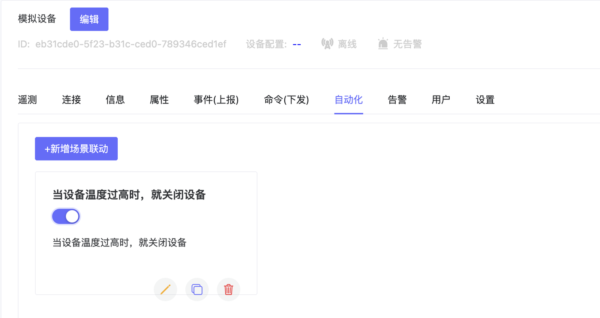

### 2.9 Alarm

- Add alarm rules to send alarms when device triggers conditions. Supports single device and same-type device alarms.

- Alarms configured in the template are automatically synchronized to the device. Devices can also add custom alarm configurations.

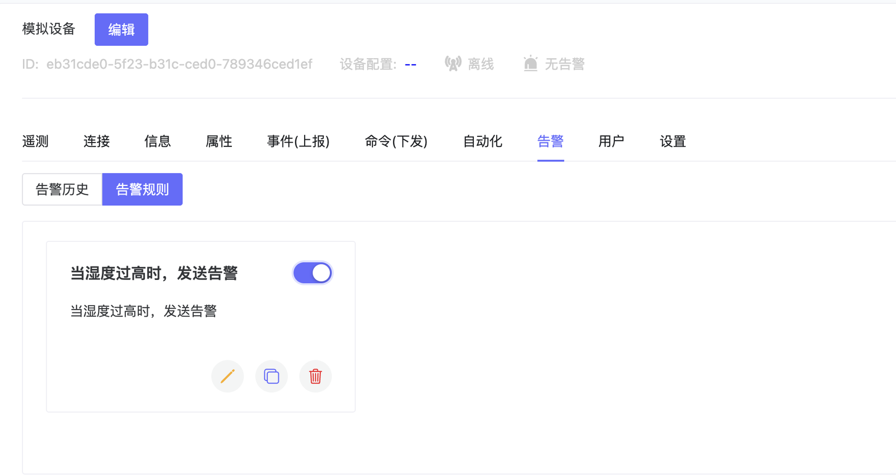

### 2.10 Settings

- Set device template, group, online/offline status, etc.

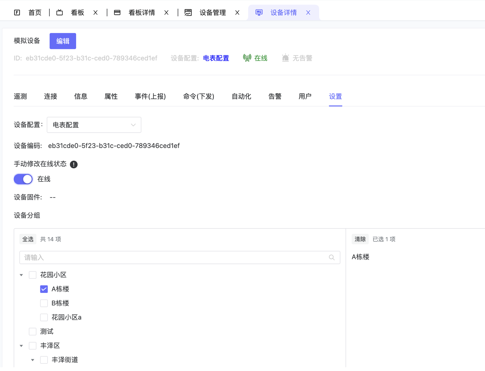
